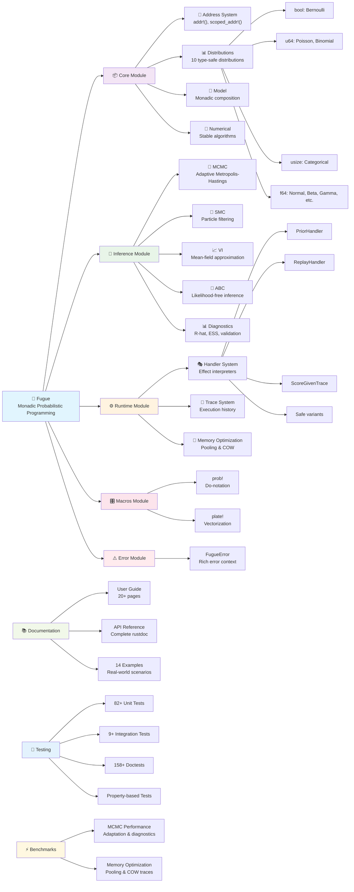

# Contributing to Fugue

Thank you for your interest in contributing to Fugue! This document provides guidelines for contributing to the project.

## Community

- **Discord**: Join our [Discord server](https://discord.gg/QAcF7Nwr)
- **Issues & Bugs**: Open an [issue](https://github.com/alexnodeland/fugue/issues) with the `Bug Report` template.
- **Feature Requests**: Open an [issue](https://github.com/alexnodeland/fugue/issues) with the `Feature Request` template.
- **RFCs**: Open an [issue](https://github.com/alexnodeland/fugue/issues) with the `RFC` template.
- **Zotero**: Joing our [Zotero group](https://www.zotero.org/groups/6138134/fugue)

## Quick Start

```bash
git clone https://github.com/alexnodeland/fugue.git
cd fugue
cargo test --all-features
```

## Development Setup

### Prerequisites

- Rust 1.70+ (install via [rustup](https://rustup.rs/))
- Git

### Building and Testing

```bash
# Run all tests
make test

# Format code
make fmt

# Lint code  
make lint

# Run benchmarks
make bench

# Generate coverage report
make coverage

# Run all checks
make all
```

Or use cargo directly:

```bash
cargo test --all-features
cargo fmt
cargo clippy -- -D warnings
```

## Contributing Guidelines

### Issues

- Use GitHub Issues for bug reports and feature requests
- Provide clear reproduction steps for bugs
- Include relevant code examples

### Pull Requests

- Fork the repository and create a feature branch from `develop`
- **Rebase your branch** to the top of `develop` before submitting PR
- Use **semantic commit messages** (e.g., `feat:`, `fix:`, `docs:`, `refactor:`)
- Add tests for new functionality
- **Ensure all CI checks pass** before requesting review
- PRs are **squash merged** to maintain linear history
- Update documentation as needed

### Versioning

- We follow [Semantic Versioning](https://semver.org/) (SemVer)
- Breaking changes increment major version
- New features increment minor version  
- Bug fixes increment patch version

### Code Style

- Follow Rust standard formatting (`cargo fmt`)
- Address all clippy warnings (`cargo clippy -- -D warnings`)
- Add documentation for public APIs
- Include examples in documentation

## Project Structure



### Directory Structure

```text
fugue/
├── src/
│   ├── core/                   # Core probabilistic programming abstractions
│   │   ├── address.rs          # Hierarchical addressing system
│   │   ├── distribution.rs     # Type-safe distributions (10 built-in)
│   │   ├── model.rs            # Monadic Model<T> abstraction
│   │   └── numerical.rs        # Numerically stable algorithms
│   ├── inference/              # Inference algorithms
│   │   ├── mh.rs               # MCMC (Adaptive Metropolis-Hastings)
│   │   ├── smc.rs              # Sequential Monte Carlo
│   │   ├── vi.rs               # Variational Inference
│   │   ├── abc.rs              # Approximate Bayesian Computation
│   │   └── diagnostics.rs      # R-hat, ESS, validation
│   ├── runtime/                # Execution engine
│   │   ├── handler.rs          # Effect handler system
│   │   ├── interpreters.rs     # Built-in handlers
│   │   ├── trace.rs            # Execution history recording
│   │   └── memory.rs           # Memory optimization (pooling, COW)
│   ├── macros/                 # Ergonomic macros
│   │   └── mod.rs              # prob!, plate!, addr! macros
│   └── error.rs                # Comprehensive error handling
├── examples/                   # 14 complete examples
│   ├── bayesian_coin_flip.rs
│   ├── linear_regression.rs
│   ├── mixture_models.rs
│   ├── hierarchical_models.rs
│   └── ...
├── benches/                    # Performance benchmarks
│   ├── mcmc_benchmarks.rs      # MCMC adaptation & diagnostics
│   └── memory_benchmarks.rs    # Memory pooling & COW traces
├── tests/                      # Integration tests
├── docs/                       # User guide & documentation
│   ├── src/                    # mdBook source
│   └── api/                    # API documentation
└── target/                     # Build artifacts
```

## Questions?

Open an issue or start a discussion on GitHub. We're happy to help!
