# Contributing to Fugue

Thank you for your interest in contributing to Fugue! This document provides guidelines for contributing to the project.

## Community

- **Discord**: Join our [Discord server](https://discord.gg/QAcF7Nwr)
- **Issues & Bugs**: Open an [issue](https://github.com/alexnodeland/fugue/issues) with the `Bug Report` template.
- **Feature Requests**: Open an [issue](https://github.com/alexnodeland/fugue/issues) with the `Feature Request` template.
- **RFCs**: Open an [issue](https://github.com/alexnodeland/fugue/issues) with the `RFC` template.
- **Zotero**: Joing our [Zotero group](https://www.zotero.org/groups/6138134/fugue)

## Quick Start

```bash
git clone https://github.com/alexnodeland/fugue.git
cd fugue
cargo test --all-features
```

## Development Setup

### Prerequisites

- Rust 1.70+ (install via [rustup](https://rustup.rs/))
- Git

### Building and Testing

```bash
# Run all tests
make test

# Format code
make fmt

# Lint code  
make lint

# Run benchmarks
make bench

# Generate coverage report
make coverage

# Run all checks
make all
```

Or use cargo directly:

```bash
cargo test --all-features
cargo fmt
cargo clippy -- -D warnings
```

## Contributing Guidelines

### Issues

- Use GitHub Issues for bug reports and feature requests
- Provide clear reproduction steps for bugs
- Include relevant code examples

### Pull Requests

- Fork the repository and create a feature branch from `develop`
- **Rebase your branch** to the top of `develop` before submitting PR
- Use **semantic commit messages** (e.g., `feat:`, `fix:`, `docs:`, `refactor:`)
- Add tests for new functionality
- **Ensure all CI checks pass** before requesting review
- PRs are **squash merged** to maintain linear history
- Update documentation as needed

### Versioning

- We follow [Semantic Versioning](https://semver.org/) (SemVer)
- Breaking changes increment major version
- New features increment minor version  
- Bug fixes increment patch version

### Code Style

- Follow Rust standard formatting (`cargo fmt`)
- Address all clippy warnings (`cargo clippy -- -D warnings`)
- Add documentation for public APIs
- Include examples in documentation

## Project Structure

```mermaid
graph LR
    A["🎻 Fugue<br/>Monadic Probabilistic Programming"] --> B["📦 Core Module"]
    A --> C["🔬 Inference Module"]
    A --> D["⚙️ Runtime Module"]
    A --> E["🎛️ Macros Module"]
    A --> F["⚠️ Error Module"]

    B --> B1["📍 Address System<br/>addr!(), scoped_addr!()"]
    B --> B2["📊 Distributions<br/>10 type-safe distributions"]
    B --> B3["🧩 Model<T><br/>Monadic composition"]
    B --> B4["🔢 Numerical<br/>Stable algorithms"]

    B2 --> B2A["bool: Bernoulli"]
    B2 --> B2B["u64: Poisson, Binomial"]
    B2 --> B2C["usize: Categorical"]
    B2 --> B2D["f64: Normal, Beta, Gamma, etc."]

    C --> C1["🔗 MCMC<br/>Adaptive Metropolis-Hastings"]
    C --> C2["🎯 SMC<br/>Particle filtering"]
    C --> C3["📈 VI<br/>Mean-field approximation"]
    C --> C4["🎲 ABC<br/>Likelihood-free inference"]
    C --> C5["📊 Diagnostics<br/>R-hat, ESS, validation"]

    D --> D1["🎭 Handler System<br/>Effect interpreters"]
    D --> D2["📝 Trace System<br/>Execution history"]
    D --> D3["💾 Memory Optimization<br/>Pooling & COW"]

    D1 --> D1A["PriorHandler"]
    D1 --> D1B["ReplayHandler"]
    D1 --> D1C["ScoreGivenTrace"]
    D1 --> D1D["Safe variants"]

    E --> E1["prob!<br/>Do-notation"]
    E --> E2["plate!<br/>Vectorization"]

    F --> F1["FugueError<br/>Rich error context"]

    G["📚 Documentation"] --> G1["User Guide<br/>20+ pages"]
    G --> G2["API Reference<br/>Complete rustdoc"]
    G --> G3["14 Examples<br/>Real-world scenarios"]

    H["🧪 Testing"] --> H1["82+ Unit Tests"]
    H --> H2["9+ Integration Tests"]
    H --> H3["158+ Doctests"]
    H --> H4["Property-based Tests"]

    I["⚡ Benchmarks"] --> I1["MCMC Performance<br/>Adaptation & diagnostics"]
    I --> I2["Memory Optimization<br/>Pooling & COW traces"]

    style A fill:#e1f5fe
    style B fill:#f3e5f5
    style C fill:#e8f5e8
    style D fill:#fff3e0
    style E fill:#fce4ec
    style F fill:#ffebee
    style G fill:#f1f8e9
    style H fill:#e3f2fd
    style I fill:#fff8e1
```



### Directory Structure

```text
fugue/
├── src/
│   ├── core/                   # Core probabilistic programming abstractions
│   │   ├── address.rs          # Hierarchical addressing system
│   │   ├── distribution.rs     # Type-safe distributions (10 built-in)
│   │   ├── model.rs            # Monadic Model<T> abstraction
│   │   └── numerical.rs        # Numerically stable algorithms
│   ├── inference/              # Inference algorithms
│   │   ├── mh.rs               # MCMC (Adaptive Metropolis-Hastings)
│   │   ├── smc.rs              # Sequential Monte Carlo
│   │   ├── vi.rs               # Variational Inference
│   │   ├── abc.rs              # Approximate Bayesian Computation
│   │   └── diagnostics.rs      # R-hat, ESS, validation
│   ├── runtime/                # Execution engine
│   │   ├── handler.rs          # Effect handler system
│   │   ├── interpreters.rs     # Built-in handlers
│   │   ├── trace.rs            # Execution history recording
│   │   └── memory.rs           # Memory optimization (pooling, COW)
│   ├── macros/                 # Ergonomic macros
│   │   └── mod.rs              # prob!, plate!, addr! macros
│   └── error.rs                # Comprehensive error handling
├── examples/                   # 14 complete examples
│   ├── bayesian_coin_flip.rs
│   ├── linear_regression.rs
│   ├── mixture_models.rs
│   ├── hierarchical_models.rs
│   └── ...
├── benches/                    # Performance benchmarks
│   ├── mcmc_benchmarks.rs      # MCMC adaptation & diagnostics
│   └── memory_benchmarks.rs    # Memory pooling & COW traces
├── tests/                      # Integration tests
├── docs/                       # User guide & documentation
│   ├── src/                    # mdBook source
│   └── api/                    # API documentation
└── target/                     # Build artifacts
```

## Questions?

Open an issue or start a discussion on GitHub. We're happy to help!
