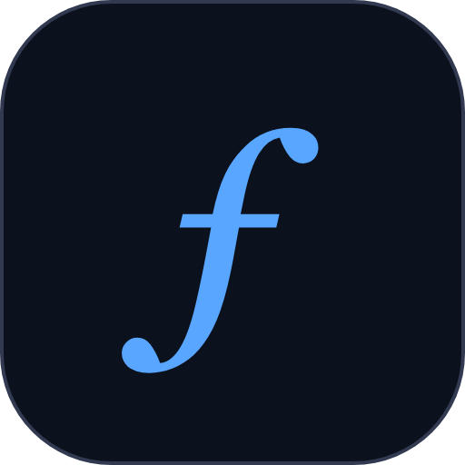

<div align="center">



# Fugue

**Una biblioteca de programación probabilística monádica y segura en tipos para Rust — pre-1.0 y en desarrollo activo**

*Componga modelos en estilo directo; ejecute hacia atrás con interpretables plugables e inferencia de última generación. Aprenda de forma interactiva en [fugue.run](https://fugue.run).*

[](https://www.rust-lang.org)
[](https://crates.io/crates/fugue-ppl)
[](https://docs.rs/fugue-ppl)
[](https://fugue.run)
[](https://opensource.org/licenses/MIT)
[](https://github.com/alexnodeland/fugue/actions/workflows/ci.yml)
[](https://codecov.io/gh/alexnodeland/fugue)
[](https://crates.io/crates/fugue-ppl)
[](https://www.zotero.org/groups/6138134/fugue/library)
[](https://discord.gg/QAcF7Nwr)
[](https://deepwiki.com/alexnodeland/fugue)

**Rust compatible:** 1.87+ • **Plataformas:** Linux / macOS / Windows • **Crate:** [`fugue-ppl` en crates.io](https://crates.io/crates/fugue-ppl)

</div>

## ✨ Características

- **PPL monádica**: Componga programas probabilísticos utilizando abstracciones puramente funcionales
- **Distribuciones seguras en tipos**: 17 distribuciones de probabilidad integradas con tipos de retorno naturales
- **Múltiples métodos de inferencia**: MCMC, HMC, SMC, Inferencia Variacional, ABC
- **Diagnósticos integrales**: Convergencia R-hat, tamaño de muestra efectivo, validación
- **Estabilidad numérica**: Cálculos en espacio logarítmico de principio a fin para una aritmética de probabilidades robusta
- **Macros ergonómicas**: Notación Do (`prob!`), vectorización (`plate!`), direccionamiento (`addr!`))

## 🤔 ¿Por qué Fugue?

- 🔒 **Distribuciones seguras en tipos**: tipos de retorno naturales (Bernoulli → `bool`, Poisson/Binomial → `u64`, Categórica → `usize`)
- 🧩 **Diseño monádico de estilo directo**: componga valores `Model<T>` con `bind/map` para un flujo de control explícito y legible
- 🔌 **Interpretables plugables**: muestreo a priori, reproducción, puntuación y variantes seguras
- 📊 **Diagnósticos**: R-hat, tamaño de muestra efectivo (ESS), utilidades de validación y una taxonomía de errores estructurada (ver [`error`](https://docs.rs/fugue-ppl/latest/fugue/error/))
- ⚡ **Enfoque en rendimiento**: clones de direcciones sin asignación y en O(1) (`Arc<str>` con hash en caché) y cálculos en espacio logarítmico numéricamente estables

## 📦 Distribuciones

Bernoulli, Beta, Binomial, Categorical, Cauchy, ChiSquared, DiscreteUniform, Exponential, Gamma, InverseGamma, Laplace, LogNormal, Normal, Poisson, StudentT, Uniform, Weibull: 17 en total, cada una con tipos de retorno naturales y parámetros validados.

## 🧪 Estado actual de Fugue

Fugue está en la versión 0.2.x: pre-1.0, en desarrollo activo, sin garantía de estabilidad SemVer por el momento y con un único mantenedor principal (consulte la Hoja de ruta, más abajo). Está ampliamente probado: cientos de pruebas unitarias, de integración y basadas en propiedades, incluidas pruebas de regresión estadística contra posteriores de forma cerrada; pero esto no equivale a afirmar que está "listo para producción". Trátelo como un PPL de grado investigación serio y con un alcance realista: fije una versión exacta, lea el [CHANGELOG](CHANGELOG.md) antes de actualizar y espere cambios que rompan la compatibilidad en la API entre lanzamientos 0.x a medida que el diseño se consolide.

## 📦 Instalación

```toml
[dependencies]
fugue-ppl = "0.2.0"
```

### Inicio rápido

```bash
cargo add fugue-ppl
```

## 💡 Ejemplo

```rust
use fugue::*;
use rand::rngs::StdRng;
use rand::SeedableRng;

// Run inference with model defined in closure
let mut rng = StdRng::seed_from_u64(42);
let samples = adaptive_mcmc_chain(&mut rng, || {
    prob! {
        let mu <- sample(addr!("mu"), Normal::new(0.0, 1.0).unwrap());
        observe(addr!("y"), Normal::new(mu, 0.5).unwrap(), 1.2);
        pure(mu)
    }
}, 1000, 500);

let mu_values: Vec<f64> = samples.iter()
    .filter_map(|(_, trace)| trace.get_f64(&addr!("mu")))
    .collect();
```

## 📚 Documentación

- **[Guía del usuario](https://fugue.run/)** - Tutoriales completos y ejemplos
- **[Explorables](https://fugue.run/explorables/index.html)** - Ensayos interactivos y manipulables: arrastre un priori y observe cómo se reforma el posterior, haga rodar el HMC por un paisaje
- **[Playground](https://fugue.run/playground.html)** - Escriba modelos `prob!` en el navegador y ejecute inferencia real, compilada a WASM
- **[Referencia de la API](https://docs.rs/fugue-ppl/latest/fugue/)** - Documentación completa de la API
- **Ejemplos** - Consulte el directorio `examples/`, que incluye un ejemplo ejecutable por cada método de inferencia:
  - `adaptive_mcmc_chain` - ejemplos fundamentales/modelado estadístico (p. ej., `bayesian_coin_flip.rs`)
  - `hmc_chain` (HMC) - consulte la [documentación rustdoc del módulo `hmc`](https://docs.rs/fugue-ppl/latest/fugue/inference/hmc/) para un doctest ejecutable
  - `adaptive_smc` (SMC) - `examples/smc_inference.rs`
  - `abc_smc_weighted` (ABC) - `examples/abc_inference.rs`
  - `optimize_meanfield_vi_with_config` (VI) - `examples/vi_inference.rs`
- **[Referencias](https://www.zotero.org/groups/6138134/fugue/library)** - Biblioteca de Zotero para Fugue

## 🌱 Ecosistema

- **[Fugue Evo](https://github.com/alexnodeland/fugue-evo)** — evolución como inferencia bayesiana: CMA-ES, NSGA-II, modelos de islas y algoritmos de estimación de distribución sobre las mismas bases, con su propia documentación interactiva y playground en vivo en [evo.fugue.run](https://evo.fugue.run)

## 🤝 Comunidad

- **Informes de problemas y errores**: Utilice [GitHub Issues](https://github.com/alexnodeland/fugue/issues)
- **Solicitudes de características**: Abra un issue con la etiqueta `enhancement` (mejora)
- **Discord**: Únase a nuestro [servidor de Discord](https://discord.gg/QAcF7Nwr)

## 🗺️ Hoja de ruta

Este proyecto es una exploración continua de la programación probabilística en Rust. Aunque muchas partes están orientadas a producción, algunas pueden no estar 100 % completas o correctas aún. Estoy trabajando constantemente hacia una implementación más robusta y un conjunto de características más amplio.

Áreas de enfoque planificadas:

- Fortalecimiento de la corrección central y la estabilidad numérica
- Ampliación de la cobertura de distribuciones e inferencia
- Refinamientos de la API y garantías de estabilidad
- Mejora de la documentación, diagnósticos y ejemplos

**Política de estabilidad de la API / SemVer:** Fugue sigue la [convención SemVer pre-1.0 de Cargo](https://doc.rust-lang.org/cargo/reference/semver.html#change-categories): cualquier incremento `0.x.y -> 0.(x+1).0` puede contener cambios que rompan la compatibilidad, y `0.x.y -> 0.x.(y+1)` es aditivo/sin roturas. Aún no hay compromiso de estabilidad para la 1.0; fije siempre una versión exacta y lea el [CHANGELOG](CHANGELOG.md) antes de actualizar la versión menor.

## 🤝 Contribuir

¡Las contribuciones son bienvenidas! Consulte nuestras [directrices de contribución](.github/CONTRIBUTING.md).

```bash
git clone https://github.com/alexnodeland/fugue.git
cd fugue && cargo test
```

## 📄 Licencia

Licenciada bajo la [Licencia MIT](LICENSE).

## 🔗 Citación

Si utiliza Fugue en sus investigaciones, cite:

```bibtex
@software{fugue2026,
  title = {Fugue: Monadic Probabilistic Programming for Rust},
  author = {Alexander Nodeland},
  url = {https://github.com/alexnodeland/fugue},
  version = {0.2.0},
  year = {2026}
}
```

O consulte la colección "Internal" en [Zotero](https://www.zotero.org/groups/6138134/fugue/library) para generar una bibliografía.
