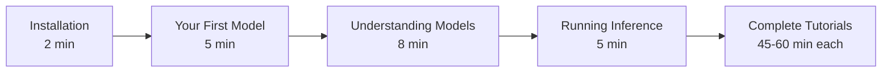
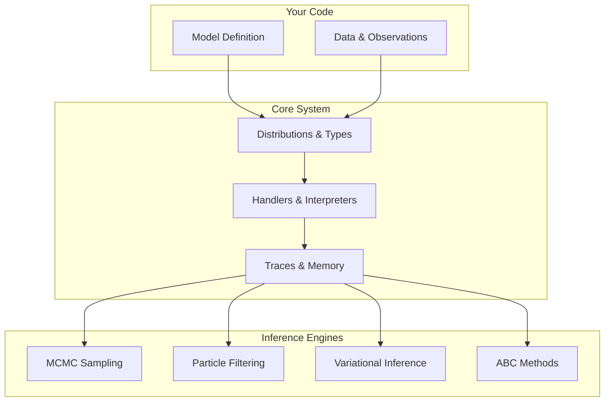

# Getting Started with Fugue

```admonish info title="Contents"
<!-- toc -->
```

Welcome to **Fugue**, a type-safe probabilistic programming library for Rust! This guide will get you building Bayesian models in just 15-20 minutes.

```admonish note
What You'll Learn

By the end of this section, you'll understand:

- How to install and set up Fugue
- Core concepts of probabilistic programming
- How Fugue's type system prevents common errors
- How to run basic Bayesian inference

**Time Investment**: ~15-20 minutes total
```

## Learning Path

We recommend following this path for the best learning experience:



## Quick Start

If you're impatient and want to see Fugue in action immediately:

```bash
# Create a new project
cargo new my_bayesian_project
cd my_bayesian_project

# Add Fugue
cargo add fugue-ppl rand

# Copy our "Hello, Probabilistic World!" example into src/main.rs
# (See Installation section)

# Run it!
cargo run
```

## What Makes Fugue Different?

### 🔒 **Type Safety First**

Unlike other probabilistic programming libraries, Fugue preserves natural types:

```rust,ignore
// In Fugue ✅
let coin: bool = sample(addr!("coin"), Bernoulli::new(0.5).unwrap());
let count: u64 = sample(addr!("events"), Poisson::new(3.0).unwrap());
let category: usize = sample(addr!("choice"), Categorical::uniform(5).unwrap());

// Other PPLs ❌
let coin: f64 = sample("coin", Bernoulli(0.5));  // Returns 0.0 or 1.0
let count: f64 = sample("events", Poisson(3.0)); // Need to cast to int
// let category: f64 = sample("choice", Categorical([...])); // Risky indexing
```

### 🚀 **Zero-Cost Abstractions**

Models compile to efficient code with no runtime overhead.

### 🧰 **Composable Architecture**

Separate model specification from execution strategy through handlers.

### 📊 **Production Ready**

Built-in diagnostics, memory optimization, and error handling.

## Architecture Overview

Fugue's modular design separates concerns cleanly:



## The Big Picture

**Probabilistic Programming** lets you:

1. **Model** uncertainty and relationships in data
2. **Condition** on observations to learn parameters
3. **Infer** posterior distributions and make predictions
4. **Quantify** uncertainty in your conclusions

**Fugue** makes this safe, fast, and composable in Rust.

## Next Steps

Ready to dive in?

```admonish tip
Start Here!

Begin with **[Installation](installation.md)** to get Fugue running on your system.

Already have Rust installed? Skip ahead to **[Your First Model](your-first-model.md)** to start building probabilistic programs right away!
```

After completing Getting Started, explore:

- **[Complete Tutorials](../tutorials/README.md)** - End-to-end projects with real applications
- **[How-To Guides](../how-to/README.md)** - Specific techniques and best practices
- **[API Documentation](../../api/core/README.md)** - Comprehensive technical reference

---

**Prerequisites**: Basic Rust knowledge (variables, functions, `cargo` commands)
