# Running Inference

```admonish info title="Contents"
<!-- toc -->
```

You now know how to build probabilistic models. But models alone don't give you answers - you need **inference** to extract insights from them. Let's explore Fugue's inference algorithms!

```admonish note
Learning Goals

In 5 minutes, you'll understand:
- What inference is and why you need it
- Fugue's main inference algorithms (MCMC, SMC, VI, ABC)
- When to use each algorithm
- How to run inference and interpret results

**Time**: ~5 minutes
```

## What is Inference?

**Inference** is the process of learning about model parameters after seeing data. In Bayesian terms:

$$\text{Posterior} = \frac{\text{Prior} \times \text{Likelihood}}{\text{Evidence}}$$

```mermaid
graph LR
    subgraph "Before Data"
        P["Prior Beliefs<br/>p(theta)"]
    end

    subgraph "Observing Data"
        L["Likelihood<br/>p(y|theta)"]
        D["Data<br/>y₁, y₂, ..."]
    end

    subgraph "After Data"
        Post["Posterior Beliefs<br/>p(theta|y)"]
    end

    P --> Post
    L --> Post
    D --> Post
```



## The Challenge

Most real models don't have analytical solutions. We need **algorithms** to approximate the posterior distribution.

## Fugue's Inference Arsenal

### 1. MCMC (Markov Chain Monte Carlo) 🥇

**Best for**: Most general-purpose Bayesian inference

**How it works**: Generates samples that approximate the posterior distribution

```rust,ignore
use fugue::*;
use rand::rngs::StdRng;
use rand::SeedableRng;

fn coin_bias_model(heads: u64, total: u64) -> Model<f64> {
    sample(addr!("bias"), Beta::new(1.0, 1.0).unwrap())  // Prior
        .bind(move |bias| {
            observe(addr!("heads"), Binomial::new(total, bias).unwrap(), heads)  // Likelihood
                .map(move |_| bias)
        })
}

fn main() {
    let mut rng = StdRng::seed_from_u64(42);

    // Run adaptive MCMC
    let samples = inference::mh::adaptive_mcmc_chain(
        &mut rng,
        || coin_bias_model(7, 10),  // 7 heads out of 10 flips
        1000,  // number of samples
        500,   // warmup samples
    );

    // Extract bias estimates
    let bias_samples: Vec<f64> = samples.iter()
        .filter_map(|(_, trace)| trace.get_f64(&addr!("bias")))
        .collect();

    let mean_bias = bias_samples.iter().sum::<f64>() / bias_samples.len() as f64;
    println!("Estimated bias: {:.3}", mean_bias);

    // Compute 90% credible interval
    let mut sorted = bias_samples.clone();
    sorted.sort_by(|a, b| a.partial_cmp(b).unwrap());
    let lower = sorted[(0.05 * sorted.len() as f64) as usize];
    let upper = sorted[(0.95 * sorted.len() as f64) as usize];
    println!("90% credible interval: [{:.3}, {:.3}]", lower, upper);
}
```

**When to use MCMC:**

- ✅ Want exact posterior samples
- ✅ Moderate number of parameters (< 100)
- ✅ Can afford computation time
- ✅ Model evaluation is reasonably fast

### 2. SMC (Sequential Monte Carlo) 🎯

**Best for**: Sequential data and online learning

**How it works**: Uses particles to approximate the posterior, good for streaming data

```rust,ignore
use fugue::*;
use rand::rngs::StdRng;
use rand::SeedableRng;

fn main() {
    let mut rng = StdRng::seed_from_u64(42);

    // Generate particles from prior
    let particles = inference::smc::smc_prior_particles(
        &mut rng,
        1000,  // number of particles
        || coin_bias_model(7, 10),
    );

    println!("Generated {} particles", particles.len());

    // Compute weighted posterior mean
    let total_weight: f64 = particles.iter().map(|p| p.weight).sum();
    let weighted_mean: f64 = particles.iter()
        .filter_map(|p| {
            p.trace.get_f64(&addr!("bias"))
                .map(|bias| bias * p.weight)
        })
        .sum::<f64>() / total_weight;

    println!("Weighted posterior mean: {:.3}", weighted_mean);

    // Check effective sample size
    let weights: Vec<f64> = particles.iter().map(|p| p.weight).collect();
    let ess = 1.0 / weights.iter().map(|w| w * w).sum::<f64>();
    println!("Effective sample size: {:.1}", ess);
}
```

**When to use SMC:**

- ✅ Sequential/streaming data
- ✅ Online inference needed
- ✅ Many discrete latent variables
- ✅ Want to visualize inference process

### 3. Variational Inference (VI) ⚡

**Best for**: Fast approximate inference with many parameters

**How it works**: Finds the best approximation within a family of simple distributions

```rust,ignore
use fugue::*;
use rand::rngs::StdRng;
use rand::SeedableRng;

fn main() {
    let mut rng = StdRng::seed_from_u64(42);

    // Estimate ELBO (Evidence Lower BOund)
    let elbo = inference::vi::estimate_elbo(
        &mut rng,
        || coin_bias_model(7, 10),
        100,  // number of samples for estimation
    );

    println!("ELBO estimate: {:.3}", elbo);

    // For more sophisticated VI, you'd set up a variational guide
    // and optimize it (see the VI tutorial for details)
}
```

**When to use VI:**

- ✅ Need fast approximate inference
- ✅ Many parameters (> 100)
- ✅ Can accept approximation error
- ✅ Want predictable runtime

### 4. ABC (Approximate Bayesian Computation) 🎲

**Best for**: Models where likelihood is intractable or expensive

**How it works**: Simulation-based inference using distance between simulated and observed data

```rust,ignore
use fugue::*;
use rand::rngs::StdRng;
use rand::SeedableRng;

fn main() {
    let mut rng = StdRng::seed_from_u64(42);

    // ABC with summary statistics
    let observed_summary = 0.7; // 7/10 = 0.7 success rate
    let samples = inference::abc::abc_scalar_summary(
        &mut rng,
        || sample(addr!("bias"), Beta::new(1.0, 1.0).unwrap()), // Prior only
        |trace| trace.get_f64(&addr!("bias")).unwrap_or(0.0), // Extract bias
        observed_summary,  // Target summary statistic
        0.1,              // Tolerance
        1000,             // Max samples to try
    );

    println!("ABC accepted {} samples", samples.len());

    if !samples.is_empty() {
        let abc_estimates: Vec<f64> = samples.iter()
            .filter_map(|trace| trace.get_f64(&addr!("bias")))
            .collect();
        let abc_mean = abc_estimates.iter().sum::<f64>() / abc_estimates.len() as f64;
        println!("ABC estimated bias: {:.3}", abc_mean);
    }
}
```

**When to use ABC:**

- ✅ Likelihood is intractable or very expensive
- ✅ Can simulate from the model easily
- ✅ Have good summary statistics
- ✅ Can tolerate approximation error

## Algorithm Comparison

| Method   | Speed     | Accuracy       | Use Case                                 |
| -------- | --------- | -------------- | ---------------------------------------- |
| **MCMC** | 🐌 Slow   | 🎯 Exact       | General-purpose, exact inference         |
| **SMC**  | 🏃 Medium | 🎯 Good        | Sequential data, online learning         |
| **VI**   | 🚀 Fast   | ⚠️ Approximate | Large models, fast approximate inference |
| **ABC**  | 🐌 Slow   | ⚠️ Approximate | Intractable likelihoods                  |

## Practical Inference Workflow

Here's a typical workflow for real inference:

```rust,ignore
use fugue::*;
use rand::rngs::StdRng;
use rand::SeedableRng;

fn inference_workflow() {
    let mut rng = StdRng::seed_from_u64(42);

    // 1. Define your model
    let model = || coin_bias_model(17, 25);  // 17 heads out of 25 flips

    // 2. Run inference (adaptive MCMC is often a good default)
    let samples = inference::mh::adaptive_mcmc_chain(
        &mut rng,
        model,
        2000,  // samples
        1000,  // warmup
    );

    // 3. Extract parameter values
    let bias_samples: Vec<f64> = samples.iter()
        .filter_map(|(_, trace)| trace.get_f64(&addr!("bias")))
        .collect();

    // 4. Compute summary statistics
    let mean = bias_samples.iter().sum::<f64>() / bias_samples.len() as f64;
    let variance = bias_samples.iter()
        .map(|&x| (x - mean).powi(2))
        .sum::<f64>() / (bias_samples.len() - 1) as f64;
    let std_dev = variance.sqrt();

    println!("Posterior Summary:");
    println!("  Mean: {:.3}", mean);
    println!("  Std Dev: {:.3}", std_dev);

    // 5. Check convergence (effective sample size)
    let ess = inference::diagnostics::effective_sample_size(&bias_samples);
    println!("  Effective Sample Size: {:.1}", ess);

    if ess > 100.0 {
        println!("  ✅ Good mixing!");
    } else {
        println!("  ⚠️ Poor mixing - consider more samples");
    }

    // 6. Make predictions
    println!("\nPredictions:");
    println!("  P(bias > 0.5) = {:.2}",
        bias_samples.iter().filter(|&&b| b > 0.5).count() as f64 / bias_samples.len() as f64);
}
```

## Choosing the Right Algorithm

### Decision Tree


### Rules of Thumb

1. **Start with MCMC** for most problems - it's the most general
2. **Use SMC** if you have sequential/streaming data
3. **Use VI** if you need speed and can accept approximation
4. **Use ABC** only when likelihood is truly intractable

## Key Takeaways

You now know how to extract insights from your models:

✅ **Inference Purpose**: Learn parameters from data using Bayesian updating  
✅ **Algorithm Options**: MCMC, SMC, VI, ABC each have their strengths  
✅ **Practical Workflow**: Define model → Run inference → Extract parameters → Check diagnostics  
✅ **Algorithm Selection**: Choose based on problem characteristics and requirements

## What's Next?

You've completed Getting Started! 🎉

```admonish tip
Ready for Real Applications?

**Complete Tutorials** - End-to-end projects with real-world applications:
- **[Bayesian Coin Flip](../tutorials/bayesian-coin-flip.md)** - Complete analysis workflow
- **[Linear Regression](../tutorials/linear-regression.md)** - Advanced modeling and diagnostics
- **[Mixture Models](../tutorials/mixture-models.md)** - Latent variable models

**How-To Guides** - Specific techniques and best practices:
- **[Working with Distributions](../how-to/working-with-distributions.md)** - Master all distribution types
- **[Debugging Models](../how-to/debugging-models.md)** - Troubleshoot inference problems
```

---

**Time**: ~5 minutes • **Next**: [Complete Tutorials](../tutorials/README.md)
