# Understanding Models

Now that you can build basic models, let's understand the key concepts that make Fugue powerful. This will give you the mental framework to build sophisticated probabilistic programs.

```admonish note
Learning Goals

In 8 minutes, you'll understand:
- Why models are separate from execution
- How addressing enables advanced inference  
- The monadic structure and composition patterns
- When to use `map` vs `bind` vs `pure`

**Time**: ~8 minutes
```

## The Big Picture: Models vs Execution

One of Fugue's key insights is **separating model specification from execution**:


**Why this matters**: The same model can be executed in different ways:

- **Forward sampling** (generate data from priors)
- **Conditioning** (inference given observations)
- **Replay** (MCMC proposals)
- **Scoring** (compute probabilities)

## Addresses: The Key to Advanced Inference

Every `sample` and `observe` site needs a **unique address**:

```rust,ignore
use fugue::*;

// Good addressing ✅
let model = sample(addr!("mu"), Normal::new(0.0, 1.0).unwrap())
    .bind(|mu| sample(addr!("sigma"), LogNormal::new(0.0, 0.5).unwrap())
        .bind(move |sigma| {
            observe(addr!("y1"), Normal::new(mu, sigma).unwrap(), 2.1);
            observe(addr!("y2"), Normal::new(mu, sigma).unwrap(), 1.9);
            pure((mu, sigma))
        }));
```

```admonish note
Why Addresses Matter

Addresses enable advanced inference by allowing algorithms to:
- **Identify** which random choices to modify (MCMC)
- **Replay** specific execution paths  
- **Condition** on subsets of variables
- **Debug** model behavior by inspecting traces

Without addresses, you can only do forward sampling!
```

### Addressing Patterns

**Simple names** for scalar parameters:

```rust,ignore
let mu = sample(addr!("mu"), Normal::new(0.0, 1.0).unwrap());
```

**Indexed addresses** for collections:

```rust,ignore
for i in 0..10 {
    let x_i = sample(addr!("x", i), Normal::new(mu, 1.0).unwrap());
}
```

**Scoped addresses** for hierarchical models:

```rust,ignore
let encoder_z = sample(scoped_addr!("encoder", "z"), dist);
let decoder_z = sample(scoped_addr!("decoder", "z"), dist);
```

````admonish warning

Address Anti-Patterns
```rust
// ❌ DON'T: Random or non-deterministic addresses  
let addr = format!("param_{}", rng.gen::<u32>());  // NEVER!

// ❌ DON'T: Reuse addresses for different purposes
sample(addr!("x"), Normal::new(0.0, 1.0).unwrap());
sample(addr!("x"), Bernoulli::new(0.5).unwrap());  // Collision!

// ❌ DON'T: Missing addresses in loops
for i in 0..10 {
    sample(addr!("x"), Normal::new(0.0, 1.0).unwrap());  // All same address!
}
```
````

## Model Composition: The Monadic Structure

Fugue models follow a **monadic pattern** that makes complex models composable:

### Three Fundamental Operations

```mermaid
graph TB
    subgraph "Model Building Blocks"
        P[pure: A → Model⟨A⟩<br/>Lift values into models]
        M[map: Model⟨A⟩ → ⟨A → B⟩ → Model⟨B⟩<br/>Transform outputs]  
        B[bind: Model⟨A⟩ → ⟨A → Model⟨B⟩⟩ → Model⟨B⟩<br/>Chain dependent computations]
    end
```



### `pure` - Lift Values

Use `pure` to inject deterministic values into the probabilistic context:

```rust,ignore
use fugue::*;

// Lift a constant
let constant = pure(42.0);

// Lift computed values
let computed = pure(data.iter().sum::<f64>() / data.len() as f64);
```

### `map` - Transform Outputs

Use `map` when you want to transform the result **without adding randomness**:

```rust,ignore
use fugue::*;

// Transform a single sample
let squared = sample(addr!("x"), Normal::new(0.0, 1.0).unwrap())
    .map(|x| x * x);

// Combine multiple values  
let sum = zip(
    sample(addr!("a"), Normal::new(0.0, 1.0).unwrap()),
    sample(addr!("b"), Normal::new(0.0, 1.0).unwrap())
).map(|(a, b)| a + b);
```

### `bind` - Chain Dependent Computations

Use `bind` when the **next random choice depends on a previous one**:

```rust,ignore
use fugue::*;

// Dependent sampling: variance depends on mean
let hierarchical = sample(addr!("mu"), Normal::new(0.0, 1.0).unwrap())
    .bind(|mu| sample(addr!("sigma"), LogNormal::new(mu.abs().ln(), 0.1).unwrap())
        .bind(move |sigma| sample(addr!("y"), Normal::new(mu, sigma).unwrap())));

// Conditional branching: choice affects distribution  
let mixture = sample(addr!("component"), Bernoulli::new(0.5).unwrap())
    .bind(|component| {
        if component {
            sample(addr!("value"), Normal::new(-2.0, 1.0).unwrap())
        } else {
            sample(addr!("value"), Normal::new(2.0, 1.0).unwrap())  
        }
    });
```

```admonish tip
When to Use What?

- **`pure`** - Inject constants or computed values
- **`map`** - Transform outputs, no new randomness
- **`bind`** - Next step depends on previous random result

**Rule of thumb**: Use the least powerful operation that works!
```

## Advanced Composition Patterns

### Building Collections

```rust,ignore
use fugue::*;

// Fixed-size collection
let samples = traverse_vec((0..10).collect(), |i| {
    sample(addr!("x", i), Normal::new(0.0, 1.0).unwrap())
});

// Data-driven collection
let observations = traverse_vec(data, |datum| {
    observe(addr!("y", datum.id), Normal::new(datum.mu, 1.0).unwrap(), datum.value)
});
```

### Conditional Models

```rust,ignore
use fugue::*;

fn model_selection(data: &[f64]) -> Model<String> {
    sample(addr!("use_robust"), Bernoulli::new(0.2).unwrap())
        .bind(|use_robust| {
            if use_robust {
                // Robust model with t-distribution
                sample(addr!("df"), LogNormal::new(1.0, 0.5).unwrap())
                    .bind(|df| {
                        // Hypothetical t-distribution sampling
                        pure("robust".to_string())
                    })
            } else {
                // Standard normal model
                sample(addr!("mu"), Normal::new(0.0, 1.0).unwrap())
                    .map(|_| "normal".to_string())
            }
        })
}
```

### Hierarchical Structure

```rust,ignore
use fugue::*;

fn hierarchical_model(groups: Vec<Vec<f64>>) -> Model<Vec<f64>> {
    // Global hyperparameters
    sample(addr!("global_mu"), Normal::new(0.0, 2.0).unwrap())
        .bind(|global_mu| {
            sample(addr!("global_sigma"), LogNormal::new(0.0, 0.5).unwrap())
                .bind(move |global_sigma| {
                    // Group-level parameters  
                    traverse_vec(groups.into_iter().enumerate().collect(), move |(g, data)| {
                        sample(addr!("group_mu", g), Normal::new(global_mu, global_sigma).unwrap())
                            .bind(move |group_mu| {
                                // Individual observations
                                traverse_vec(data.into_iter().enumerate().collect(), move |(i, y)| {
                                    observe(addr!("y", g, i), Normal::new(group_mu, 1.0).unwrap(), y)
                                }).map(move |_| group_mu)
                            })
                    })
                })
        })
}
```

## Mental Models for Success

### Think in Terms of **Generative Stories**

Ask yourself: "How could this data have been generated?"

```rust,ignore
// Story: "Each person has a skill level, and their performance 
//         on each task reflects that skill plus task-specific noise"

let model = sample(addr!("skill"), Normal::new(100.0, 15.0).unwrap())  // Person's skill
    .bind(|skill| {
        traverse_vec(tasks, move |task| {
            let difficulty = task.difficulty;
            let expected_score = skill - difficulty;
            observe(addr!("score", task.id), Normal::new(expected_score, 5.0).unwrap(), task.actual_score)
        }).map(move |_| skill)
    });
```

### Separate **What** from **How**

- **What**: Model describes relationships and distributions
- **How**: Handler determines execution strategy (sampling, inference, etc.)

```rust,ignore
// The SAME model...
let model = build_regression_model(&data);

// Can be executed different ways:
let (sample, _) = run(PriorHandler { /*...*/ }, model.clone());      // Forward sampling
let (_, scored_trace) = run(ScoreGivenTrace { /*...*/ }, model.clone()); // Compute likelihood  
let mcmc_chain = adaptive_mcmc_chain(rng, || model.clone(), 1000, 500); // MCMC inference
```

## Key Takeaways

You now understand the foundational concepts:

✅ **Separation of Concerns**: Models describe computations, handlers execute them  
✅ **Addressing Strategy**: Unique, stable addresses enable advanced inference  
✅ **Monadic Composition**: `pure`, `map`, `bind` build complex models from simple parts  
✅ **Compositional Patterns**: Collections, conditionals, and hierarchical structures  
✅ **Generative Thinking**: Model the data generation process

## What's Next?

You have the conceptual foundation to build sophisticated models! 🎉

```admonish tip
Next Steps

**Continue Getting Started:**
- **[Running Inference](basic-inference.md)** - Learn to extract insights from your models

**Ready for Real Projects:**
- **[Bayesian Coin Flip Tutorial](../tutorials/bayesian-coin-flip.md)** - Complete end-to-end analysis
- **[Linear Regression Tutorial](../tutorials/linear-regression.md)** - Advanced modeling techniques
```

---

**Time**: ~8 minutes • **Next**: [Running Inference](basic-inference.md)
