# How-To Guides

```admonish info title="Contents"
<!-- toc -->
```

The How-To guides provide **practical, task-oriented instructions** for accomplishing specific goals with Fugue. Unlike tutorials that teach concepts step-by-step, these guides assume you understand the basics and want to solve particular problems efficiently.

## Guide Overview

These guides are designed to be **example-first** and **immediately actionable**. Each guide includes comprehensive, executable code examples that serve as the canonical source of truth for the patterns they demonstrate.

### 📊 [Working with Distributions](./working-with-distributions.md)

**When to use**: You need to understand Fugue's type-safe distribution system, parameter validation, or probability calculations.

**What you'll learn**:

- Type-safe distribution usage (`bool`, `u64`, `usize`, `f64` return types)
- Parameter validation and error handling
- Continuous vs discrete distribution patterns
- Categorical distributions and safe indexing
- Distribution composition and practical modeling
- Probability calculations and testing strategies

**Key patterns**: Natural return types, parameter validation, distribution testing

---

### 🏗️ [Building Complex Models](./building-complex-models.md)

**When to use**: You want to compose sophisticated probabilistic models using Fugue's macro system and advanced patterns.

**What you'll learn**:

- `prob!` macro for do-notation style probabilistic programming
- `plate!` macro for vectorized operations and array processing
- `scoped_addr!` macro for hierarchical address management
- Model composition and sequential dependencies
- Hierarchical modeling patterns
- Bayesian linear regression and mixture models

**Key patterns**: Monadic composition, vectorization, hierarchical structure

---

### ⚡ [Optimizing Performance](./optimizing-performance.md)

**When to use**: Your models need to run efficiently in production or handle large-scale inference workloads.

**What you'll learn**:

- Memory pooling with `TracePool` and `PooledPriorHandler`
- Numerical stability with log-space computations
- Efficient trace construction with `TraceBuilder`
- Copy-on-write traces for MCMC optimization
- Batch processing patterns
- Performance monitoring and measurement

**Key patterns**: Memory optimization, numerical stability, batch processing

---

### 🔍 [Debugging Models](./debugging-models.md)

**When to use**: Your probabilistic models aren't behaving as expected, or you need to diagnose issues in inference.

**What you'll learn**:

- Comprehensive trace inspection and analysis
- Type-safe value access with proper error handling
- Model validation against analytical solutions
- Safe vs strict handler usage for error resilience
- MCMC diagnostics and convergence assessment
- Performance and memory debugging techniques

**Key patterns**: Trace analysis, validation testing, diagnostic metrics

---

### 🎛️ [Custom Handlers](./custom-handlers.md)

**When to use**: You need to extend Fugue's execution model with custom behavior, logging, or specialized inference algorithms.

**What you'll learn**:

- Complete `Handler` trait implementation
- Decorator pattern for cross-cutting concerns
- Stateful handlers for analytics and monitoring
- Conditional filtering and value modification
- Performance monitoring integration
- Custom inference algorithms (MCMC-like patterns)
- Handler composition and chaining

**Key patterns**: Algebraic effects, decorator composition, custom inference

---

### 🚀 [Production Deployment](./production-deployment.md)

**When to use**: You're deploying probabilistic models to production environments and need reliability, monitoring, and operational excellence.

**What you'll learn**:

- Error handling and graceful degradation patterns
- Circuit breaker implementation for fault tolerance
- Configuration management for multiple environments
- Comprehensive metrics and Prometheus integration
- Automated health checks and system validation
- Input validation and security best practices
- Deployment strategies (blue-green, canary, rolling)

**Key patterns**: Fault tolerance, observability, operational readiness

---

## How to Use These Guides

### 🎯 **Task-Oriented Approach**

Each guide focuses on **solving specific problems**:

- **Need to understand distributions?** → Start with "Working with Distributions"
- **Building complex models?** → "Building Complex Models" has the macros and patterns
- **Performance issues?** → "Optimizing Performance" covers memory and numerical techniques
- **Models not working?** → "Debugging Models" provides diagnostic approaches
- **Need custom behavior?** → "Custom Handlers" shows how to extend the system
- **Going to production?** → "Production Deployment" covers operational concerns

### 📚 **Progressive Complexity**

The guides are ordered by increasing complexity:

```mermaid
graph TD
    A["📊 Working with<br/>Distributions"] --> B["🏗️ Building Complex<br/>Models"]
    B --> C["⚡ Optimizing<br/>Performance"]
    A --> D["🚀 Production<br/>Deployment"]
    E["🔍 Debugging<br/>Models"] --> F["🎛️ Custom<br/>Handlers"]
    F --> D
    C --> D
```



- **Start** with distributions and model building
- **Add** performance optimization when needed
- **Use** debugging when things go wrong
- **Extend** with custom handlers for specialized needs
- **Deploy** with production patterns for real applications

### 🔄 **Cross-References**

Guides frequently reference each other:

- **Performance optimization** builds on complex models
- **Debugging** techniques apply to all model types
- **Custom handlers** can incorporate performance patterns
- **Production deployment** uses patterns from all previous guides

### 📝 **Example-First Philosophy**

Every guide follows the same structure:

1. **Executable examples** as the source of truth
2. **Comprehensive code snippets** with anchor tags
3. **Practical explanations** of when and how to use patterns
4. **Testing strategies** to verify correctness
5. **Best practices** learned from real-world usage

## Code Examples

All code examples in these guides are:

- ✅ **Executable**: Run with `cargo run --example <guide_name>`
- ✅ **Tested**: Verified with `cargo test --examples`
- ✅ **Documented**: Included via `{{#include}}` from example files
- ✅ **Comprehensive**: Cover real-world usage patterns
- ✅ **Type-Safe**: Leverage Rust's type system throughout

## Quick Reference

| Task                     | Guide                                                         | Key Patterns                 |
| ------------------------ | ------------------------------------------------------------- | ---------------------------- |
| Understand distributions | [Working with Distributions](./working-with-distributions.md) | Type safety, validation      |
| Build complex models     | [Building Complex Models](./building-complex-models.md)       | Macros, composition          |
| Optimize performance     | [Optimizing Performance](./optimizing-performance.md)         | Memory pooling, numerics     |
| Debug model issues       | [Debugging Models](./debugging-models.md)                     | Trace analysis, diagnostics  |
| Extend functionality     | [Custom Handlers](./custom-handlers.md)                       | Handler patterns, decorators |
| Deploy to production     | [Production Deployment](./production-deployment.md)           | Fault tolerance, monitoring  |

## Integration with Other Documentation

### 🚀 **Getting Started** → **How-To Guides**

After completing the Getting Started tutorials, use these guides to solve specific problems in your own projects.

### 📖 **How-To Guides** → **Tutorials**

For deeper conceptual understanding, see the Tutorials section which provides comprehensive examples of complete applications.

### 🔧 **How-To Guides** → **API Reference**

For detailed API documentation, consult the API Reference section for specific functions and types mentioned in these guides.

## Contributing

When adding new How-To guides:

1. **Create executable examples** first in `examples/`
2. **Use anchor tags** to mark code sections for inclusion
3. **Write the guide** using `{{#include}}` for all code snippets
4. **Test thoroughly** with both `cargo test` and `mdbook test`
5. **Update this README** with the new guide information

Each guide should solve **specific, practical problems** that users commonly encounter when working with Fugue in real applications.
