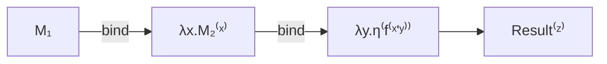
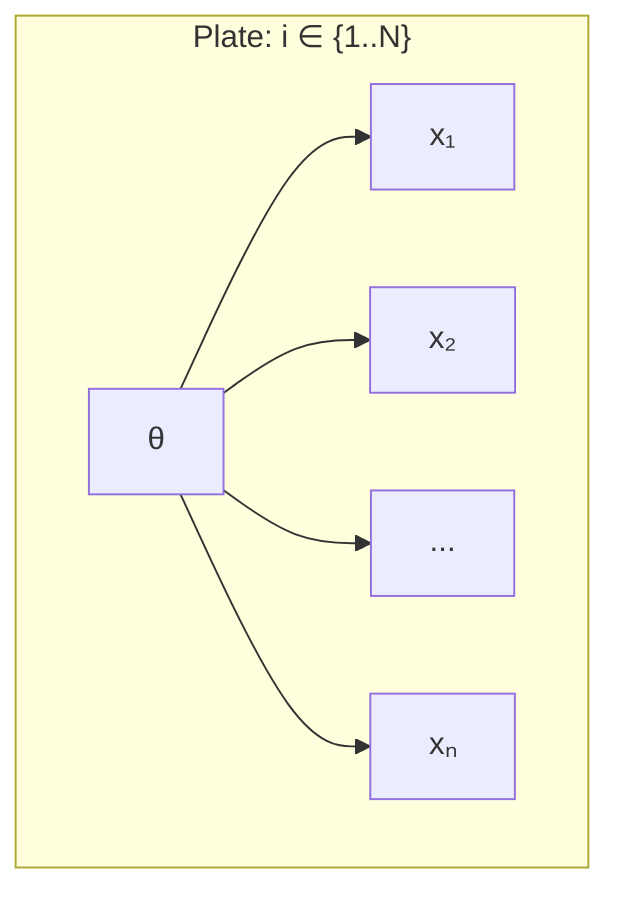
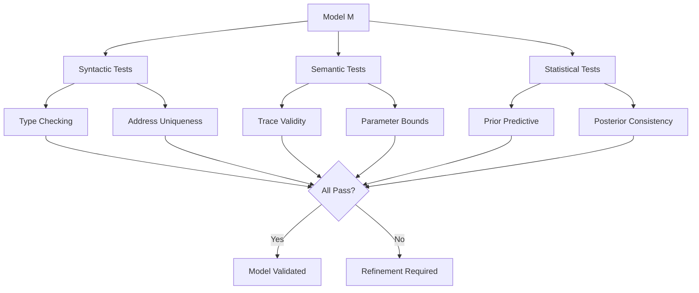

# Building Complex Models

```admonish info title="Contents"
<!-- toc -->
```

Fugue's compositional architecture is grounded in **category theory** and **monadic structures**, enabling the systematic construction of sophisticated probabilistic models through principled composition operators. This guide explores the mathematical foundations and practical applications of Fugue's macro system for building complex probabilistic programs.

```admonish info title="Categorical Foundations"
Fugue models form a **monad** $\mathcal{M}$ with:
- **Unit**: $\eta : A \rightarrow \mathcal{M}[A]$ via `pure()`
- **Bind**: $\mu : \mathcal{M}[\mathcal{M}[A]] \rightarrow \mathcal{M}[A]$ via `prob!` macro
- **Composition**: Satisfies associativity and unit laws

This categorical structure ensures that model composition is **mathematically sound** and **computationally tractable**.
```

## Do-Notation with `prob!`

The `prob!` macro implements **monadic do-notation** for probabilistic computations, providing a natural syntax for sequential dependence. Formally, it translates:

$$
\begin{align}
\texttt{prob!} \{ &\\
&x \leftarrow \mathcal{M}_1 \\
&y \leftarrow \mathcal{M}_2(x) \\
&\text{pure}(f(x,y))
\end{align} \}
$$

into the monadic composition $\mathcal{M}_1 \gg\!\!= \lambda x. \mathcal{M}_2(x) \gg\!\!= \lambda y. \eta(f(x,y))$:



```rust,ignore
{{#include ../../../examples/building_complex_models.rs:basic_prob_macro}}
```

**Key Features:**

- `<-` for probabilistic binding (monadic bind)
- `=` for regular variable assignment
- `pure()` to lift deterministic values
- Natural control flow without callback nesting

```admonish tip
Use `prob!` when you need to chain multiple probabilistic operations. It's especially powerful for dependent sampling where later variables depend on earlier ones.
```

## Vectorized Operations with `plate!`

The `plate!` macro implements **plate notation** from graphical models, representing **conditionally independent replications**. Given $N$ independent observations, plate notation expresses:

$$P(\mathbf{x} \mid \theta) = \prod_{i=1}^N P(x_i \mid \theta)$$

The computational graph shows the independence structure:



```admonish important title="Conditional Independence"
Plate notation encodes the **conditional independence assumption**: $x_i \perp x_j \mid \theta$ for $i \neq j$. This factorization enables efficient likelihood computation and parallel processing.
```

```rust,ignore
{{#include ../../../examples/building_complex_models.rs:plate_notation_basic}}
```

**Benefits:**

- Automatic address indexing prevents conflicts
- Natural iteration over data structures
- Vectorized likelihood computations
- Clear intent for independent operations

```admonish note
The `plate!` macro automatically appends indices to addresses, so `addr!("sample", i)` becomes unique for each iteration without manual address management.
```

## Hierarchical Address Management

Complex models require **systematic parameter organization** following a **tree-structured address space**. The address hierarchy $\mathcal{A}$ forms a **prefix tree** where each node represents a scope:

$$\mathcal{A} = \{a_1, a_1.a_2, a_1.a_2.a_3, \ldots\}$$

This hierarchical structure prevents **address collisions** and enables **efficient parameter lookup**:

```admonish note title="Address Space Theory"
The hierarchical address space forms a **partially ordered set** $(A, \preceq)$ where $a \preceq b$ if $a$ is a prefix of $b$. This structure ensures **unique identification** of parameters while maintaining **compositional semantics**.
```

```rust,ignore
{{#include ../../../examples/building_complex_models.rs:hierarchical_scoping}}
```

**Address Strategy:**

- `scoped_addr!` prevents parameter name collisions
- Hierarchical structure mirrors model dependencies
- Systematic naming aids debugging and introspection
- Indices enable parameter arrays

## Sequential Dependencies

**Sequential models** exhibit **temporal dependence** where the state at time $t$ depends on previous states. This creates a **Markov chain** structure:

$$P(x_{1:T}) = P(x_1) \prod_{t=2}^T P(x_t \mid x_{t-1})$$

The computational challenge lies in maintaining **state consistency** while enabling **efficient inference**:

```rust,ignore
{{#include ../../../examples/building_complex_models.rs:sequential_dependencies}}
```

**Patterns:**

- Explicit state threading through computations
- Observation conditioning at each time step
- Autoregressive dependencies
- Mixed probabilistic and deterministic updates

```admonish warning
Sequential models can create large traces. Consider using memory-efficient handlers for long sequences.
```

## Composable Model Functions

Build reusable model components:

```rust,ignore
{{#include ../../../examples/building_complex_models.rs:model_composition}}
```

**Design Principles:**

- Functions return `Model<T>` for composability
- Pattern matching enables model selection
- Pure functions for deterministic transformations
- Higher-order functions for model templates

## Advanced Address Patterns

For large-scale models like neural networks:

```rust,ignore
{{#include ../../../examples/building_complex_models.rs:address_management}}
```

**Scaling Strategies:**

- Systematic parameter naming conventions
- Multi-level scoping for complex architectures
- Consistent indexing schemes
- Hierarchical parameter organization

## Mixing Styles for Flexibility

Combine macros with traditional function composition:

```rust,ignore
{{#include ../../../examples/building_complex_models.rs:mixture_models}}
```

**Best Practices:**

- Use functions for reusable components
- Use macros for readable composition
- Separate concerns (priors, likelihood, observations)
- Document parameter dependencies

## Real-World Applications

### Bayesian Linear Regression

**Bayesian linear regression** models the relationship $\mathbf{y} = \mathbf{X}\boldsymbol{\beta} + \boldsymbol{\epsilon}$ with uncertainty quantification:

$$\begin{align}
\boldsymbol{\beta} &\sim \mathcal{N}(\boldsymbol{\mu}_0, \boldsymbol{\Sigma}_0) \\
\sigma^2 &\sim \text{InverseGamma}(\alpha, \beta) \\
y_i \mid \mathbf{x}_i, \boldsymbol{\beta}, \sigma^2 &\sim \mathcal{N}(\mathbf{x}_i^T\boldsymbol{\beta}, \sigma^2)
\end{align}$$

```rust,ignore
{{#include ../../../examples/building_complex_models.rs:bayesian_regression}}
```

### Hierarchical Clustering  

**Hierarchical models** implement **partial pooling** through multi-level parameter structures. The hierarchy enables **information sharing** across groups while maintaining **group-specific effects**:

$$\begin{align}
\mu_{\text{pop}} &\sim \mathcal{N}(0, \tau_{\text{pop}}^2) \\
\sigma_{\text{group}} &\sim \text{HalfCauchy}(\sigma_0) \\
\mu_j \mid \mu_{\text{pop}}, \sigma_{\text{group}} &\sim \mathcal{N}(\mu_{\text{pop}}, \sigma_{\text{group}}^2) \\
y_{ij} \mid \mu_j, \sigma_j &\sim \mathcal{N}(\mu_j, \sigma_j^2)
\end{align}$$

```rust,ignore
{{#include ../../../examples/building_complex_models.rs:multilevel_hierarchy}}
```

### State Space Models

Sequential latent variable models:

```rust,ignore
{{#include ../../../examples/building_complex_models.rs:sequential_dependencies}}
```

## Multi-Level Hierarchies

Population → Groups → Individuals structure:

```rust,ignore
{{#include ../../../examples/building_complex_models.rs:multilevel_hierarchy}}
```

**Key Features:**

- Partial pooling across hierarchy levels
- Systematic parameter organization
- Natural shrinkage properties
- Scalable to large group structures

## Configurable Model Factories

Dynamic model construction:

```rust,ignore
{{#include ../../../examples/building_complex_models.rs:model_composition}}
```

**Flexibility Benefits:**

- Runtime model configuration
- Conditional model components
- A/B testing different model structures
- Experiment management

## Testing Complex Models

**Model validation** requires **systematic testing** across multiple dimensions: **syntactic correctness**, **semantic validity**, and **statistical consistency**:



**Testing Hierarchy**:
1. **Unit Tests**: Individual model components
2. **Integration Tests**: Model composition correctness  
3. **Statistical Tests**: Distributional properties
4. **Performance Tests**: Scalability and efficiency

```rust,ignore
{{#include ../../../examples/building_complex_models.rs:composition_testing}}
```

## Common Pitfalls

1. **Address Conflicts**: Use `scoped_addr!` for complex models
2. **Memory Usage**: Large plate operations can create big traces
3. **Sequential Dependencies**: Explicit state management required
4. **Type Inference**: Sometimes need explicit type annotations

## Performance Considerations

- **Plate Size**: Very large plates may exceed memory limits
- **Nesting Depth**: Deep hierarchies increase trace size
- **Address Complexity**: Simple addresses are more efficient
- **Function Composition**: Pure functions are optimized away

## Next Steps

- **Optimization**: See [Optimizing Performance](./optimizing-performance.md) for efficiency techniques
- **Debugging**: Check [Debugging Models](./debugging-models.md) for troubleshooting complex models
- **Production**: Learn [Production Deployment](./production-deployment.md) for scaling

```admonish success title="Compositional Excellence"  
**Building complex models** successfully combines **mathematical rigor** with **practical implementation**:

1. **Categorical Foundations**: Monadic structure ensures compositionality
2. **Systematic Organization**: Hierarchical addressing prevents conflicts
3. **Efficient Computation**: Plate notation enables vectorization
4. **Validation Framework**: Multi-level testing ensures correctness

These patterns transform complex probabilistic modeling from **ad-hoc construction** into **principled composition**.
```

Complex models become **tractable and maintainable** through systematic composition, principled addressing, and mathematical abstraction. Fugue's macro system provides elegant syntactic sugar while preserving the underlying **categorical structure** that enables powerful inference algorithms and compositional reasoning about probabilistic programs.
