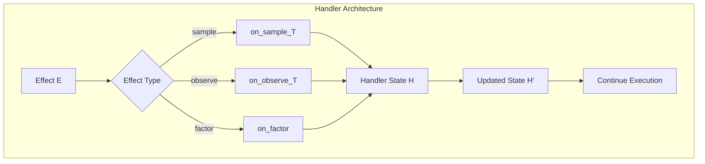
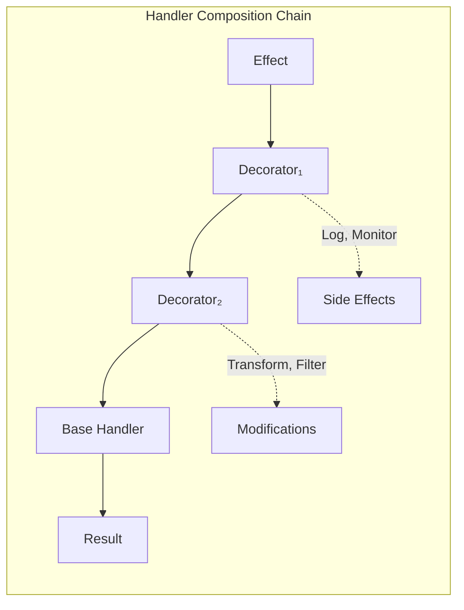
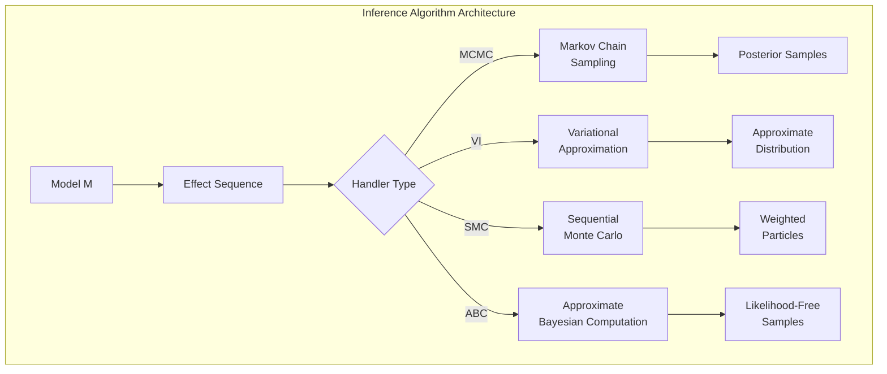
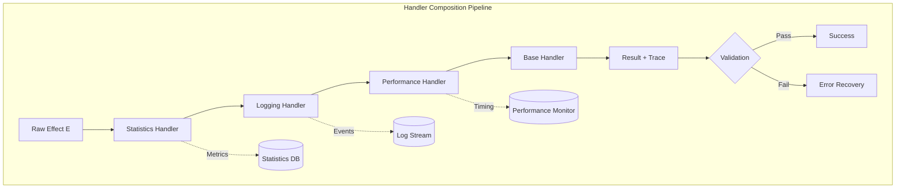

# Custom Handlers

```admonish info title="Contents"
<!-- toc -->
```

Fugue's handler system is grounded in **algebraic effect theory**, providing a principled approach to **effect interpretation** and **computational extension**. Custom handlers enable specialized execution strategies, monitoring systems, and novel inference algorithms through systematic **effect handling** and **handler composition**.

```admonish info title="Algebraic Effects Foundation"
Fugue models effects through an **algebra** $(\mathcal{E}, \Sigma)$ where:
- $\mathcal{E}$ is the set of **effect operations** (sample, observe, factor)
- $\Sigma$ is the **signature** defining operation types
- **Handlers** provide **interpretations** $h: \mathcal{E} \to \mathcal{C}$ into a **carrier** $\mathcal{C}$

This algebraic structure ensures **compositional semantics** and **modular interpretation**.
```

## Understanding the Handler Trait

The `Handler` trait provides the **algebraic signature** for probabilistic effects. Each method represents an **effect operation** with its **semantic interpretation**:



**Effect Algebra**: Each handler interprets the **probabilistic effect signature**:

$$\begin{align}
\text{sample} &: \text{Dist}[T] \to T \\
\text{observe} &: \text{Dist}[T] \times T \to \text{Unit} \\
\text{factor} &: \mathbb{R} \to \text{Unit}
\end{align}$$

where the **carrier type** varies by handler implementation.

```rust,ignore
{{#include ../../../examples/custom_handlers.rs:basic_custom_handler}}
```

**Handler Responsibilities:**

- **Type-specific sampling**: Handle `f64`, `bool`, `u64`, and `usize` distributions appropriately
- **Observation handling**: Process observed values and update likelihood components
- **Factor management**: Accumulate constraint and penalty terms
- **Trace construction**: Build execution traces with choices and log-weights
- **Resource cleanup**: Properly finalize and return traces

## Decorator Pattern for Handler Composition

The **decorator pattern** implements **handler composition** through **effect forwarding** with **computational augmentation**. This pattern follows the mathematical principle of **function composition**:

$$(f \circ g)(x) = f(g(x))$$

Applied to handlers: $h_{\text{decorated}} = h_{\text{decorator}} \circ h_{\text{base}}$



**Compositional Properties**:
- **Associativity**: $(h_1 \circ h_2) \circ h_3 = h_1 \circ (h_2 \circ h_3)$
- **Identity**: $\text{id} \circ h = h \circ \text{id} = h$
- **Effect Preservation**: Core semantics remain unchanged

```rust,ignore
{{#include ../../../examples/custom_handlers.rs:logging_handler}}
```

**Decorator Benefits:**

- Non-invasive functionality addition
- Composable and reusable components
- Separation of concerns between core logic and cross-cutting features
- Easy to enable/disable features dynamically

## Stateful Handlers for Analytics

Handlers can maintain state to accumulate statistics and monitor model behavior:

```rust,ignore
{{#include ../../../examples/custom_handlers.rs:statistics_handler}}
```

**Analytics Applications:**

- Model complexity analysis (parameter counts by type)
- Execution profiling and bottleneck identification
- Parameter range monitoring for numerical stability
- Distribution usage patterns for optimization

## Conditional and Filtering Handlers

Implement business logic and constraints through conditional handling:

```rust,ignore
{{#include ../../../examples/custom_handlers.rs:filtering_handler}}
```

**Filtering Use Cases:**

- Parameter clamping for numerical stability
- Outlier detection and handling
- Domain-specific constraints enforcement
- Robustness testing through perturbations

## Performance Monitoring

Track and optimize computational characteristics with monitoring handlers:

```rust,ignore
{{#include ../../../examples/custom_handlers.rs:performance_handler}}
```

**Performance Insights:**

- Operation timing and bottleneck identification
- Memory allocation patterns
- Execution hotspots and optimization opportunities
- Scalability analysis for production deployment

## Custom Inference Algorithms  

**Custom inference algorithms** extend Fugue's **effect interpretation** to implement novel **sampling strategies** and **approximate inference** methods. Each algorithm provides a unique **semantic mapping** from probabilistic effects to computational actions:



**Algorithm Design Principles**:

1. **Effect Consistency**: $\forall e \in \mathcal{E}: h(e)$ preserves probabilistic semantics
2. **Convergence Guarantees**: Algorithm converges to target distribution under regularity conditions  
3. **Computational Tractability**: Runtime complexity is polynomial in problem dimensions
4. **Statistical Efficiency**: Effective sample size scales appropriately with computational cost

**Mathematical Framework**: Each inference handler implements a **stochastic operator** $T: \mathcal{P}(\Theta) \to \mathcal{P}(\Theta)$ with **fixed point** $\pi$ such that $T\pi = \pi$.

```rust,ignore
{{#include ../../../examples/custom_handlers.rs:custom_inference_handler}}
```

**Inference Handler Patterns:**

- **MCMC variants**: Custom proposal mechanisms and acceptance criteria
- **Variational methods**: Gradient-based optimization with custom families
- **Rejection sampling**: Domain-specific acceptance/rejection logic
- **Importance sampling**: Custom proposal distributions and weight calculations

## Handler Composition and Chaining

**Handler chaining** implements **multi-stage effect processing** through systematic **composition operators**. The composition forms a **computational pipeline** with well-defined **data flow** and **effect propagation**:



**Composition Laws**:

1. **Preservation**: $h_n \circ \ldots \circ h_1$ preserves effect semantics
2. **Associativity**: Composition order affects performance but not correctness
3. **Commutativity**: Decorators with disjoint side effects commute
4. **Distributivity**: $h \circ (g_1 + g_2) = h \circ g_1 + h \circ g_2$ for effect unions

**Performance Analysis**: Handler chain depth $d$ introduces overhead $\mathcal{O}(d \cdot c)$ where $c$ is the per-handler cost. Optimization strategies include **handler fusion** and **effect batching**.

```rust,ignore
{{#include ../../../examples/custom_handlers.rs:handler_composition}}
```

**Composition Strategies:**

- **Layered approach**: Statistics → Logging → Performance → Base
- **Conditional activation**: Enable decorators based on environment/configuration
- **Feature flags**: Runtime selection of handler combinations
- **Pipeline optimization**: Order decorators for minimal overhead

## Advanced Handler Patterns

### Caching Handler

```rust,ignore
struct CachingHandler<H: Handler> {
    inner: H,
    cache: HashMap<(Address, String), ChoiceValue>, // Address + dist info -> cached value
}
```

### Distributed Handler

```rust,ignore
struct DistributedHandler<H: Handler> {
    inner: H,
    worker_id: usize,
    coordinator: Arc<Mutex<SharedState>>,
}
```

### Fault-Tolerant Handler

```rust,ignore
struct FaultTolerantHandler<H: Handler> {
    inner: H,
    fallback_strategy: FallbackMode,
    error_count: u32,
    max_errors: u32,
}
```

## Testing Custom Handlers

Systematic testing ensures handler correctness:

```rust,ignore
{{#include ../../../examples/custom_handlers.rs:handler_testing}}
```

**Testing Strategy:**

- **Unit tests**: Individual handler method behavior
- **Integration tests**: Handler with realistic models
- **Property tests**: Invariant verification across random inputs
- **Composition tests**: Multi-layer handler combinations

## Production Considerations

### Error Handling

```rust,ignore
impl Handler for ProductionHandler {
    fn on_sample_f64(&mut self, addr: &Address, dist: &dyn Distribution<f64>) -> f64 {
        match self.inner.on_sample_f64(addr, dist) {
            value if value.is_finite() => value,
            _ => {
                self.log_error(addr, "Non-finite sample");
                0.0 // Safe fallback
            }
        }
    }
}
```

### Memory Management

```rust,ignore
struct MemoryEfficientHandler<H: Handler> {
    inner: H,
    choice_pool: Vec<Choice>, // Reusable allocations
    max_trace_size: usize,
}
```

### Monitoring Integration

```rust,ignore
struct MetricsHandler<H: Handler> {
    inner: H,
    metrics_client: MetricsClient,
    model_name: String,
}
```

## Common Patterns Summary

1. **Decorator Pattern**: Wrap handlers for additional functionality
2. **State Accumulation**: Track statistics and model behavior
3. **Conditional Logic**: Apply domain-specific constraints
4. **Performance Monitoring**: Identify bottlenecks and optimization opportunities
5. **Custom Inference**: Implement specialized algorithms
6. **Composition**: Chain multiple handlers for comprehensive capabilities
7. **Error Handling**: Graceful degradation and recovery
8. **Resource Management**: Efficient memory and computation usage

## Best Practices

1. **Single Responsibility**: Each handler should have one clear purpose
2. **Composability**: Design handlers to work well in combination
3. **Type Safety**: Leverage Rust's type system for correctness
4. **Performance**: Minimize overhead in hot paths
5. **Error Handling**: Fail gracefully with meaningful diagnostics
6. **Testing**: Comprehensive unit and integration tests
7. **Documentation**: Clear API contracts and usage examples

Custom handlers transform Fugue from a probabilistic programming framework into a platform for building specialized inference systems, analytics tools, and production-ready probabilistic applications.
