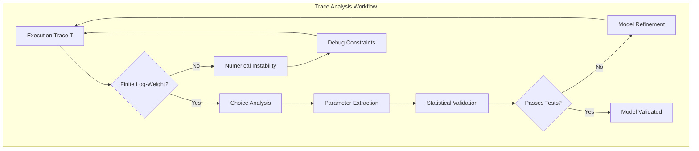
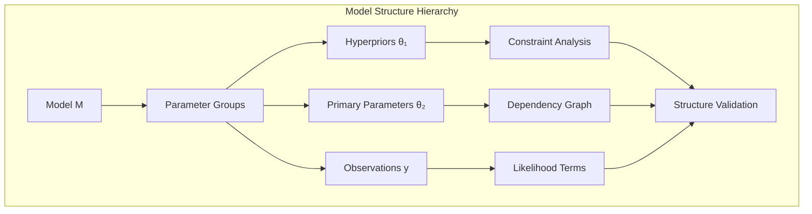
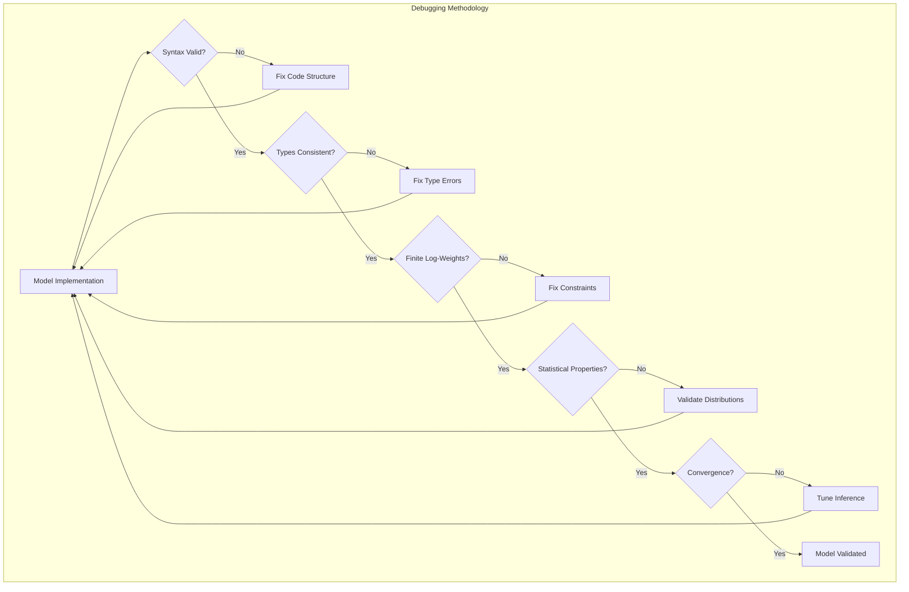

# Debugging Models

```admonish info title="Contents"
<!-- toc -->
```

Debugging probabilistic models presents unique challenges due to their **stochastic nature** and **high-dimensional parameter spaces**. Unlike deterministic programs, probabilistic models require **statistical validation**, **convergence analysis**, and **distributional testing**. This guide establishes a systematic methodology for probabilistic model debugging using Fugue's comprehensive diagnostic framework.

```admonish info title="Probabilistic Debugging Theory"
Model debugging operates on multiple **abstraction levels**:
- **Syntactic**: Code structure and type correctness
- **Semantic**: Model specification and parameter validity  
- **Statistical**: Distributional properties and moment consistency
- **Computational**: Numerical stability and convergence behavior

Each level requires specialized diagnostic techniques and validation criteria.
```

## Trace Inspection and Analysis

**Execution traces** form the foundation of probabilistic model debugging. Each trace $\mathcal{T}$ contains a complete record of the program's stochastic execution:

$$\mathcal{T} = \{(a_i, v_i, w_i)\}_{i=1}^n$$

where $a_i$ is the address, $v_i$ is the sampled value, and $w_i$ is the log-weight contribution.



**Mathematical Properties**: A valid trace must satisfy the **weight consistency condition**:
$$\log P(\mathcal{T}) = \sum_{i=1}^n w_i < \infty$$

```rust,ignore
{{#include ../../../examples/debugging_models.rs:trace_inspection}}
```

**Key Debugging Insights:**

- **Choice count** reveals model complexity and structure
- **Log-weight decomposition** identifies prior vs. likelihood vs. factor issues
- **Per-choice analysis** shows individual parameter contributions
- **Finite log-weights** indicate valid model execution

## Type-Safe Value Access

Fugue provides robust access patterns that handle type mismatches gracefully:

```rust,ignore
{{#include ../../../examples/debugging_models.rs:type_safe_access}}
```

**Error Handling Strategies:**

- Use `get_*_result()` for detailed error information
- Use `get_*()` for simple None-handling
- Always check for missing addresses before assuming success
- Iterate through all choices to understand model structure

## Model Validation and Testing

Systematic validation ensures your model behaves as expected:

```rust,ignore
{{#include ../../../examples/debugging_models.rs:model_validation}}
```

**Validation Best Practices:**

- Test against known analytical solutions
- Verify all traces have finite log-weights
- Check basic statistical properties (means, variances)
- Test edge cases and boundary conditions

## Safe vs Strict Error Handling

Fugue provides both strict (fail-fast) and safe (error-resilient) execution modes:

```rust,ignore
{{#include ../../../examples/debugging_models.rs:safe_handlers}}
```

**When to Use Each:**

- **Strict handlers** (`ReplayHandler`, `ScoreGivenTrace`): Development and testing
- **Safe handlers** (`SafeReplayHandler`, `SafeScoreGivenTrace`): Production systems
- Safe handlers log warnings instead of panicking on mismatches

## MCMC Diagnostics

**Markov Chain Monte Carlo** convergence assessment requires **statistical hypothesis testing** and **diagnostic metrics**. The fundamental question is whether the chain has reached its **stationary distribution** $\pi(\theta)$.

### Gelman-Rubin Diagnostic

The **potential scale reduction factor** $\hat{R}$ compares **within-chain** and **between-chain** variance:

$$\hat{R} = \sqrt{\frac{\hat{V}}{W}}$$

where:

- $W = \frac{1}{m}\sum_{j=1}^m s_j^2$ (within-chain variance)
- $B = \frac{n}{m-1}\sum_{j=1}^m (\bar{\theta}_{j\cdot} - \bar{\theta}_{\cdot\cdot})^2$ (between-chain variance)
- $\hat{V} = \frac{n-1}{n}W + \frac{1}{n}B$ (marginal posterior variance estimate)

```admonish important title="Convergence Criterion"
**Theoretical Result**: As $n \to \infty$, if the chain has converged, then $\hat{R} \to 1$. 
**Practical Threshold**: $\hat{R} < 1.1$ indicates approximate convergence for most applications.
**Statistical Interpretation**: $\hat{R} > 1$ suggests the chain hasn't explored the full posterior distribution.
```

### Effective Sample Size

The **effective sample size** accounts for **autocorrelation** in MCMC samples:

$$\text{ESS} = \frac{mn}{1 + 2\sum_{t=1}^{\infty} \rho_t}$$

where $\rho_t$ is the lag-$t$ autocorrelation and $mn$ is the total number of samples.

```rust,ignore
{{#include ../../../examples/debugging_models.rs:mcmc_diagnostics}}
```

**Convergence Indicators:**

- **R-hat < 1.1**: Chains have converged
- **High ESS**: Efficient sampling without excessive correlation
- **Multiple chains**: Essential for reliable convergence assessment
- **Visual inspection**: Always examine trace plots when possible

## Model Structure Analysis

**Model structure analysis** reveals the **computational graph** and **parameter dependencies**. This analysis is crucial for understanding model complexity and identifying potential issues:



**Structural Invariants** to validate:

1. **Address Uniqueness**: $|\{a_i\}| = n$ (no collisions)
2. **Parameter Hierarchy**: $\forall i, j: a_i \preceq a_j \implies \text{dependency}(i, j)$
3. **Choice Count Consistency**: Expected vs. actual parameter count
4. **Type Safety**: Each address maps to consistent value types

```rust,ignore
{{#include ../../../examples/debugging_models.rs:model_structure_debugging}}
```

**Structure Analysis Benefits:**

- Understand parameter organization and hierarchies
- Detect unexpected address patterns
- Verify choice counts match model expectations
- Identify bottlenecks in complex models

## Performance Diagnostics

Monitor computational efficiency and identify bottlenecks:

```rust,ignore
{{#include ../../../examples/debugging_models.rs:performance_diagnostics}}
```

**Performance Warning Signs:**

- Zero choices recorded (model execution failure)
- Infinite log-weights (constraint violations)
- Excessive execution time (optimization needed)
- Large memory footprint (consider streaming approaches)

## Common Debugging Patterns

**Systematic debugging** follows a **hierarchical validation strategy** from basic correctness to statistical validity:



**Debug Level Hierarchy**:

1. **Syntactic**: Code compiles and types check
2. **Semantic**: Model executes without runtime errors
3. **Numerical**: Computations remain stable and finite
4. **Statistical**: Results match theoretical expectations
5. **Convergence**: Inference algorithms reach stationarity

```rust,ignore
{{#include ../../../examples/debugging_models.rs:debugging_patterns}}
```

**Debugging Workflow:**

1. **Start Simple**: Test individual components before complex composition
2. **Validate Incrementally**: Add complexity one piece at a time
3. **Check Address Uniqueness**: Prevent parameter collision bugs
4. **Monitor Log-Weights**: Track prior, likelihood, and factor contributions
5. **Use Systematic Testing**: Automated validation for all model components

## Testing Framework Integration

Embed debugging checks in your test suite:

```rust,ignore
{{#include ../../../examples/debugging_models.rs:debugging_tests}}
```

**Testing Strategy:**

- Unit tests for individual model components
- Integration tests for complete workflows
- Performance regression tests
- Statistical validation against known results

## Common Issues and Solutions

### Issue: Infinite Log-Weights

**Symptoms:** `trace.total_log_weight().is_infinite()`

**Causes:**

- Factor statements with impossible constraints
- Parameters outside valid ranges
- Numerical overflow in likelihood computations

**Solutions:**

- Check factor conditions carefully
- Validate parameter ranges in constructors
- Use log-space computations for numerical stability

### Issue: Missing or Wrong Parameter Values

**Symptoms:** `get_*()` returns `None` or wrong types

**Causes:**

- Address typos or inconsistencies
- Model structure doesn't match expectations
- Type mismatches in trace replay

**Solutions:**

- Use consistent address naming conventions
- Print all addresses for verification
- Use safe handlers for production resilience

### Issue: Poor MCMC Convergence

**Symptoms:** High R-hat values, low ESS

**Causes:**

- Inappropriate step sizes
- Poor model parameterization
- Insufficient warm-up periods

**Solutions:**

- Increase warm-up iterations
- Reparameterize for better geometry
- Use adaptive algorithms with proper tuning

### Issue: Slow Model Execution

**Symptoms:** High execution times, memory usage

**Causes:**

- Inefficient model structure
- Excessive address creation
- Large trace construction overhead

**Solutions:**

- Use `plate!` for vectorized operations
- Pre-allocate data structures when possible
- Profile with performance diagnostics

## Best Practices Summary

1. **Debug Incrementally**: Start simple and add complexity systematically
2. **Use All Tools**: Combine trace inspection, validation, and diagnostics
3. **Test Edge Cases**: Verify behavior at parameter boundaries
4. **Monitor Performance**: Track execution time and memory usage
5. **Validate Statistically**: Compare against known theoretical results
6. **Handle Errors Gracefully**: Use safe handlers in production
7. **Document Assumptions**: Clear model specifications aid debugging

Effective debugging transforms probabilistic programming from guesswork into systematic model development. Fugue's comprehensive debugging toolkit enables confident deployment of complex probabilistic systems.
