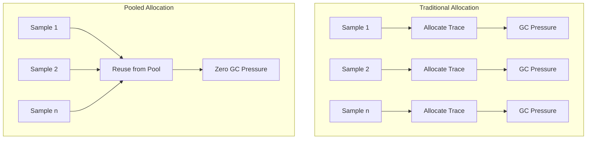
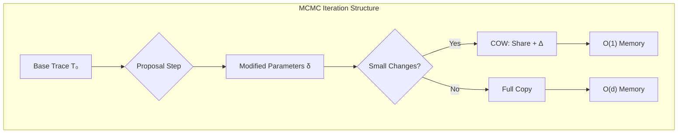
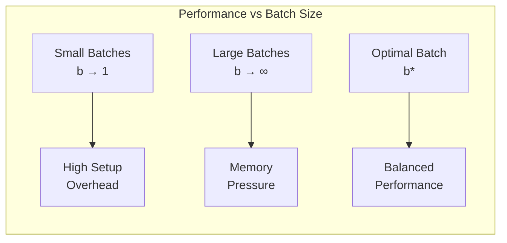

# Optimizing Performance

```admonish info title="Contents"
<!-- toc -->
```

Performance optimization in probabilistic programming requires understanding both **computational complexity** and **numerical analysis**. This guide explores Fugue's systematic approach to memory optimization, numerical stability, and algorithmic efficiency for production-scale probabilistic workloads.

```admonish info title="Computational Complexity Framework"
Probabilistic programs exhibit **multi-dimensional complexity**:
- **Time complexity**: $\mathcal{O}(n \cdot d \cdot k)$ for $n$ samples, $d$ parameters, $k$ iterations
- **Space complexity**: $\mathcal{O}(d + \log n)$ with memory pooling
- **Numerical complexity**: Condition number $\kappa = \|A\| \|A^{-1}\|$ affects convergence

Fugue's optimization framework addresses each dimension systematically.
```

## Memory-Optimized Inference

**Memory allocation** becomes the computational bottleneck in high-throughput scenarios due to **garbage collection overhead**. The allocation rate $R_{\text{alloc}}$ for naive inference scales as:

$$R_{\text{alloc}} = n \cdot |T| \cdot f_{\text{gc}}$$

where $n$ is the sample count, $|T|$ is the trace size, and $f_{\text{gc}}$ is the GC frequency. Fugue's **object pooling** reduces this to $\mathcal{O}(1)$ after warmup:



```rust,ignore
{{#include ../../../examples/optimizing_performance.rs:memory_pooling}}
```

**Key Benefits:**

- Zero-allocation execution after warm-up
- Configurable pool size for memory control
- Automatic trace recycling and cleanup
- Built-in performance monitoring with hit ratios

## Numerical Stability

**Numerical stability** in probabilistic computing requires careful analysis of **condition numbers** and **floating-point precision**. The **log-sum-exp** operation is fundamental:

$$\text{LSE}(\mathbf{x}) = \log\left(\sum_{i=1}^n e^{x_i}\right) = x_{\max} + \log\left(\sum_{i=1}^n e^{x_i - x_{\max}}\right)$$

**Stability Analysis**: Direct computation of $\sum e^{x_i}$ has condition number $\kappa \approx e^{x_{\max} - x_{\min}}$, which becomes **ill-conditioned** when $x_{\max} - x_{\min} \gg \log(\epsilon_{\text{machine}})$.

```admonish warning title="Catastrophic Cancellation"
When $x_i$ are large and similar, direct computation suffers from **catastrophic cancellation**:
$$\log(e^{100.1} + e^{100.0}) \neq \log(e^{100.0}(e^{0.1} + 1))$$
The LSE formulation maintains **relative precision** $\mathcal{O}(\epsilon_{\text{machine}})$ regardless of scale.
```

```rust,ignore
{{#include ../../../examples/optimizing_performance.rs:numerical_stability}}
```

**Stability Features:**

- `log_sum_exp` prevents overflow in mixture computations
- `weighted_log_sum_exp` for importance sampling
- `safe_ln` handles edge cases gracefully
- All operations maintain numerical precision across scales

## Efficient Trace Construction

When building traces programmatically, use `TraceBuilder` for optimal performance:

```rust,ignore
{{#include ../../../examples/optimizing_performance.rs:efficient_construction}}
```

**Construction Benefits:**

- Pre-allocated data structures minimize reallocations
- Type-specific insertion methods avoid boxing overhead
- Batch operations for multiple choices
- Efficient conversion to immutable traces

## Copy-on-Write for MCMC

MCMC algorithms exhibit **temporal locality** in parameter updates, modifying only $\mathcal{O}(\log d)$ parameters per iteration where $d$ is the total dimensionality. **Copy-on-Write (COW)** data structures exploit this pattern:



**Complexity Analysis**: Traditional MCMC requires $\mathcal{O}(d)$ space per sample. COW reduces this to $\mathcal{O}(\Delta + \log d)$ where $\Delta$ is the **edit distance** between traces.

```rust,ignore
{{#include ../../../examples/optimizing_performance.rs:cow_traces}}
```

**MCMC Optimizations:**

- O(1) trace cloning until modification
- Shared memory for unchanged parameters
- Lazy copying only when traces diverge
- Perfect for Metropolis-Hastings and Gibbs sampling

## Vectorized Model Patterns

Structure models for efficient batch processing:

```rust,ignore
{{#include ../../../examples/optimizing_performance.rs:optimized_patterns}}
```

**Vectorization Strategy:**

- Pre-allocate data collections
- Use `plate!` for independent parallel operations
- Minimize dynamic allocations in hot paths
- Leverage compiler optimizations with static sizing

## Performance Monitoring

**Systematic performance monitoring** requires tracking multiple **performance metrics** with their theoretical bounds:

$$\begin{align}
\text{Throughput} &= \frac{\text{samples}}{\text{time}} \leq \frac{1}{\tau_{\min}} \\
\text{Latency} &= \text{time per sample} \geq \tau_{\min} \\
\text{Memory Efficiency} &= \frac{\text{useful allocations}}{\text{total allocations}} \rightarrow 1
\end{align}$$

where $\tau_{\min}$ is the **theoretical minimum** execution time per sample.

```admonish note title="Amdahl's Law for MCMC"
Even with perfect parallelization, MCMC exhibits **sequential dependencies** that limit speedup:
$$S_{\text{max}} = \frac{1}{f_{\text{seq}} + \frac{1-f_{\text{seq}}}{p}}$$
where $f_{\text{seq}}$ is the fraction of sequential computation and $p$ is the number of processors.
```

```rust,ignore
{{#include ../../../examples/optimizing_performance.rs:performance_monitoring}}
```

**Monitoring Approach:**

- Collect trace characteristics for optimization insights
- Track memory usage patterns
- Validate numerical stability
- Profile execution bottlenecks

## Batch Processing

**Batch processing** amortizes **setup costs** and exploits **hardware parallelism**. The optimal batch size $b^*$ balances memory usage and throughput:

$$b^* = \arg\min_b \left( \frac{C_{\text{setup}}}{b} + b \cdot C_{\text{memory}} + \frac{C_{\text{sync}}}{b} \right)$$

where:
- $C_{\text{setup}}$ is the per-batch initialization cost
- $C_{\text{memory}}$ is the per-sample memory cost  
- $C_{\text{sync}}$ is the synchronization overhead



```rust,ignore
{{#include ../../../examples/optimizing_performance.rs:batch_processing}}
```

**Batch Benefits:**

- Amortized setup costs across samples
- Memory pool reuse for consistent performance
- Scalable to large sample counts
- Predictable memory footprint

## Numerical Precision Testing

Validate stability across different computational scales:

```rust,ignore
{{#include ../../../examples/optimizing_performance.rs:precision_testing}}
```

**Testing Strategy:**

- Verify stability across extreme value ranges
- Test edge cases and boundary conditions
- Validate consistency of numerical operations
- Profile precision vs. performance trade-offs

## Performance Testing

Implement systematic performance validation:

```rust,ignore
{{#include ../../../examples/optimizing_performance.rs:performance_testing}}
```

**Testing Framework:**

- Memory pool efficiency validation
- Numerical stability regression tests
- Trace construction benchmarking
- COW sharing verification

## Production Deployment

### Memory Configuration

- Size `TracePool` based on peak concurrent inference
- Monitor hit ratios to validate pool efficiency
- Use COW traces for MCMC workloads
- Pre-warm pools before production traffic

### Numerical Strategies

- Always use log-space for probability computations
- Validate extreme value handling in testing
- Monitor for numerical instabilities in production
- Use stable algorithms for critical computations

### Monitoring and Alerting

- Track inference latency and memory usage
- Monitor pool statistics and efficiency metrics
- Alert on numerical instabilities or performance degradation
- Profile hot paths for optimization opportunities

## Common Performance Patterns

1. **Pool First**: Use `TracePool` for any repeated inference
2. **Log Always**: Work in log-space for numerical stability
3. **Batch Everything**: Amortize costs across multiple samples
4. **Monitor Continuously**: Track performance metrics in production
5. **Test Extremes**: Validate stability with extreme values

These optimization strategies enable Fugue to handle production-scale probabilistic programming workloads with consistent performance and numerical reliability.
