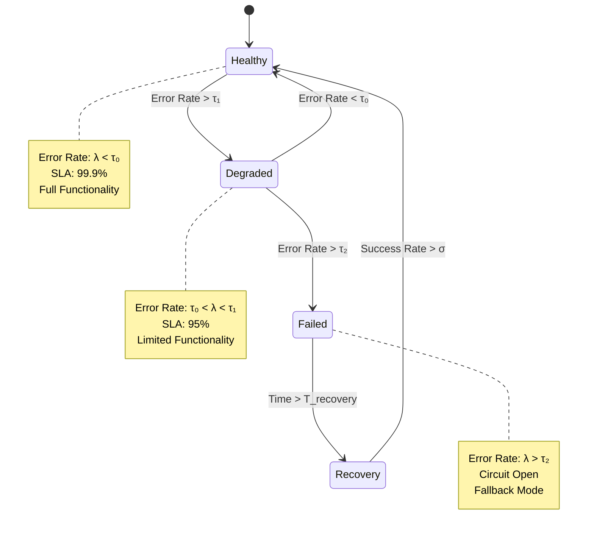
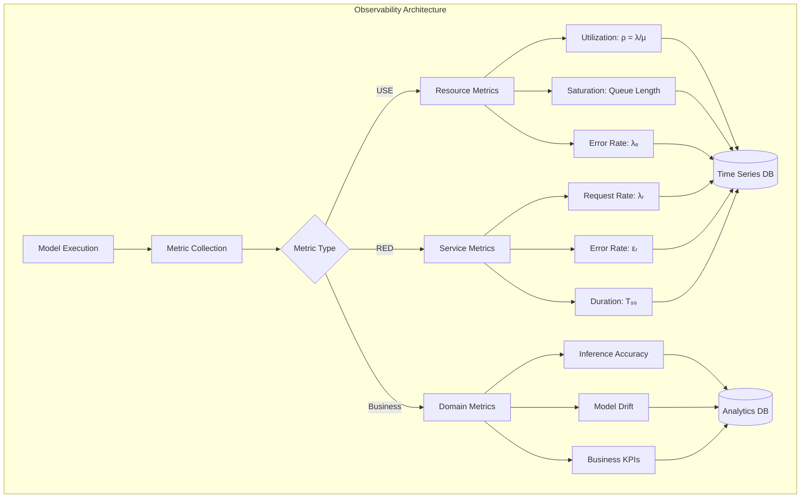
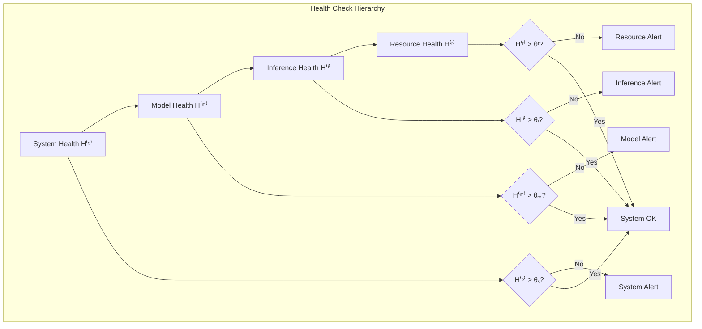
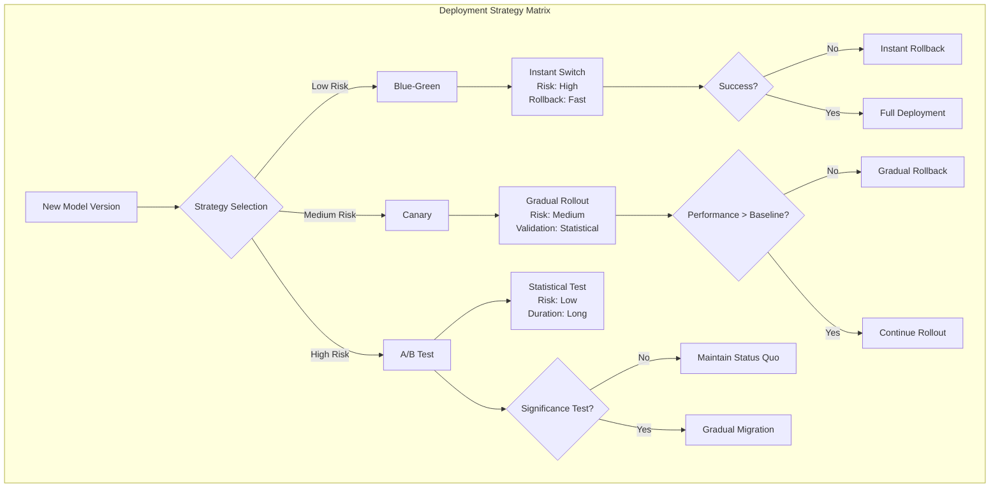

# Production Deployment

```admonish info title="Contents"
<!-- toc -->
```

Production deployment of probabilistic models requires **reliability engineering**, **performance optimization**, and **operational excellence** at scale. This guide establishes a mathematical framework for **fault tolerance**, **service reliability**, and **system observability** using Fugue's production-ready infrastructure patterns.

```admonish info title="Reliability Theory Framework"
Production systems exhibit **stochastic reliability** characterized by:
- **Availability**: $A(t) = \frac{\text{MTBF}}{\text{MTBF} + \text{MTTR}}$ where MTBF = Mean Time Between Failures
- **Reliability Function**: $R(t) = P(T > t) = e^{-\lambda t}$ for exponential failure rates
- **Service Level Agreement**: $\text{SLA} = P(\text{response time} < T) \geq \alpha$

Fugue's deployment patterns optimize these metrics through **systematic fault isolation** and **graceful degradation**.
```

## Error Handling and Graceful Degradation

**Graceful degradation** implements **fault tolerance** through **systematic error recovery** and **service continuity**. The mathematical foundation relies on **Markov reliability models** and **circuit breaker theory**:



**Circuit Breaker Mathematics**: The failure rate follows a **Poisson process** with rate $\lambda(t)$. The circuit breaker transitions based on:

$$P(\text{trip}) = 1 - e^{-\int_0^T \lambda(t) dt}$$

**Error Budget Model**: For SLA target $\alpha$, the **error budget** is:
$$\text{Budget}(t) = (1 - \alpha) \cdot t - \int_0^t \mathbb{1}_{\text{error}}(s) ds$$

```rust,ignore
{{#include ../../../examples/production_deployment.rs:error_handling}}
```

**Robust Error Handling Features:**

- **Circuit Breaker Pattern**: Prevents cascade failures by switching to fallback mode
- **Panic Recovery**: Catches panics and provides safe default values
- **Input Validation**: Ensures all inputs are finite and within expected ranges
- **Fallback Values**: Domain-specific defaults for different parameter types
- **Error Counting**: Tracks error rates to trigger circuit breaker activation

## Configuration Management

Production models require flexible configuration for different environments:

```rust,ignore
{{#include ../../../examples/production_deployment.rs:configuration_management}}
```

**Configuration Best Practices:**

- **Environment-Specific Settings**: Different behavior for development/staging/production
- **Model Parameter Configuration**: Tunable priors, noise levels, and thresholds
- **Runtime Configuration**: Memory pool sizes, timeout limits, error thresholds
- **Deployment Configuration**: Circuit breaker settings, logging levels, metrics enablement
- **Type-Safe Defaults**: Sensible fallbacks for all configuration parameters

## Production Metrics and Observability

**Observability** requires **systematic metric collection** with **statistical analysis** and **anomaly detection**. The **metric taxonomy** follows the **USE method** (Utilization, Saturation, Errors) and **RED method** (Rate, Errors, Duration):



**Statistical Process Control**: Metrics follow **control chart theory** with **statistical control limits**:

$$\begin{align}
\text{UCL} &= \bar{X} + 3\sigma/\sqrt{n} \\
\text{LCL} &= \bar{X} - 3\sigma/\sqrt{n}
\end{align}$$

**Anomaly Detection**: Using **exponentially weighted moving averages**:
$$\text{EWMA}_t = \alpha X_t + (1-\alpha)\text{EWMA}_{t-1}$$

```rust,ignore
{{#include ../../../examples/production_deployment.rs:production_metrics}}
```

**Metrics Collection:**

- **Performance Metrics**: Inference time, throughput, operation counts
- **Error Tracking**: Error rates, timeout counts, failure categorization
- **System Health**: Uptime, resource utilization, memory pool efficiency
- **Prometheus Integration**: Standard metrics format for monitoring systems
- **Real-Time Dashboards**: Live performance and health indicators

## Health Checks and System Validation

**Health monitoring** implements **continuous system validation** through **multi-level health checks** with **statistical thresholds** and **predictive alerting**:



**Health Score Calculation**: Weighted combination of subsystem health:
$$H^{(s)} = \sum_{i} w_i H^{(i)}$$

where $w_i$ are **importance weights** and $\sum w_i = 1$.

**Predictive Health Modeling**: Using **time series forecasting**:
$$H_{t+k} = \alpha H_t + \beta \frac{dH}{dt}\bigg|_t + \gamma \frac{d^2H}{dt^2}\bigg|_t$$

```admonish warning title="Health Degradation Alert"
**Early Warning System**: When $\frac{dH}{dt} < -\delta$ for sustained periods, the system triggers **preemptive scaling** or **graceful degradation** before reaching critical thresholds.
```

```rust,ignore
{{#include ../../../examples/production_deployment.rs:health_checks}}
```

**Health Check Components:**

- **Model Execution Health**: Verifies core functionality with simplified tests
- **Memory Health**: Monitors pool efficiency and memory usage patterns
- **Error Rate Analysis**: Tracks and categorizes different failure modes
- **Performance Monitoring**: Identifies degradation before it impacts users
- **Multi-Level Status**: Healthy/Degraded/Unhealthy with detailed diagnostics

## Input Validation and Security

Robust input validation prevents security vulnerabilities and system failures:

```rust,ignore
{{#include ../../../examples/production_deployment.rs:input_validation}}
```

**Security Measures:**

- **Range Validation**: Ensure parameters are within physically meaningful bounds
- **Type Safety**: Validate all inputs before model construction
- **Sanitization**: Clean address components to prevent injection attacks
- **Business Rule Enforcement**: Domain-specific validation logic
- **Error Messages**: Informative feedback without revealing system internals

## Deployment Strategies and Patterns

**Deployment strategies** implement **risk management** through **controlled rollout** and **statistical validation**. Each strategy provides different **risk-latency tradeoffs**:



**Canary Analysis**: Statistical significance testing for canary deployments:

$$\text{Z-score} = \frac{(\bar{X}_{\text{canary}} - \bar{X}_{\text{control}})}{\sqrt{\frac{s_1^2}{n_1} + \frac{s_2^2}{n_2}}}$$

**A/B Testing**: **Welch's t-test** for unequal variances:
$$t = \frac{\bar{X}_A - \bar{X}_B}{\sqrt{\frac{s_A^2}{n_A} + \frac{s_B^2}{n_B}}}$$

```rust,ignore
{{#include ../../../examples/production_deployment.rs:deployment_strategies}}
```

**Deployment Patterns:**

- **Blue-Green Deployment**: Instant traffic switching between model versions
- **Canary Releases**: Gradual rollout to percentage of traffic for risk mitigation
- **Rolling Updates**: Progressive deployment across infrastructure
- **A/B Testing**: Compare model performance with statistical significance
- **Rollback Capability**: Quick reversion to previous version on issues

## Performance Optimization Patterns

### Memory Management

```rust,ignore
use fugue::runtime::memory::{TracePool, PooledPriorHandler};

// Production memory management
let mut pool = TracePool::new(1000);
let handler = PooledPriorHandler::new(&mut rng, &mut pool);
```

### Batch Processing

```rust,ignore
// Process multiple inference requests efficiently
struct BatchProcessor {
    pool: TracePool,
    batch_size: usize,
}

impl BatchProcessor {
    fn process_batch(&mut self, requests: Vec<InferenceRequest>) -> Vec<InferenceResult> {
        requests.into_iter().map(|req| {
            let handler = PooledPriorHandler::new(&mut req.rng, &mut self.pool);
            self.run_single_inference(handler, req.model)
        }).collect()
    }
}
```

### Connection Pooling

```rust,ignore
// Database connection management for model parameters
struct ModelParameterStore {
    connection_pool: Arc<ConnectionPool>,
    parameter_cache: LruCache<String, ModelParameters>,
}
```

## Monitoring Integration

### Prometheus Metrics

```rust,ignore
// Export metrics in Prometheus format
fn export_metrics(metrics: &ProductionMetrics) -> String {
    format!(
        "# HELP fugue_inference_total Total inference operations\n\
         # TYPE fugue_inference_total counter\n\
         fugue_inference_total {}\n\
         # HELP fugue_error_rate Current error rate\n\
         # TYPE fugue_error_rate gauge\n\
         fugue_error_rate {}\n",
        metrics.inference_count,
        metrics.error_rate()
    )
}
```

### Structured Logging

```rust,ignore
use serde_json::json;

// Structured logging for production debugging
fn log_inference_event(
    request_id: &str,
    model_version: &str,
    duration: Duration,
    result: &InferenceResult
) {
    let log_entry = json!({
        "event": "inference_completed",
        "request_id": request_id,
        "model_version": model_version,
        "duration_ms": duration.as_millis(),
        "success": result.is_success(),
        "timestamp": SystemTime::now(),
    });
    println!("{}", log_entry);
}
```

### Alert Rules

```rust,ignore
// Define alerting thresholds
struct AlertRules {
    max_error_rate: f64,
    max_latency_ms: u64,
    min_throughput_per_sec: f64,
}

impl AlertRules {
    fn check_alerts(&self, metrics: &ProductionMetrics) -> Vec<Alert> {
        let mut alerts = Vec::new();

        if metrics.error_rate() > self.max_error_rate {
            alerts.push(Alert::HighErrorRate(metrics.error_rate()));
        }

        if metrics.avg_latency().as_millis() > self.max_latency_ms as u128 {
            alerts.push(Alert::HighLatency(metrics.avg_latency()));
        }

        alerts
    }
}
```

## Testing in Production

### Shadow Mode Testing

```rust,ignore
// Run new model versions in shadow mode
struct ShadowTester {
    primary_model: Box<dyn Fn() -> Model<f64>>,
    shadow_model: Box<dyn Fn() -> Model<f64>>,
    comparison_rate: f64,
}

impl ShadowTester {
    fn run_with_shadow(&mut self, input: &Input) -> (PrimaryResult, Option<ShadowResult>) {
        let primary = self.run_primary(input);

        let shadow = if rand::random::<f64>() < self.comparison_rate {
            Some(self.run_shadow(input))
        } else {
            None
        };

        (primary, shadow)
    }
}
```

### Production Validation

```rust,ignore
// Continuous validation in production
fn validate_model_assumptions(trace: &Trace) -> ValidationResult {
    let mut issues = Vec::new();

    // Check log-weight stability
    if !trace.total_log_weight().is_finite() {
        issues.push("Non-finite log-weight detected".to_string());
    }

    // Check parameter ranges
    for (addr, choice) in &trace.choices {
        if let ChoiceValue::F64(value) = choice.value {
            if value.abs() > 1000.0 {
                issues.push(format!("Extreme value at {}: {}", addr, value));
            }
        }
    }

    ValidationResult { issues }
}
```

## Operational Excellence

### Infrastructure as Code

```yaml
# Kubernetes deployment example
apiVersion: apps/v1
kind: Deployment
metadata:
  name: fugue-inference-service
spec:
  replicas: 3
  selector:
    matchLabels:
      app: fugue-inference
  template:
    metadata:
      labels:
        app: fugue-inference
    spec:
      containers:
      - name: inference-service
        image: fugue-inference:v1.2.0
        resources:
          requests:
            memory: "256Mi"
            cpu: "250m"
          limits:
            memory: "512Mi"
            cpu: "500m"
        livenessProbe:
          httpGet:
            path: /health
            port: 8080
          initialDelaySeconds: 30
          periodSeconds: 10
```

### Service Level Objectives (SLOs)

```rust,ignore
// Define and monitor SLOs
struct ServiceLevelObjectives {
    availability_target: f64,    // 99.9%
    latency_p99_ms: u64,        // 100ms
    error_rate_threshold: f64,   // 0.1%
}

impl ServiceLevelObjectives {
    fn evaluate_slo_compliance(&self, metrics: &ProductionMetrics) -> SLOReport {
        SLOReport {
            availability: self.calculate_availability(metrics),
            latency_compliance: metrics.p99_latency() <= Duration::from_millis(self.latency_p99_ms),
            error_rate_compliance: metrics.error_rate() <= self.error_rate_threshold,
        }
    }
}
```

### Capacity Planning

```rust,ignore
// Capacity planning and auto-scaling
struct CapacityPlanner {
    target_cpu_utilization: f64,
    target_memory_utilization: f64,
    scale_up_threshold: f64,
    scale_down_threshold: f64,
}

impl CapacityPlanner {
    fn recommend_scaling(&self, current_metrics: &SystemMetrics) -> ScalingRecommendation {
        if current_metrics.cpu_utilization > self.scale_up_threshold {
            ScalingRecommendation::ScaleUp(self.calculate_scale_factor(current_metrics))
        } else if current_metrics.cpu_utilization < self.scale_down_threshold {
            ScalingRecommendation::ScaleDown(0.5)
        } else {
            ScalingRecommendation::NoAction
        }
    }
}
```

## Security Best Practices

### Input Sanitization

Always validate and sanitize inputs before processing:

- **Range checks** for numerical parameters
- **Character filtering** for string inputs
- **Business rule validation** for domain constraints
- **Rate limiting** to prevent abuse
- **Authentication and authorization** for API access

### Secret Management

```rust,ignore
// Secure configuration management
struct SecureConfig {
    database_url: SecretString,
    api_key: SecretString,
    model_parameters: ModelConfig,
}

impl SecureConfig {
    fn from_environment() -> Result<Self, ConfigError> {
        Ok(SecureConfig {
            database_url: env::var("DATABASE_URL")?.into(),
            api_key: env::var("API_KEY")?.into(),
            model_parameters: ModelConfig::from_file("model_config.toml")?,
        })
    }
}
```

### Audit Logging

```rust,ignore
// Comprehensive audit trail
fn log_inference_request(
    user_id: &str,
    request: &InferenceRequest,
    response: &InferenceResponse,
) {
    let audit_log = AuditLogEntry {
        timestamp: SystemTime::now(),
        user_id: user_id.to_string(),
        action: "inference_request".to_string(),
        input_hash: hash_sensitive_data(&request.input),
        output_hash: hash_sensitive_data(&response.output),
        model_version: response.model_version.clone(),
        success: response.success,
    };

    audit_logger::log(audit_log);
}
```

## Common Production Pitfalls

### Memory Leaks

```rust,ignore
// Avoid: Creating new pools repeatedly
// for _ in 0..1000 {
//     let pool = TracePool::new(100); // Memory leak!
// }

// Do: Reuse pools across requests
let mut pool = TracePool::new(100);
for request in requests {
    let handler = PooledPriorHandler::new(&mut request.rng, &mut pool);
    process_request(handler, request);
}
```

### Blocking Operations

```rust,ignore
// Avoid: Synchronous database calls in request handlers
// let result = database.query_sync(query); // Blocks event loop

// Do: Use async operations with proper timeouts
async fn process_request(request: Request) -> Result<Response, Error> {
    let timeout = Duration::from_millis(100);
    let result = tokio::time::timeout(timeout, database.query(query)).await??;
    Ok(result)
}
```

### Error Propagation

```rust,ignore
// Avoid: Panicking on errors
// let value = risky_operation().unwrap(); // May crash service

// Do: Graceful error handling with fallbacks
let value = match risky_operation() {
    Ok(v) => v,
    Err(e) => {
        metrics.increment_error_count();
        log::warn!("Operation failed: {}, using fallback", e);
        fallback_value()
    }
};
```

```admonish success title="Production Excellence Framework"
Successful production deployment combines **mathematical rigor** with **engineering excellence**:

1. **Reliability Engineering**: Fault tolerance through statistical modeling and circuit breaker patterns
2. **Performance Optimization**: Memory pooling, numerical stability, and batch processing
3. **Observability**: Multi-dimensional metrics with statistical process control
4. **Deployment Strategies**: Risk-managed rollouts with statistical validation
5. **Health Monitoring**: Predictive alerting and graceful degradation

These patterns enable **robust production systems** capable of handling real-world probabilistic computing at scale.
```

Production deployment represents the culmination of probabilistic programming excellence, where **theoretical foundations** meet **operational reality**. Fugue's comprehensive tooling transforms academic probabilistic models into production-grade systems that deliver reliable, scalable, and maintainable probabilistic computing solutions.
