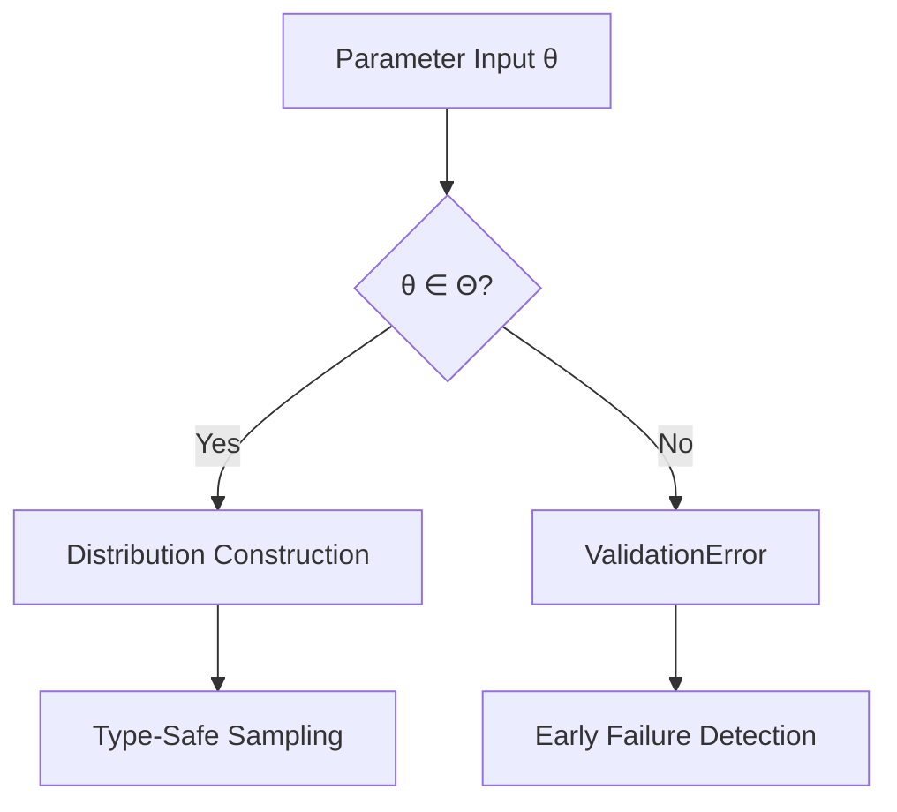

# Working with Distributions

Fugue's type-safe distribution system represents a principled approach to probabilistic programming, eliminating entire classes of runtime errors through rigorous type theory while preserving the full expressiveness of statistical modeling. This guide demonstrates the mathematical foundations and practical applications of Fugue's distribution architecture.

```admonish info title="Type Theory Foundation"
Fugue's distribution system is grounded in **dependent type theory**, where each distribution $D$ is parameterized not just by its parameters $\theta$, but by its **support type** $\mathcal{S}$. This ensures that $\text{sample}(D_\theta) : \mathcal{S}$ and eliminates the need for runtime type checking or unsafe casting operations.
```

## Type Safety in Practice

Traditional probabilistic programming libraries return `f64` for everything, leading to casting overhead and runtime errors. Fugue distributions return their natural types:

```rust,ignore
{{#include ../../../examples/working_with_distributions.rs:type_safety_demo}}
```

No casting, no comparisons with floating-point values—just natural boolean logic.

## Continuous Distributions

Continuous distributions in Fugue model phenomena over uncountable domains $\mathcal{S} \subseteq \mathbb{R}^n$. The probability density function $f_X(x)$ satisfies the normalization condition:

$$\int_{\mathcal{S}} f_X(x) \, dx = 1$$

For computational stability, Fugue operates in **log-space** by default, computing $\log f_X(x)$ to avoid numerical underflow:

```admonish important title="Log-Space Computation"
Working directly with densities $f_X(x)$ can cause severe numerical issues when $f_X(x) \ll 1$. Fugue's `log_prob()` method computes $\log f_X(x)$, which remains numerically stable even for extreme tail probabilities.
```

```rust,ignore
{{#include ../../../examples/working_with_distributions.rs:continuous_distributions}}
```

**Key Points:**

- `sample()` returns `f64` for direct arithmetic
- `log_prob()` computes log-density (avoids numerical underflow)
- Parameter validation happens at construction time

```admonish tip
Always work with log-probabilities for numerical stability. Only convert to regular probabilities when necessary for interpretation.
```

## Discrete Distributions

Discrete distributions operate over countable support sets $\mathcal{S} \subseteq \mathbb{Z}^n$ or finite sets. The probability mass function satisfies:

$$\sum_{x \in \mathcal{S}} P(X = x) = 1$$

Fugue enforces this constraint at construction time and leverages natural integer types to eliminate precision loss from floating-point representation:

```admonish note title="Integer Precision Preservation"
Unlike floating-point representations that can introduce rounding errors, Fugue's native `u64` and `usize` types preserve exact integer values. This is crucial for count data where $X \in \{0, 1, 2, \ldots\}$ must remain precisely representable.
```

```rust,ignore
{{#include ../../../examples/working_with_distributions.rs:discrete_distributions}}
```

**Benefits:**

- `u64` counts support direct arithmetic without casting
- No precision loss from floating-point representations
- Natural integration with Rust's type system

## Safe Categorical Sampling

Categorical distributions return `usize` for safe array indexing:

```rust,ignore
{{#include ../../../examples/working_with_distributions.rs:categorical_usage}}
```

```admonish note
The `usize` return type eliminates bounds checking errors—the sampled index is guaranteed to be valid for the probability vector length.
```

## Parameter Validation

Fugue enforces mathematical constraints through **compile-time and runtime validation**. Each distribution family $\mathcal{D}_\theta$ has a **parameter space** $\Theta$ defining valid configurations:



**Constraint Examples:**

- **Normal Distribution**: $\mathcal{N}(\mu, \sigma^2)$ requires $\sigma > 0$
- **Beta Distribution**: $\text{Beta}(\alpha, \beta)$ requires $\alpha, \beta > 0$
- **Categorical Distribution**: $\sum_i p_i = 1$ and $p_i \geq 0 \, \forall i$

```rust,ignore
{{#include ../../../examples/working_with_distributions.rs:parameter_validation}}
```

**Validation Rules:**

- Normal: σ > 0
- Beta: α > 0, β > 0  
- Poisson: λ ≥ 0
- Categorical: probabilities sum to 1, all non-negative

## Storing Mixed Distributions

Use trait objects for collections of distributions with the same return type:

```rust,ignore
{{#include ../../../examples/working_with_distributions.rs:distribution_composition}}
```

This enables dynamic distribution selection and model composition patterns.

## Practical Modeling Patterns

Common modeling scenarios demonstrate natural type usage:

```rust,ignore
{{#include ../../../examples/working_with_distributions.rs:practical_modeling}}
```

Each distribution serves its natural domain without artificial conversions.

## Working with Log-Probabilities

**Logarithmic probability computation** is essential for numerical stability in probabilistic programming. Consider the **log-sum-exp** operation for computing:

$$\log\left(\sum_{i=1}^n e^{x_i}\right) = x_{\max} + \log\left(\sum_{i=1}^n e^{x_i - x_{\max}}\right)$$

where $x_{\max} = \max_i x_i$. This formulation prevents overflow when $|x_i|$ is large:

```admonish warning title="Numerical Stability Theorem"
**Direct computation** of $\prod_{i=1}^n p_i$ where $p_i \ll 1$ will underflow to machine zero for moderate $n$. **Log-space computation** of $\sum_{i=1}^n \log p_i$ remains stable for arbitrarily small probabilities, preserving up to 15-17 digits of precision in IEEE 754 double precision.
```

```rust,ignore
{{#include ../../../examples/working_with_distributions.rs:probability_calculations}}
```

```admonish warning
Converting large negative log-probabilities back to regular probabilities can underflow to zero. Keep computations in log-space when possible.
```

## Advanced Patterns

For complex modeling scenarios, see these patterns:

### Hierarchical Models

```rust,ignore
{{#include ../../../examples/advanced_distribution_patterns.rs:hierarchical_priors}}
```

### Mixture Components

```rust,ignore
{{#include ../../../examples/advanced_distribution_patterns.rs:mixture_components}}
```

### Conjugate Priors

```rust,ignore
{{#include ../../../examples/advanced_distribution_patterns.rs:conjugate_pairs}}
```

## Testing Your Distributions

Always test distribution properties and parameter validation:

```rust,ignore
{{#include ../../../examples/working_with_distributions.rs:distribution_testing}}
```

## Common Pitfalls

1. **Underflow in probability space**: Use log-probabilities for accumulation
2. **Parameter validation**: Check constructor errors, don't assume success
3. **Precision with counts**: Use `u64` return types directly, avoid `f64` conversion
4. **Categorical indexing**: Trust the `usize` return—it's guaranteed valid

## Next Steps

- **Complex Models**: See [Building Complex Models](./building-complex-models.md) for compositional patterns
- **Debugging**: Check out [Debugging Models](./debugging-models.md) for troubleshooting
- **Custom Logic**: Learn [Custom Handlers](./custom-handlers.md) for specialized inference

The type-safe distribution system eliminates entire classes of runtime errors while making statistical code more readable and maintainable.
