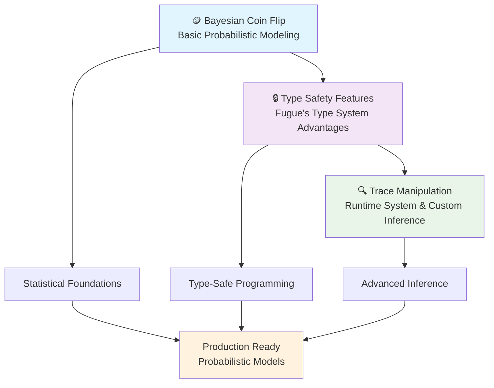

# Foundation Tutorials

Welcome to Fugue's **Foundation Tutorials** — your comprehensive introduction to the core concepts and unique features that make Fugue a revolutionary approach to probabilistic programming.

## What You'll Learn

These tutorials build upon each other to give you a complete understanding of Fugue's foundational principles:



## Learning Path

### 🎯 Recommended Order

1. **[Bayesian Coin Flip](./bayesian-coin-flip.md)** *(~45 minutes)*
   - Start here for statistical foundations
   - Learn Bayesian inference principles
   - Understand model specification and analysis

2. **[Type Safety Features](./type-safety-features.md)** *(~30 minutes)*
   - Discover Fugue's unique advantages
   - Master type-safe probabilistic programming
   - Eliminate runtime errors with compile-time guarantees

3. **[Trace Manipulation](./trace-manipulation.md)** *(~60 minutes)*
   - Deep dive into Fugue's runtime system
   - Learn custom inference and debugging techniques
   - Build production-ready probabilistic applications

## Tutorial Overview

### 🪙 [Bayesian Coin Flip](./bayesian-coin-flip.md)

**Foundation**: Statistical inference and model analysis

Your introduction to Bayesian reasoning through the classic coin flipping problem. This tutorial demonstrates how prior beliefs are updated with evidence to form posterior distributions.

**Key Concepts:**

- Prior, likelihood, and posterior distributions
- Bayesian updating with Beta-Binomial conjugacy
- Model validation and parameter estimation
- Analytical vs computational solutions

**What You'll Build:**

- Complete Bayesian coin bias estimation model
- Prior sensitivity analysis framework
- Model validation with synthetic data

```admonish info title="Prerequisites"
Basic probability theory (distributions, Bayes' theorem)
```

---

### 🔒 [Type Safety Features](./type-safety-features.md)

**Foundation**: Type-safe probabilistic programming

Explore Fugue's revolutionary type system that eliminates runtime errors while preserving full statistical expressiveness. Learn how dependent types make probabilistic programs both safer and faster.

**Key Concepts:**

- Natural return types for distributions (`bool`, `u64`, `f64`, `usize`)
- Compile-time safety guarantees
- Safe array indexing with categorical distributions
- Parameter validation at construction time
- Performance benefits through zero-cost abstractions

**What You'll Build:**

- Type-safe hierarchical models
- Safe array indexing examples
- Performance comparison with traditional PPLs

```admonish tip title="Why This Matters"
Traditional PPLs force everything through `f64`, leading to runtime casting and errors. Fugue's type system catches these issues at compile time.
```

---

### 🔍 [Trace Manipulation](./trace-manipulation.md)

**Foundation**: Runtime system and advanced inference

Master Fugue's execution trace system — the foundation that enables sophisticated inference algorithms. Learn how traces record, replay, and analyze probabilistic model executions.

**Key Concepts:**

- Trace system architecture and execution history
- Handler system for flexible model interpretation
- Replay mechanics for MCMC and inference algorithms
- Custom handlers for specialized inference strategies
- Memory optimization for production deployment
- Diagnostic tools for convergence assessment

**What You'll Build:**

- Custom MCMC algorithm using trace replay
- Specialized handlers for debugging models
- Production inference pipeline with memory optimization
- Comprehensive diagnostic system for model validation

```admonish warning title="Advanced Content"
This tutorial covers sophisticated concepts. Complete the previous tutorials first.
```

## Learning Outcomes

After completing these foundation tutorials, you will:

### 📊 **Statistical Mastery**

- ✅ Understand Bayesian inference from first principles
- ✅ Build and validate probabilistic models confidently
- ✅ Interpret posterior distributions and uncertainty quantification
- ✅ Apply conjugate analysis and computational methods

### 🛡️ **Type-Safe Programming**

- ✅ Write probabilistic programs that catch errors at compile time
- ✅ Leverage natural return types for cleaner, safer code
- ✅ Understand performance benefits of zero-cost abstractions
- ✅ Build complex models with guaranteed type safety

### ⚙️ **Advanced Inference**

- ✅ Manipulate execution traces for custom inference algorithms
- ✅ Implement specialized handlers for unique requirements
- ✅ Debug and optimize problematic models systematically  
- ✅ Deploy production-ready probabilistic systems

### 🔧 **Production Skills**

- ✅ Memory optimization techniques for high-throughput scenarios
- ✅ Convergence diagnostics and model validation workflows
- ✅ Custom inference algorithms tailored to specific problems
- ✅ Systematic debugging of numerical issues

## Code Examples

All tutorials include comprehensive, tested code examples:

- **📁 [`examples/bayesian_coin_flip.rs`](../../../../examples/bayesian_coin_flip.rs)** - Complete Bayesian analysis
- **📁 [`examples/type_safety.rs`](../../../../examples/type_safety.rs)** - Type system demonstrations  
- **📁 [`examples/trace_manipulation.rs`](../../../../examples/trace_manipulation.rs)** - Runtime system examples

Each example includes:

- ✅ **Comprehensive tests** ensuring correctness
- ✅ **Detailed comments** explaining every concept
- ✅ **Runnable code** you can execute immediately
- ✅ **Performance benchmarks** where applicable

```bash
# Run any example to see concepts in action
cargo run --example bayesian_coin_flip
cargo run --example type_safety  
cargo run --example trace_manipulation

# Run tests to verify your understanding
cargo test --example bayesian_coin_flip
cargo test --example type_safety
cargo test --example trace_manipulation
```

## Next Steps

After mastering these foundations, you're ready for:

### 📈 [Statistical Modeling Tutorials](../statistical-modeling/README.md)

Apply your knowledge to real-world problems:

- Linear and logistic regression
- Hierarchical models and mixed effects
- Mixture models and clustering
- Time series and forecasting

### 🏗️ [How-To Guides](../../how-to/README.md)

Practical guidance for specific tasks:

- [Building Complex Models](../../how-to/building-complex-models.md)
- [Custom Handlers](../../how-to/custom-handlers.md)
- [Optimizing Performance](../../how-to/optimizing-performance.md)
- [Debugging Models](../../how-to/debugging-models.md)

### 🚀 [Advanced Applications](../advanced-applications/README.md)

Cutting-edge probabilistic programming:

- Advanced inference techniques
- Model comparison and selection
- Large-scale distributed inference

## Getting Help

### 📚 **Documentation**

- [Getting Started Guide](../../getting-started/README.md) - Fugue basics
- [API Reference](../../api-reference.md) - Complete function documentation
- [How-To Guides](../../how-to/README.md) - Task-specific instructions

### 💡 **Tips for Success**

```admonish tip title="Learning Strategy"
1. **Code Along**: Don't just read — run the examples and modify them
2. **Experiment**: Change parameters and observe how results differ  
3. **Test Understanding**: Complete the exercises in each tutorial
4. **Apply Concepts**: Try building your own models using the techniques
```

```admonish note title="Common Pitfalls"
- **Skipping mathematical foundations**: The Bayesian coin flip tutorial builds essential intuition
- **Ignoring type safety**: Fugue's type system prevents many subtle bugs
- **Not understanding traces**: The execution history is key to advanced inference
```

### 🔧 **Troubleshooting**

If you encounter issues:

1. **Check prerequisites** - Ensure you have the required mathematical background
2. **Run examples step-by-step** - Isolate where confusion arises
3. **Review error messages** - Fugue's type system provides helpful compile-time feedback
4. **Consult diagnostics** - Use trace analysis to debug model behavior

---

## Ready to Begin?

Start your journey with **[Bayesian Coin Flip](./bayesian-coin-flip.md)** — the gateway to mastering probabilistic programming with Fugue.

```admonish success title="Foundation Tutorials"
These tutorials transform you from a probabilistic programming novice to someone who can build sophisticated, type-safe, production-ready Bayesian models. Each concept builds on the previous, creating a complete mental model of how Fugue works.

**Time Investment**: ~2.5 hours total  
**Skill Level**: Beginner to Intermediate  
**Outcome**: Complete foundation in modern probabilistic programming
```
