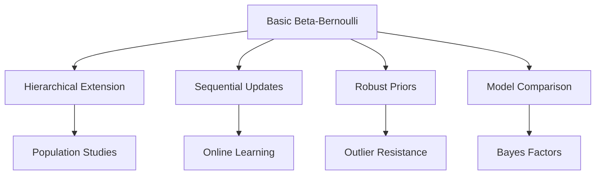

# Bayesian Coin Flip

```admonish info title="Contents"
<!-- toc -->
```

A comprehensive introduction to Bayesian inference through the classic coin flip problem. This tutorial demonstrates core Bayesian concepts including prior beliefs, likelihood functions, posterior distributions, and conjugate analysis using Fugue's type-safe probabilistic programming framework.

```admonish info title="Learning Objectives"
By the end of this tutorial, you will understand:
- **Bayesian Inference**: How to combine prior beliefs with data
- **Conjugate Analysis**: Analytical solutions for Beta-Bernoulli models
- **Model Validation**: Posterior predictive checks and diagnostics  
- **Decision Theory**: Making practical decisions under uncertainty
```

## The Problem & Data

**Research Question**: Is a coin fair, or does it have a bias toward heads or tails?

In classical statistics, we might perform a hypothesis test. In **Bayesian statistics**, we express our uncertainty about the coin's bias as a probability distribution and update this belief as we observe data.

```admonish note title="Why Coin Flips Matter"
The coin flip problem is fundamental because it introduces all core Bayesian concepts in their simplest form:
- **Binary outcomes** (success/failure, true/false) appear everywhere in practice
- **Beta-Bernoulli conjugacy** provides exact analytical solutions
- **Parameter uncertainty** is naturally quantified through probability distributions
```

### Data Generation & Exploration

```rust,no_run
{{#include ../../../../examples/bayesian_coin_flip.rs:data_setup}}
```

**Real-World Context**: This could represent:

- **Quality Control**: Defective vs. non-defective products
- **Medical Trials**: Treatment success rates
- **A/B Testing**: Conversion rates between variants
- **Survey Response**: Yes/No answers to questions

## Mathematical Foundation

The **Bayesian paradigm** treats parameters as random variables with probability distributions. For the coin flip problem:

### Model Specification

**Prior Distribution**: Our initial belief about the coin bias $p$ before seeing data.

$$p \sim \text{Beta}(\alpha_0, \beta_0)$$

where $\alpha_0$ and $\beta_0$ encode our prior "pseudo-observations" of successes and failures.

**Likelihood Function**: Given bias $p$, each flip $X_i$ follows:

$$X_i \mid p \sim \text{Bernoulli}(p) \quad \text{for } i = 1, 2, \ldots, n$$

The **joint likelihood** for $n$ independent flips with $k$ successes is:

$$L(p \mid \mathbf{x}) = p^k (1-p)^{n-k}$$

**Posterior Distribution**: By **Bayes' theorem**:

$$p(\theta \mid \text{data}) = \frac{p(\text{data} \mid \theta) \cdot p(\theta)}{p(\text{data})} \propto p(\text{data} \mid \theta) \cdot p(\theta)$$

For the Beta-Bernoulli model, the posterior is:

$$p \mid \mathbf{x} \sim \text{Beta}(\alpha_0 + k, \beta_0 + n - k)$$

```admonish important title="Conjugate Prior Theorem"
The **Beta distribution** is **conjugate** to the **Bernoulli likelihood**, meaning:
- **Prior**: $\text{Beta}(\alpha_0, \beta_0)$
- **Likelihood**: $\text{Bernoulli}(p)^n$ with $k$ successes  
- **Posterior**: $\text{Beta}(\alpha_0 + k, \beta_0 + n - k)$

This gives us **exact analytical solutions** without requiring numerical approximation.
```

```rust,no_run
{{#include ../../../../examples/bayesian_coin_flip.rs:mathematical_foundation}}
```

### Prior Choice and Interpretation

The **Beta($\alpha, \beta$)** distribution has:

- **Mean**: $\mathbb{E}[p] = \frac{\alpha}{\alpha + \beta}$
- **Variance**: $\text{Var}[p] = \frac{\alpha\beta}{(\alpha + \beta)^2(\alpha + \beta + 1)}$

Common choices:

- **Beta(1,1)**: Uniform prior (no preference)
- **Beta(2,2)**: Weakly informative, slight preference for fairness
- **Beta(0.5, 0.5)**: Jeffreys prior (non-informative)

## Basic Implementation

Let's implement our Bayesian coin flip model in Fugue:

```rust,no_run
# use fugue::*;
{{#include ../../../../examples/bayesian_coin_flip.rs:basic_model}}
```

**Key Implementation Details**:

1. **Type Safety**: `Bernoulli` returns `bool` directly—no casting required
2. **Plate Notation**: `plate!` efficiently handles vectorized observations
3. **Address Uniqueness**: Each observation gets a unique address `flip#i`
4. **Pure Functional**: Model returns the parameter of interest directly

```admonish tip title="Model Design Patterns"
- Use **descriptive addresses** like `"coin_bias"` instead of generic names
- **Plate notation** scales efficiently to large datasets
- **Pure functions** make models testable and composable
- **Type safety** eliminates runtime errors from incorrect data types
```

## Advanced Techniques

### Analytical Posterior Solution

The beauty of conjugate priors is that we can compute the exact posterior without numerical approximation:

```rust,no_run
{{#include ../../../../examples/bayesian_coin_flip.rs:analytical_solution}}
```

### MCMC Validation

While analytical solutions are preferred, we can validate our results using MCMC:

```rust,no_run
{{#include ../../../../examples/bayesian_coin_flip.rs:mcmc_inference}}
```

**Why MCMC for a Conjugate Model?**

Even though we have analytical solutions, MCMC serves important purposes:

- **Validation**: Confirms our analytical calculations
- **Flexibility**: Easily extends to non-conjugate models
- **Diagnostics**: Provides convergence and mixing assessments

```admonish note title="Effective Sample Size"
The **Effective Sample Size (ESS)** measures how many independent samples we have. For good MCMC:
- **ESS > 400**: Generally adequate for inference
- **ESS < 100**: May indicate poor mixing or autocorrelation
- **ESS/Total < 0.1**: Consider increasing chain length or improving proposals
```

## Diagnostics & Validation

**Model validation** ensures our model adequately represents the data-generating process:

```rust,no_run
{{#include ../../../../examples/bayesian_coin_flip.rs:model_validation}}
```

### Posterior Predictive Checks

The **posterior predictive distribution** answers: "If our model is correct, what data would we expect to see?"

$$p(\tilde{\mathbf{x}} \mid \mathbf{x}) = \int p(\tilde{\mathbf{x}} \mid \theta) p(\theta \mid \mathbf{x}) d\theta$$

**Interpretation**:

- **Good fit**: Observed data looks typical under the posterior predictive
- **Poor fit**: Observed data is extreme under the posterior predictive
- **Model inadequacy**: Systematic deviations suggest missing model components

```admonish warning title="Model Checking Principles"
- **Never use the same data** for both model fitting and validation
- **Multiple checks** are better than single summary statistics
- **Graphical diagnostics** often reveal patterns missed by numerical summaries
- **Extreme p-values** (< 0.05 or > 0.95) suggest potential model issues
```

## Production Extensions

### Decision Theory and Practical Applications

Bayesian inference provides the foundation for **optimal decision-making** under uncertainty:

```rust,no_run
{{#include ../../../../examples/bayesian_coin_flip.rs:decision_analysis}}
```

### Advanced Model Extensions

Real applications often require extensions beyond the basic model:

```rust,no_run
{{#include ../../../../examples/bayesian_coin_flip.rs:advanced_extensions}}
```

**Advanced Modeling Scenarios**:

1. **Hierarchical Models**: Multiple coins with shared population parameters
2. **Sequential Learning**: Online updates as new flips arrive  
3. **Robust Priors**: Heavy-tailed distributions to handle outliers
4. **Model Selection**: Comparing fair vs. biased hypotheses using Bayes factors



## Real-World Considerations

### When to Use Bayesian vs. Frequentist Methods

**Bayesian Advantages**:

- **Natural uncertainty quantification**: Full posterior distributions
- **Prior knowledge incorporation**: Systematic way to include expert knowledge  
- **Decision-theoretic framework**: Optimal decisions under specified loss functions
- **Sequential updating**: Natural online learning as data arrives

**Frequentist Advantages**:

- **Objective interpretation**: No need to specify prior distributions
- **Computational simplicity**: Often faster for standard problems
- **Regulatory acceptance**: Many standards assume frequentist methods

```admonish note title="Practical Guidelines"
**Use Bayesian methods when**:
- You have relevant prior information to incorporate
- You need full uncertainty quantification (not just point estimates)
- You're making sequential decisions as data arrives
- The cost of wrong decisions varies significantly

**Use Frequentist methods when**:
- You want to avoid specifying prior distributions
- Regulatory requirements mandate specific procedures  
- Computational resources are severely limited
- The problem has well-established frequentist solutions
```

### Performance Implications

- **Conjugate Models**: Analytical solutions are extremely fast
- **MCMC Methods**: Scale linearly with data size and number of parameters
- **Memory Usage**: Fugue's trace system efficiently manages large parameter spaces
- **Numerical Stability**: Log-space computations prevent underflow issues

### Common Pitfalls

1. **Improper Priors**: Always verify prior distributions integrate to 1
2. **Label Switching**: In mixture models, parameter interpretability can change
3. **Convergence Assessment**: Always check MCMC diagnostics before making inferences
4. **Prior Sensitivity**: Test how conclusions change under different reasonable priors

## Exercises

1. **Prior Sensitivity Analysis**:
   - Try different Beta priors: Beta(1,1), Beta(5,5), Beta(0.5,0.5)
   - How do the posteriors differ with the same data?
   - When does prior choice matter most?

2. **Sequential Learning**:
   - Start with Beta(2,2) prior
   - Update after each flip in sequence
   - Plot how the posterior evolves with each observation

3. **Model Comparison**:
   - Implement a "fair coin" model with p = 0.5 exactly
   - Compare evidence for fair vs. biased models using marginal likelihoods
   - What sample size is needed to distinguish p = 0.5 from p = 0.6?

4. **Hierarchical Extension**:
   - Model 5 different coins with a shared Beta population prior
   - Each coin has different numbers of flips
   - How does information sharing affect individual coin estimates?

## Testing Your Understanding

Comprehensive test suite for validation:

```rust,no_run
{{#include ../../../../examples/bayesian_coin_flip.rs:testing_framework}}
```

## Next Steps

Now that you understand Bayesian inference fundamentals:

- **[Type Safety Features](./type-safety-features.md)**: Learn how Fugue's type system prevents common errors
- **[Trace Manipulation](./trace-manipulation.md)**: Understand Fugue's runtime system for custom inference
- **[Linear Regression](../statistical-modeling/linear-regression.md)**: Extend to continuous outcomes
- **[Hierarchical Models](../statistical-modeling/hierarchical-models.md)**: Multi-level modeling

The coin flip problem provides the conceptual foundation for all Bayesian modeling. Every complex model builds on these same principles: prior beliefs, likelihood functions, and posterior inference.

```admonish success title="Key Takeaways"
✅ **Bayesian inference** combines prior knowledge with observed data systematically

✅ **Conjugate priors** enable exact analytical solutions for many important problems

✅ **Posterior distributions** quantify parameter uncertainty naturally

✅ **Model validation** through posterior predictive checks ensures model adequacy

✅ **Decision theory** provides a framework for optimal decision-making under uncertainty
```
