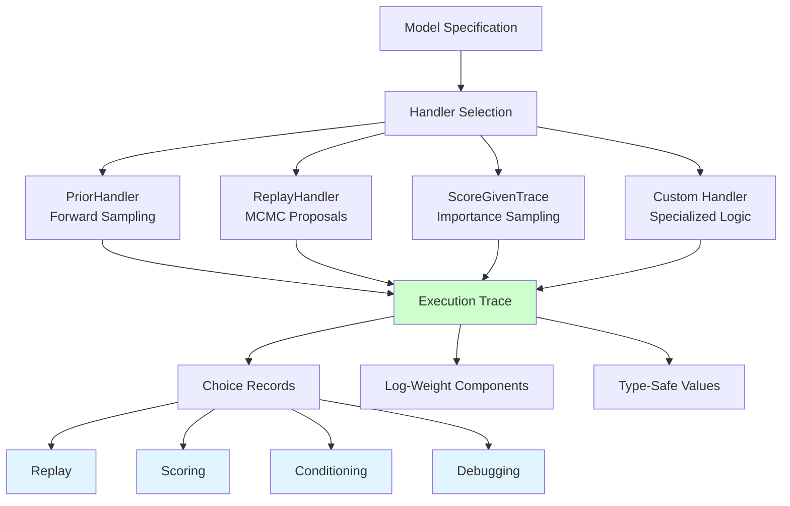
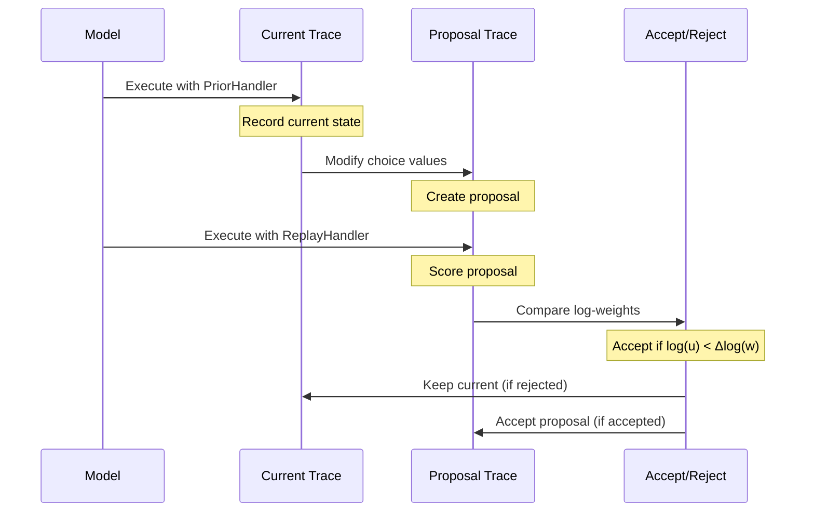
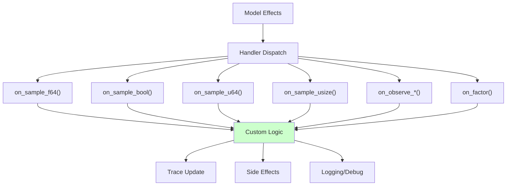
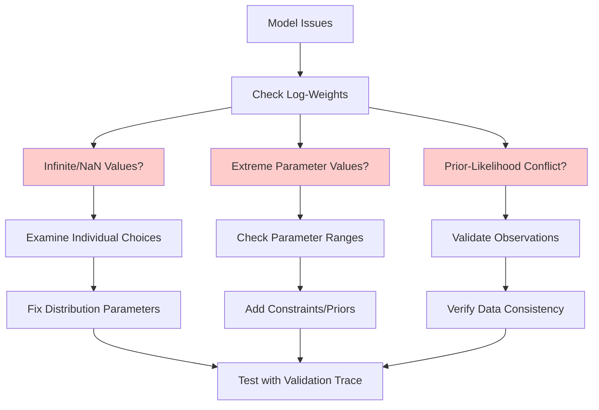

# Trace Manipulation

```admonish info title="Contents"
<!-- toc -->
```

A deep exploration of Fugue's runtime system and trace manipulation capabilities. This tutorial demonstrates how traces enable sophisticated probabilistic programming techniques including replay, scoring, custom inference, and debugging. Learn how Fugue's execution history recording makes advanced inference algorithms possible while maintaining full type safety.

```admonish info title="Learning Objectives"
By the end of this tutorial, you will understand:
- **Trace System Architecture**: How execution history is recorded and structured  
- **Runtime Interpreters**: Different ways to execute the same probabilistic model
- **Replay Mechanics**: How traces enable MCMC and other inference algorithms
- **Custom Handlers**: Building specialized execution strategies for specific needs
- **Memory Optimization**: Production-ready techniques for high-throughput scenarios
- **Diagnostic Tools**: Convergence assessment and debugging problematic models
```

## The Execution History Problem

Traditional programming languages execute once and discard their execution history. In probabilistic programming, we need to **record, manipulate, and reason about random choices** to enable sophisticated inference algorithms. Fugue's trace system solves this fundamental challenge.



## Mathematical Foundation

### Trace Formalization

A **trace** $\tau$ records the complete execution history of a probabilistic model, formally represented as:

$$\tau = \langle \mathcal{C}, \log w_{\text{prior}}, \log w_{\text{likelihood}}, \log w_{\text{factors}} \rangle$$

Where:

- $\mathcal{C}$: Map from addresses to choices $\{a_i \mapsto (v_i, \log p_i)\}$
- $\log w_{\text{prior}}$: Accumulated prior log-probability $\sum_i \log p(v_i)$
- $\log w_{\text{likelihood}}$: Accumulated observation log-probability $\sum_j \log p(y_j|x_j)$
- $\log w_{\text{factors}}$: Accumulated factor weights $\sum_k \log f_k$

### Total Log-Weight

The total unnormalized log-probability is:

$$\log w(\tau) = \log w_{\text{prior}} + \log w_{\text{likelihood}} + \log w_{\text{factors}}$$

This decomposition enables sophisticated inference algorithms to reason about different sources of probability mass.

```admonish math title="Trace Properties"
**Consistency**: For a valid execution, $\log w(\tau)$ represents the unnormalized log-probability of that specific execution path.

**Replayability**: Given trace $\tau$, the model can be deterministically re-executed to produce the same result and weight.

**Compositionality**: Traces can be modified, combined, and analyzed to implement complex inference strategies.
```

## Basic Trace Inspection

Let's start by understanding how Fugue records execution history:

```rust,ignore
# use fugue::*;
# use fugue::runtime::interpreters::PriorHandler;
# use rand::{SeedableRng, rngs::StdRng};
{{#include ../../../../examples/trace_manipulation.rs:basic_trace_inspection}}
```

### Trace Structure Analysis

Every trace contains three critical components:

1. **Choices Map**: Records every random decision with its address, value, and log-probability
2. **Weight Decomposition**: Separates prior, likelihood, and factor contributions
3. **Type-Safe Values**: Maintains natural types throughout execution

```admonish tip title="Debugging with Traces"
The trace decomposition immediately shows you:
- **Prior weight**: How likely your parameter values are under priors
- **Likelihood weight**: How well your model fits the observed data  
- **Factor weight**: Contribution from explicit `factor()` statements
```

## Replay Mechanics

The replay system is the foundation of MCMC algorithms. It allows deterministic re-execution with modified random choices:

```rust,ignore
# use fugue::*;
# use fugue::runtime::interpreters::*;
# use fugue::runtime::trace::*;
# use rand::{SeedableRng, rngs::StdRng};
{{#include ../../../../examples/trace_manipulation.rs:replay_mechanics}}
```

### MCMC Proposal Mechanism



The key insight: **the same model specification can be executed with different random choices** by manipulating the trace and using replay.

## Custom Handlers

Handlers define **how** probabilistic effects are interpreted. You can create custom handlers for specialized inference algorithms:

```rust,ignore
# use fugue::*;
# use fugue::runtime::{handler::Handler, trace::*};
# use rand::{SeedableRng, rngs::StdRng};
{{#include ../../../../examples/trace_manipulation.rs:custom_handler}}
```

### Handler Architecture



### Built-in Handler Types

| Handler | Purpose | Use Case |
|---------|---------|----------|
| `PriorHandler` | Forward sampling | Generate data, initialization |
| `ReplayHandler` | Deterministic replay | MCMC, validation |  
| `ScoreGivenTrace` | Compute log-probability | Importance sampling |
| `SafeReplayHandler` | Error-resilient replay | Production MCMC |
| `SafeScoreGivenTrace` | Safe scoring | Robust inference |

## Trace Scoring

Scoring computes the log-probability of a specific execution path, essential for importance sampling and model comparison:

```rust,ignore
# use fugue::*;
# use fugue::runtime::interpreters::*;
# use fugue::runtime::trace::*;
# use rand::{SeedableRng, rngs::StdRng};
{{#include ../../../../examples/trace_manipulation.rs:trace_scoring}}
```

### Importance Sampling Theory

Given proposal trace $\tau_q$ and target model $p$:

$$w(\tau_q) = \frac{p(\tau_q)}{q(\tau_q)}$$

Where the importance weight is:
$$\log w = \log p(\tau_q) - \log q(\tau_q)$$

Fugue's scoring system automatically computes $\log p(\tau_q)$ for any trace under any model.

```admonish warning title="Numerical Stability"
Always work in log-space for importance weights. Direct probability ratios quickly underflow or overflow for realistic models.
```

## Memory Optimization

For production workloads, efficient memory management is crucial:

```rust,ignore
# use fugue::*;
# use fugue::runtime::{interpreters::PriorHandler, memory::*};
# use rand::{SeedableRng, rngs::StdRng};
{{#include ../../../../examples/trace_manipulation.rs:memory_optimization}}
```

### Production Memory Strategies

1. **Copy-on-Write Traces**: Share read-only data, copy only when modified
2. **Trace Pooling**: Reuse allocated memory across multiple inferences
3. **Pre-sized Allocation**: Reserve space for expected number of choices
4. **Batch Processing**: Amortize allocation costs across many executions

```admonish tip title="Memory Benchmarking"
For high-throughput scenarios:
- Use `TracePool` for batch processing
- Pre-size trace builders when choice count is predictable
- Profile memory allocation patterns in your specific use case
```

## Diagnostic Tools

Fugue provides comprehensive tools for analyzing trace quality and convergence:

```rust,ignore
# use fugue::*;
# use fugue::runtime::interpreters::PriorHandler;
# use fugue::inference::diagnostics::*;
# use rand::{SeedableRng, rngs::StdRng};
{{#include ../../../../examples/trace_manipulation.rs:diagnostic_tools}}
```

### Convergence Assessment

**R-hat Statistic**: Compares between-chain variance to within-chain variance

$$\hat{R} = \sqrt{\frac{\hat{V}}{W}}$$

Where:

- $\hat{V}$: Estimated marginal posterior variance
- $W$: Within-chain variance

**Interpretation**:

- $\hat{R} \approx 1.0$: Good convergence
- $\hat{R} > 1.1$: Chains haven't mixed well, need more samples
- $\hat{R} > 1.2$: Poor convergence, investigate model or algorithm

### Parameter Summaries

For each parameter, compute:

- **Mean and Standard Deviation**: Central tendency and spread
- **Quantiles**: 5%, 25%, 50%, 75%, 95% for uncertainty intervals
- **Effective Sample Size**: Accounting for autocorrelation

## Advanced Debugging

When models behave unexpectedly, trace analysis reveals the root causes:

```rust,ignore
# use fugue::*;
# use fugue::runtime::interpreters::*;
# use fugue::runtime::trace::*;
# use rand::{SeedableRng, rngs::StdRng};
{{#include ../../../../examples/trace_manipulation.rs:advanced_debugging}}
```

### Debugging Strategy



### Common Issues and Solutions

| Problem | Symptom | Solution |
|---------|---------|----------|
| Numerical overflow | `Inf` log-weights | Use log-space throughout |
| Parameter explosion | Extreme values | Add regularizing priors |
| Prior-data conflict | Very negative likelihood | Check data preprocessing |
| Precision issues | Unstable gradients | Use higher precision types |

```admonish warning title="Production Debugging"
Always validate your models with:
1. **Known-good traces** with reasonable parameter values
2. **Synthetic data** where you know the true parameters  
3. **Multiple random seeds** to check consistency
4. **Finite-value assertions** in your handlers
```

## Real-World Applications

### Custom MCMC Algorithm

```rust,ignore
# use fugue::*;
# use fugue::runtime::{interpreters::*, trace::*};

struct CustomMCMC<R: rand::Rng> {
    rng: R,
    current_trace: Trace,
    step_size: f64,
}

impl<R: rand::Rng> CustomMCMC<R> {
    fn step<F>(&mut self, model_fn: F) -> bool 
    where F: Fn() -> Model<f64>
    {
        // Create proposal by modifying current trace
        let mut proposal_trace = self.current_trace.clone();
        
        // Modify a random choice (simplified)
        if let Some((addr, choice)) = proposal_trace.choices.iter_mut().next() {
            if let Some(current_val) = choice.value.as_f64() {
                let proposal_val = current_val + self.step_size * 
                    Normal::new(0.0, 1.0).unwrap().sample(&mut self.rng);
                choice.value = ChoiceValue::F64(proposal_val);
            }
        }
        
        // Score proposal
        let (_, scored_trace) = runtime::handler::run(
            ScoreGivenTrace::new(proposal_trace),
            model_fn()
        );
        
        // Accept/reject based on Metropolis criterion
        let log_alpha = scored_trace.total_log_weight() - 
                       self.current_trace.total_log_weight();
        
        if log_alpha > 0.0 || 
           self.rng.gen::<f64>().ln() < log_alpha {
            self.current_trace = scored_trace;
            true // Accepted
        } else {
            false // Rejected  
        }
    }
}
```

### Production Inference Pipeline

```rust,ignore
# use fugue::*;
# use fugue::runtime::memory::TracePool;

struct InferencePipeline {
    pool: TracePool,
    diagnostics: Vec<f64>,
}

impl InferencePipeline {
    fn run_batch<F>(&mut self, 
                   model_fn: F, 
                   n_samples: usize) -> Vec<(f64, Trace)>
    where F: Fn() -> Model<f64> + Copy
    {
        let mut results = Vec::with_capacity(n_samples);
        
        for _ in 0..n_samples {
            // Get pooled trace to avoid allocation
            let pooled_trace = self.pool.get_trace();
            
            let mut rng = rand::thread_rng();
            let handler = PriorHandler { 
                rng: &mut rng, 
                trace: pooled_trace 
            };
            
            let (result, trace) = runtime::handler::run(handler, model_fn());
            
            // Record diagnostics
            self.diagnostics.push(trace.total_log_weight());
            
            results.push((result, trace));
        }
        
        results
    }
    
    fn convergence_summary(&self) -> (f64, f64) {
        let mean = self.diagnostics.iter().sum::<f64>() / self.diagnostics.len() as f64;
        let var = self.diagnostics.iter()
            .map(|x| (x - mean).powi(2))
            .sum::<f64>() / (self.diagnostics.len() - 1) as f64;
        (mean, var.sqrt())
    }
}
```

## Best Practices

### Handler Development

```admonish tip title="Custom Handler Guidelines"
1. **Type Safety**: Always match handler methods to distribution return types
2. **Error Handling**: Use `Result` types for production handlers
3. **State Management**: Keep handler state minimal and well-documented
4. **Performance**: Pre-allocate collections when possible
5. **Testing**: Validate against known-good traces
```

### Memory Management

```admonish tip title="Production Optimization"
1. **Profile First**: Measure actual memory usage patterns
2. **Pool Strategically**: Use `TracePool` for repeated operations
3. **Size Appropriately**: Pre-size traces when choice count is predictable
4. **Monitor Growth**: Watch for memory leaks in long-running processes
```

### Debugging Workflow

```admonish tip title="Systematic Debugging"
1. **Check Basics**: Verify all log-weights are finite
2. **Isolate Components**: Test prior, likelihood, factors separately  
3. **Use Validation**: Create traces with known-good parameter values
4. **Compare Algorithms**: Try different inference methods
5. **Visualize Traces**: Plot parameter trajectories over time
```

## Testing Your Understanding

### Exercise 1: Custom Proposal Mechanism

Implement a custom handler that uses **adaptive proposals** based on the acceptance rate history:

```rust,ignore
# use fugue::*;
# use fugue::runtime::{handler::Handler, trace::*};

struct AdaptiveMCMCHandler<R: rand::Rng> {
    rng: R,
    current_trace: Trace,
    proposal_scale: f64,
    acceptance_history: Vec<bool>,
    adaptation_interval: usize,
}

// TODO: Implement Handler trait with adaptive step size
```

### Exercise 2: Multi-Chain Diagnostics

Create a system that runs multiple MCMC chains in parallel and automatically assesses convergence:

```rust,ignore
# use fugue::inference::diagnostics::*;

fn multi_chain_inference<F>(
    model_fn: F,
    n_chains: usize, 
    n_samples: usize
) -> (Vec<Vec<Trace>>, bool)
where F: Fn() -> Model<f64> + Copy
{
    // TODO: Run multiple chains and check R-hat convergence
    unimplemented!()
}
```

### Exercise 3: Memory-Optimized Batch Processing

Design a system for processing thousands of similar models efficiently:

```rust,ignore
# use fugue::runtime::memory::*;

struct BatchProcessor {
    pool: TracePool,
    // TODO: Add fields for efficient batch processing
}

impl BatchProcessor {
    fn process_batch<F>(&mut self, 
                       models: Vec<F>) -> Vec<(f64, Trace)>
    where F: Fn() -> Model<f64>
    {
        // TODO: Implement memory-efficient batch processing
        unimplemented!()
    }
}
```

## Key Takeaways

```admonish success title="Trace Manipulation Mastery"
1. **Execution History**: Traces record complete probabilistic execution paths
2. **Handler Flexibility**: The same model can be executed in radically different ways
3. **Replay Foundation**: MCMC and other algorithms depend on deterministic replay
4. **Custom Strategies**: Implement specialized inference through custom handlers
5. **Production Ready**: Memory optimization and diagnostics enable robust deployment
6. **Debugging Power**: Trace analysis reveals numerical issues and convergence problems
```

**Core Capabilities:**

- ✅ **Complete execution recording** with type safety and weight decomposition
- ✅ **Flexible interpretation** through the handler system
- ✅ **MCMC foundation** via deterministic replay mechanics
- ✅ **Custom inference** algorithms through handler extensibility  
- ✅ **Production optimization** with memory pooling and efficient allocation
- ✅ **Comprehensive diagnostics** for convergence assessment and debugging

## Further Reading

- [Custom Handlers Guide](../../how-to/custom-handlers.md) - Building specialized interpreters
- [Optimizing Performance](../../how-to/optimizing-performance.md) - Production deployment strategies  
- [Debugging Models](../../how-to/debugging-models.md) - Troubleshooting problematic models
- [API Reference](../../api-reference.md) - Complete runtime system specification
- *The Elements of Statistical Learning* - Theoretical foundations of inference algorithms
- *Monte Carlo Statistical Methods* - MCMC theory and practice
