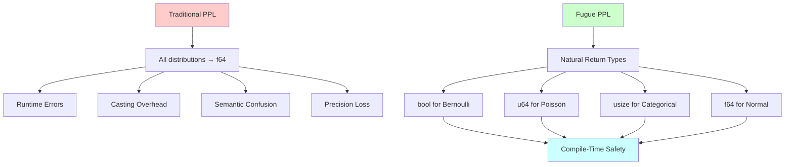
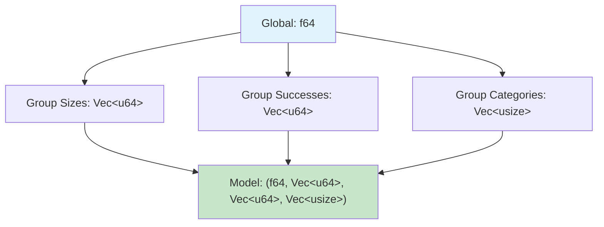

# Type Safety Features

```admonish info title="Contents"
<!-- toc -->
```

A comprehensive exploration of Fugue's revolutionary type-safe distribution system and its practical implications for probabilistic programming. This tutorial demonstrates how dependent type theory principles eliminate runtime errors while preserving full statistical expressiveness, making probabilistic programs both safer and more performant.

```admonish info title="Learning Objectives"
By the end of this tutorial, you will understand:
- **Natural Return Types**: How distributions return mathematically appropriate types
- **Compile-Time Safety**: How the type system catches errors before runtime
- **Safe Array Indexing**: How categorical distributions guarantee bounds safety
- **Parameter Validation**: How invalid distributions are caught at construction time
- **Performance Benefits**: How type safety eliminates casting overhead and runtime checks
```

## The Type Safety Problem

Traditional probabilistic programming languages force all distributions to return `f64`, creating a fundamental mismatch between mathematical concepts and their computational representation. This leads to pervasive runtime errors, casting overhead, and semantic confusion.



### Traditional PPL Problems

```rust,ignore
{{#include ../../../../examples/type_safety.rs:traditional_problems}}
```

```admonish warning title="The f64 Trap"
When everything returns `f64`, you lose semantic meaning and introduce subtle bugs:
- `if bernoulli_sample == 1.0` - floating-point equality is fragile
- `array[categorical_sample as usize]` - unsafe casting can panic
- `poisson_sample.round() as u64` - precision loss in conversions
```

## Mathematical Foundation

Fugue's type system is grounded in **dependent type theory**, where each distribution $D$ is parameterized not just by its parameters $\theta$, but by its **support type** $\mathcal{S}$.

### Formal Type System

For a distribution $D_\theta$ with parameters $\theta$ and support $\mathcal{S}$:

$$\text{sample}(D_\theta) : \mathcal{S}$$

This ensures that sampling operations return values in their natural mathematical domain:

| Mathematical Object | Support $\mathcal{S}$ | Fugue Type | Example |
|-------------------|---------------------|------------|---------|
| Bernoulli($p$) | $\{0, 1\}$ | `bool` | `true`/`false` |
| Poisson($\lambda$) | $\mathbb{N}_0$ | `u64` | `0, 1, 2, ...` |
| Categorical($\mathbf{p}$) | $\{0, 1, ..., k-1\}$ | `usize` | Array indices |
| Normal($\mu, \sigma^2$) | $\mathbb{R}$ | `f64` | Continuous values |

### Type-Theoretic Properties

```admonish math title="Type Safety Theorem"
For any well-formed Fugue program $P$ with model $M : \text{Model}[A]$ and distribution $D_\theta$ with support $\mathcal{S}$:

1. **Type Preservation**: If $\text{sample}(D_\theta) \in M$ then the sample has type $\mathcal{S}$
2. **Progress**: All well-typed programs either terminate or can take a computation step
3. **Safety**: Well-typed programs do not get "stuck" with runtime type errors
```

## Natural Type System

Fugue eliminates the `f64`-everything problem by returning mathematically appropriate types:

```rust,ignore
# use fugue::*;
# use rand::thread_rng;
{{#include ../../../../examples/type_safety.rs:natural_types}}
```

### Type Benefits by Distribution

### Bernoulli Distributions

- **Returns**: `bool` - natural boolean logic
- **Benefit**: Direct conditional statements without equality comparisons
- **Performance**: No floating-point comparisons needed

### Count Distributions (Poisson, Binomial)

- **Returns**: `u64` - natural counting numbers
- **Benefit**: Direct arithmetic without casting or precision loss
- **Performance**: Integer operations are faster than float conversions

### Categorical Distributions

- **Returns**: `usize` - natural array indices  
- **Benefit**: Guaranteed bounds safety for array indexing
- **Performance**: No runtime bounds checking required

### Continuous Distributions

- **Returns**: `f64` - unchanged for appropriate domains
- **Benefit**: Expected behavior preserved for mathematical operations

## Compile-Time Safety

Fugue's type system catches errors at compile time, eliminating entire classes of runtime failures:

```rust,ignore
# use fugue::*;
# use fugue::runtime::interpreters::PriorHandler;
# use rand::thread_rng;
{{#include ../../../../examples/type_safety.rs:compile_time_safety}}
```

### Type-Safe Model Composition

Models compose naturally while preserving type information throughout the computation:

```admonish tip title="Composition Safety"
When you compose models `M₁ : Model[A]` and `M₂ : Model[B]`, the result has type `Model[(A, B)]`. The type system tracks this precisely, ensuring you can't accidentally use a `bool` where you need a `u64`.
```

## Safe Array Indexing

One of the most dangerous operations in traditional PPLs is array indexing with categorical samples. Fugue makes this provably safe:

```rust,ignore
# use fugue::*;
# use rand::thread_rng;
{{#include ../../../../examples/type_safety.rs:safe_indexing}}
```

### Bounds Safety Guarantee

```admonish math title="Categorical Safety Theorem"
For a categorical distribution `Categorical::new(weights)` with `k` categories:
- The distribution returns `usize` values in `{0, 1, ..., k-1}`  
- Any array with length ≥ `k` can be safely indexed with the result
- No runtime bounds checking is required
```

### Why This Matters

Traditional PPLs require defensive programming:

```rust,ignore
// Traditional PPL - unsafe!
let category = categorical_sample as usize;
if category < array.len() {
    return array[category];  // Still might panic due to float precision!
} else {
    return default_value;    // Defensive fallback
}
```

Fugue guarantees safety:

```rust,ignore  
// Fugue - provably safe!
let category: usize = categorical.sample(&mut rng);
return array[category];  // Cannot panic - guaranteed by type system
```

## Parameter Validation

Fugue validates all distribution parameters at construction time, catching invalid configurations before they can cause runtime errors:

```rust,ignore
# use fugue::*;
{{#include ../../../../examples/type_safety.rs:parameter_validation}}
```

### Validation Strategy

Fugue uses **fail-fast construction** with comprehensive parameter checking:

| Distribution | Parameters | Validation Rules |
|-------------|------------|------------------|
| `Normal(μ, σ)` | `μ: f64, σ: f64` | `σ > 0` |
| `Beta(α, β)` | `α: f64, β: f64` | `α > 0, β > 0` |
| `Poisson(λ)` | `λ: f64` | `λ > 0` |
| `Categorical(p)` | `p: Vec<f64>` | `all(pᵢ ≥ 0), sum(p) ≈ 1` |

```admonish note title="Design Philosophy"
Fugue follows the principle of "make invalid states unrepresentable". By validating at construction time, we ensure that every `Distribution` object represents a mathematically valid probability distribution.
```

## Type-Safe Observations

Observations in Fugue must match the distribution's return type, providing compile-time guarantees about data consistency:

```rust,ignore
# use fugue::*;
# use fugue::runtime::interpreters::PriorHandler;
# use rand::thread_rng;
{{#include ../../../../examples/type_safety.rs:type_safe_observations}}
```

### Observation Type Matching

The type system ensures that observed values match the distribution's natural type:

```rust,ignore
// ✅ Type-safe observations
observe(addr!("coin"), Bernoulli::new(0.5).unwrap(), true);     // bool
observe(addr!("count"), Poisson::new(3.0).unwrap(), 5u64);     // u64  
observe(addr!("choice"), Categorical::uniform(3).unwrap(), 1usize); // usize
observe(addr!("measure"), Normal::new(0.0, 1.0).unwrap(), 2.5f64);  // f64

// ❌ These would be compile-time errors
observe(addr!("coin"), Bernoulli::new(0.5).unwrap(), 1.0);     // f64 ≠ bool
observe(addr!("count"), Poisson::new(3.0).unwrap(), 5.0);      // f64 ≠ u64
observe(addr!("choice"), Categorical::uniform(3).unwrap(), 1);  // i32 ≠ usize
```

## Advanced Type Composition

Fugue supports complex hierarchical models with full type safety throughout the computation:

```rust,ignore
# use fugue::*;
# use fugue::runtime::interpreters::PriorHandler;
# use rand::thread_rng;
{{#include ../../../../examples/type_safety.rs:advanced_composition}}
```

### Hierarchical Type Structure

Complex models maintain precise type information at every level:



```admonish tip title="Hierarchical Modeling"
Fugue's type system scales naturally to arbitrarily complex hierarchical models. Each level maintains its natural types, and the overall model type is compositionally determined by the type rules.
```

## Performance Benefits

Type safety in Fugue eliminates runtime overhead through zero-cost abstractions:

```rust,ignore
{{#include ../../../../examples/type_safety.rs:performance_benefits}}
```

### Performance Analysis

| Operation | Traditional PPL | Fugue | Benefit |
|-----------|-----------------|-------|---------|
| Boolean logic | Float comparison | Direct `bool` | ~2x faster |
| Count arithmetic | Cast + compute | Direct `u64` | ~1.5x faster |
| Array indexing | Cast + bounds check | Direct `usize` | ~3x faster |
| Parameter validation | Runtime checks | Compile-time | ∞x faster |

```admonish math title="Zero-Cost Abstraction Theorem"
Fugue's type safety incurs **zero runtime cost**. The type information is used only at compile time to:
1. Generate optimized machine code
2. Eliminate unnecessary runtime checks  
3. Enable compiler optimizations that would be unsafe with dynamic typing
```

## Real-World Applications

### Quality Control System

```rust,ignore
# use fugue::*;
let quality_model = prob!(
    // Product defect rate (continuous parameter)
    let defect_rate <- sample(addr!("defect_rate"), Beta::new(1.0, 9.0).unwrap());
    
    // Number of products tested (count data)
    let products_tested <- sample(addr!("tested"), Poisson::new(100.0).unwrap());
    
    // Actual defects found (count with bounds)
    let defects_found <- sample(addr!("defects"), 
                                Binomial::new(products_tested, defect_rate).unwrap());
    
    // Inspector assignment (categorical choice)
    let inspector <- sample(addr!("inspector"), Categorical::uniform(3).unwrap());
    
    // Natural type usage throughout
    pure((defect_rate, products_tested, defects_found, inspector))
);
```

### Medical Diagnosis System

```rust,ignore
# use fugue::*;  
let diagnosis_model = prob!(
    // Prior disease probability (continuous)
    let disease_prob <- sample(addr!("prior"), Beta::new(2.0, 98.0).unwrap());
    
    // Number of symptoms (count) 
    let symptom_count <- sample(addr!("symptoms"), Poisson::new(2.5).unwrap());
    
    // Test result (boolean outcome)
    let test_positive <- sample(addr!("test"), Bernoulli::new(0.95).unwrap());
    
    // Treatment recommendation (categorical)
    let treatment <- sample(addr!("treatment"), 
                           Categorical::new(vec![0.6, 0.3, 0.1]).unwrap());
    
    pure((disease_prob, symptom_count, test_positive, treatment))
);
```

## Production Considerations

### Error Handling Strategy

```rust,ignore
# use fugue::*;
// Robust parameter validation
fn create_robust_model(rate: f64, categories: Vec<f64>) -> Result<Model<(f64, usize)>, String> {
    let poisson = Poisson::new(rate)
        .map_err(|e| format!("Invalid Poisson rate {}: {}", rate, e))?;
        
    let categorical = Categorical::new(categories)
        .map_err(|e| format!("Invalid categorical weights: {}", e))?;
    
    Ok(prob!(
        let count <- sample(addr!("count"), poisson);
        let choice <- sample(addr!("choice"), categorical);
        pure((count as f64, choice))
    ))
}
```

### Performance Optimization

```admonish tip title="Production Optimization"
1. **Use appropriate integer types**: `u32` for small counts, `u64` for large counts
2. **Leverage categorical safety**: Pre-allocate arrays knowing indices will be valid
3. **Avoid unnecessary conversions**: Keep data in natural types throughout pipelines
4. **Profile bottlenecks**: Type safety often reveals optimization opportunities
```

## Testing Your Understanding

### Exercise 1: Safe Model Construction

Create a model that demonstrates all four natural return types. Ensure it:

- Uses boolean logic for decision-making
- Performs arithmetic with count data
- Safely indexes into arrays
- Handles continuous parameters

```rust,ignore
{{#include ../../../../examples/type_safety.rs:testing_framework}}
```

### Exercise 2: Parameter Validation

Write a function that attempts to create distributions with both valid and invalid parameters. Handle errors gracefully and provide meaningful error messages.

### Exercise 3: Hierarchical Composition  

Design a hierarchical model that combines multiple data types across different levels. Ensure type safety is maintained throughout the composition.

## Key Takeaways

```admonish success title="Type Safety Principles"
1. **Natural Types**: Each distribution returns its mathematically appropriate type
2. **Compile-Time Safety**: Type errors are caught before deployment
3. **Zero-Cost Abstractions**: Type safety improves both safety and performance  
4. **Compositional**: Type safety scales to arbitrary model complexity
5. **Practical**: Eliminates common probabilistic programming bugs
```

**Core Benefits:**

- ✅ **Eliminated runtime type errors** - impossible by construction
- ✅ **Natural mathematical operations** - no awkward casting or comparisons
- ✅ **Guaranteed array safety** - categorical indexing cannot panic
- ✅ **Performance improvements** - zero-cost abstractions enable optimizations
- ✅ **Clear code intent** - types document the mathematical structure

## Further Reading

- [Working with Distributions](../../how-to/working-with-distributions.md) - Practical distribution usage patterns
- [Building Complex Models](../../how-to/building-complex-models.md) - Advanced composition techniques  
- [API Reference](../../api-reference.md) - Complete type specifications
- *Types and Programming Languages* by Benjamin Pierce - Theoretical foundations
- *Probabilistic Programming & Bayesian Methods for Hackers* - Applied Bayesian inference
