# Statistical Modeling

```admonish info title="Contents"
This section provides comprehensive coverage of statistical modeling using Fugue:
- **[Linear Regression](./linear-regression.md)** - Foundation of statistical modeling
- **[Classification](./classification.md)** - Discrete outcome modeling
- **[Mixture Models](./mixture-models.md)** - Unsupervised clustering and heterogeneous populations
- **[Hierarchical Models](./hierarchical-models.md)** - Multi-level and grouped data modeling
```

Welcome to **statistical modeling with Fugue**! This section demonstrates how Bayesian probabilistic programming transforms traditional statistical analysis through principled uncertainty quantification, robust inference, and flexible model specification.

```admonish success title="Why Bayesian Statistical Modeling?"
**Traditional statistics** gives you point estimates and p-values.  
**Bayesian modeling** gives you full posterior distributions, prediction intervals, and principled model comparison.

✅ **Natural uncertainty quantification** for all parameters  
✅ **Robust inference** with constraint-aware MCMC  
✅ **Principled model selection** via Bayes factors and information criteria  
✅ **Flexible prior knowledge integration** through hierarchical structures  
✅ **Automatic regularization** prevents overfitting  
✅ **Production-ready workflows** with comprehensive diagnostics
```

## Learning Path

```mermaid
graph TB
    A[Statistical Modeling Journey] --> B[Foundation]
    A --> C[Supervised Learning] 
    A --> D[Unsupervised Learning]
    A --> E[Advanced Methods]

    B --> F["Linear Regression<br/>📊 Basic Bayesian inference<br/>📊 Robust methods<br/>📊 Polynomial models<br/>📊 Model selection"]

    C --> G["Classification<br/>🧠 Logistic regression<br/>🧠 Multi-class methods<br/>🧠 Hierarchical classification<br/>🧠 Model comparison"]

    D --> H["Mixture Models<br/>🧬 Gaussian mixtures<br/>🧬 Infinite mixtures<br/>🧬 Hidden Markov models<br/>🧬 Clustering validation"]

    E --> I["Hierarchical Models<br/>🏢 Varying intercepts<br/>🏢 Mixed effects<br/>🏢 Nested structures<br/>🏢 Partial pooling"]

    F --> J["Applications<br/>🔬 Economic forecasting<br/>🔬 Medical research<br/>🔬 Scientific modeling"]
    G --> J
    H --> J
    I --> J
```



### Recommended Learning Sequence

```admonish tip title="Structured Learning Path"
**Beginners**: Start with **Linear Regression** → **Classification**

**Intermediate**: Add **Mixture Models** for unsupervised learning

**Advanced**: Master **Hierarchical Models** for complex data structures

**All Levels**: Each tutorial includes complete working examples with runnable code!
```

## Tutorial Overview

### 📊 [Linear Regression](./linear-regression.md)

**The foundation of statistical modeling**, covering:

- **Basic Bayesian regression** with uncertainty quantification
- **Robust regression** for outlier resistance  
- **Polynomial regression** for nonlinear relationships
- **Model selection** using Bayes factors
- **Ridge regression** for high-dimensional problems

```rust,no_run
# use fugue::*;
// Example: Basic Bayesian linear regression
let model = prob! {
    let intercept <- sample(addr!("intercept"), Normal::new(0.0, 10.0).unwrap());
    let slope <- sample(addr!("slope"), Normal::new(0.0, 10.0).unwrap());
    let sigma <- sample(addr!("sigma"), Gamma::new(1.0, 1.0).unwrap());
    
    // Observations with uncertainty
    for (i, (x_i, y_i)) in x_data.iter().zip(y_data.iter()).enumerate() {
        let mu_i = intercept + slope * x_i;
        observe(addr!("y", i), Normal::new(mu_i, sigma).unwrap(), *y_i);
    }
    
    pure((intercept, slope, sigma))
};
```

### 🧠 [Classification](./classification.md)

**Discrete outcome modeling** with comprehensive coverage:

- **Binary classification** with logistic regression
- **Multi-class classification** using multinomial methods
- **Hierarchical classification** for grouped data
- **Model comparison** and performance evaluation

```rust,no_run
# use fugue::*;
// Example: Hierarchical logistic regression
let model = prob! {
    let global_intercept <- sample(addr!("global_intercept"), Normal::new(0.0, 2.0).unwrap());
    let slope <- sample(addr!("slope"), Normal::new(0.0, 2.0).unwrap());
    let group_sigma <- sample(addr!("group_sigma"), Gamma::new(1.0, 1.0).unwrap());
    
    // Group-specific intercepts with partial pooling
    let group_intercepts <- plate!(g in 0..n_groups => {
        sample(addr!("group_intercept", g), Normal::new(global_intercept, group_sigma).unwrap())
    });
    
    pure((global_intercept, slope, group_intercepts))
};
```

### 🧬 [Mixture Models](./mixture-models.md)

**Advanced unsupervised learning** techniques:

- **Gaussian mixtures** for continuous data clustering
- **Multivariate mixtures** with correlation structure
- **Infinite mixtures** with automatic component discovery
- **Hidden Markov models** for temporal clustering

```rust,no_run
# use fugue::*;
// Example: Gaussian mixture with latent variables
let model = prob! {
    let pi1 <- sample(addr!("pi1"), Beta::new(1.0, 1.0).unwrap());
    let mu1 <- sample(addr!("mu1"), Normal::new(0.0, 5.0).unwrap());
    let sigma1 <- sample(addr!("sigma1"), Gamma::new(1.0, 1.0).unwrap());
    
    // Latent cluster assignments
    let assignments <- plate!(i in 0..data.len() => {
        sample(addr!("z", i), Categorical::new(vec![pi1, 1.0 - pi1]).unwrap())
    });
    
    pure((pi1, mu1, sigma1, assignments))
};
```

### 🏢 [Hierarchical Models](./hierarchical-models.md)

**Multi-level modeling** for complex data structures:

- **Varying intercepts** for group-level baseline differences
- **Varying slopes** for group-level relationship differences
- **Mixed effects** combining fixed and random effects
- **Nested hierarchies** for multi-level clustering

```rust,no_run
# use fugue::*;
// Example: Varying intercepts model
let model = prob! {
    // Population-level hyperparameters
    let mu_alpha <- sample(addr!("mu_alpha"), Normal::new(0.0, 5.0).unwrap());
    let sigma_alpha <- sample(addr!("sigma_alpha"), Gamma::new(1.0, 1.0).unwrap());
    let beta <- sample(addr!("beta"), Normal::new(0.0, 2.0).unwrap());
    
    // Group-specific intercepts via partial pooling
    let _observations <- plate!(i in 0..x_data.len() => {
        let group_j = group_ids[i];
        sample(addr!("alpha", group_j), Normal::new(mu_alpha, sigma_alpha).unwrap())
            .bind(move |alpha_j| {
                let mu_i = alpha_j + beta * x_data[i];
                observe(addr!("y", i), Normal::new(mu_i, sigma_y).unwrap(), y_data[i])
            })
    });
    
    pure((mu_alpha, sigma_alpha, beta, sigma_y))
};
```

## Key Statistical Concepts

### Bayesian Inference Pipeline

```mermaid
graph LR
    A["Data<br/>y₁, y₂, ..., yₙ"] --> B["Model<br/>p(y|θ)"]
    C["Priors<br/>p(θ)"] --> B

    B --> D["Posterior<br/>p(θ|y) ∝ p(y|θ)p(θ)"]

    D --> E["MCMC Sampling<br/>θ⁽¹⁾, θ⁽²⁾, ..., θ⁽ᴹ⁾"]

    E --> F["Inference<br/>📊 Point estimates<br/>📊 Credible intervals<br/>📊 Predictions"]

    E --> G["Diagnostics<br/>🔍 Convergence<br/>🔍 Model checking<br/>🔍 Validation"]
```



### Core Advantages

| Traditional Methods | Bayesian Methods |
|-------------------|-----------------|
| Point estimates | **Full posterior distributions** |
| Confidence intervals | **Credible intervals** |
| P-values | **Bayes factors** |
| Ad-hoc regularization | **Principled prior specification** |
| Model selection via AIC/BIC | **Marginal likelihood comparison** |

## Practical Implementation

### Essential Patterns

**Model Structure:**

```rust,no_run
# use fugue::*;
let model = prob! {
    // 1. Prior specification
    let parameter <- sample(addr!("param"), Normal::new(0.0, 1.0).unwrap());
    
    // 2. Likelihood specification
    for (i, observation) in data.iter().enumerate() {
        observe(addr!("obs", i), distribution, *observation);
    }
    
    // 3. Return parameters of interest
    pure(parameter)
};
```

**MCMC Workflow:**

```rust,no_run
# use fugue::inference::mh::adaptive_mcmc_chain;
# use rand::{SeedableRng, rngs::StdRng};

// 1. Define model function
let model_fn = move || your_statistical_model(data.clone());

// 2. Run adaptive MCMC
let mut rng = StdRng::seed_from_u64(42);
let samples = adaptive_mcmc_chain(&mut rng, model_fn, 1000, 200);

// 3. Extract and analyze results
let parameter_samples: Vec<f64> = samples.iter()
    .map(|(params, _)| params.parameter_of_interest)
    .collect();
```

## Model Selection Framework

### Information Criteria

| Criterion | Formula | Use Case |
|-----------|---------|----------|
| **DIC** | $\bar{D} + p_D$ | General model comparison |
| **WAIC** | $-2(\text{lppd} - p_{\text{WAIC}})$ | Robust alternative to DIC |
| **Bayes Factor** | $\frac{p(y\|\mathcal{M}_1)}{p(y\|\mathcal{M}_2)}$ | Direct model evidence |
| **Cross-Validation** | Leave-one-out predictive accuracy | Out-of-sample validation |

### Model Building Strategy

```admonish tip title="Systematic Model Development"
1. **Start Simple**: Begin with basic models (e.g., linear regression)
2. **Add Complexity Gradually**: Introduce robustness, nonlinearity, hierarchy as needed  
3. **Compare Systematically**: Use information criteria and cross-validation
4. **Validate Thoroughly**: Check residuals, convergence, and predictive performance
5. **Document Assumptions**: Clearly state model assumptions and limitations
```

## Running the Examples

All tutorials include complete, runnable examples:

```bash
# Linear regression demonstrations
cargo run --example linear_regression

# Classification methods
cargo run --example classification  

# Mixture modeling techniques
cargo run --example mixture_models

# Hierarchical model applications
cargo run --example hierarchical_models

# Run all statistical modeling tests
cargo test --example linear_regression
cargo test --example classification
cargo test --example mixture_models  
cargo test --example hierarchical_models
```

## Production Deployment

### Scalability Considerations

```rust,no_run
# use fugue::*;

// For large datasets, consider:

// 1. Mini-batch processing
fn minibatch_mcmc(data_chunks: Vec<Vec<Data>>, model_fn: ModelFn) {
    for chunk in data_chunks {
        let samples = adaptive_mcmc_chain(&mut rng, || model_fn(chunk), n_samples, warmup);
        // Process samples...
    }
}

// 2. Parallel inference
use std::thread;
let handles: Vec<_> = (0..n_chains).map(|chain_id| {
    thread::spawn(move || {
        let mut rng = StdRng::seed_from_u64(chain_id as u64);
        adaptive_mcmc_chain(&mut rng, model_fn, n_samples, warmup)
    })
}).collect();

// 3. Streaming inference for real-time data
```

### Monitoring and Diagnostics

```admonish warning title="Production Checklist"
**Essential monitoring for production Bayesian models:**

✅ **Convergence diagnostics**: R-hat < 1.1, effective sample size > 100  
✅ **Prior sensitivity**: Results stable across reasonable prior choices  
✅ **Posterior predictive checks**: Model captures key data features  
✅ **Cross-validation**: Stable out-of-sample performance  
✅ **Computational efficiency**: Reasonable wall-clock time for inference  
✅ **Parameter stability**: Results consistent across multiple runs
```

## Mathematical Foundations

### Core Statistical Models

**Linear Models:**
$$y_i = \mathbf{x}_i^T \boldsymbol{\beta} + \varepsilon_i, \quad \varepsilon_i \sim \mathcal{N}(0, \sigma^2)$$

**Generalized Linear Models:**
$$g(\mathbb{E}[y_i]) = \mathbf{x}_i^T \boldsymbol{\beta}$$

**Hierarchical Models:**
$$y_{ij} = \alpha_j + \boldsymbol{\beta}^T \mathbf{x}_{ij} + \varepsilon_{ij}$$
$$\alpha_j \sim \mathcal{N}(\mu_\alpha, \sigma_\alpha^2)$$

**Mixture Models:**
$$p(y_i) = \sum_{k=1}^K \pi_k f(y_i | \theta_k)$$

### Bayesian Workflow


## Advanced Topics

### Model Extensions

Each tutorial demonstrates advanced extensions:

- **Robustness**: Heavy-tailed distributions, outlier modeling
- **Nonlinearity**: Polynomial basis, spline methods, kernels
- **Correlation**: Multivariate models, spatial/temporal correlation
- **Hierarchical Structure**: Multi-level, nested, cross-classified models
- **Model Uncertainty**: Averaging, selection, expansion

### Computational Methods

```rust,no_run
# use fugue::*;

// Advanced MCMC techniques demonstrated:

// 1. Constraint-aware proposals for positive parameters
// Automatically handled by Fugue's MCMC implementation

// 2. Adaptive MCMC for efficient exploration
let samples = adaptive_mcmc_chain(&mut rng, model_fn, n_samples, warmup);

// 3. Multiple chains for convergence assessment  
let chains: Vec<_> = (0..n_chains).map(|seed| {
    let mut rng = StdRng::seed_from_u64(seed as u64);
    adaptive_mcmc_chain(&mut rng, model_fn.clone(), n_samples, warmup)
}).collect();

// 4. Posterior predictive sampling
let predictions: Vec<f64> = samples.iter().map(|(params, _)| {
    // Generate predictions using posterior samples
    predictive_model(new_x, params)
}).collect();
```

## Integration with Fugue Ecosystem

### Type Safety Benefits

```rust,no_run
# use fugue::*;

// Fugue's type safety prevents common statistical errors:

let bernoulli = Bernoulli::new(0.7).unwrap();
let outcome: bool = bernoulli.sample(&mut rng);  // Returns bool, not int!

let categorical = Categorical::new(vec![0.2, 0.3, 0.5]).unwrap(); 
let class: usize = categorical.sample(&mut rng);  // Safe indexing!

let normal = Normal::new(0.0, 1.0).unwrap();
let value: f64 = normal.sample(&mut rng);  // Explicit numeric type!
```

### Runtime Integration

```rust,no_run
# use fugue::runtime::handler::run;
# use fugue::runtime::interpreters::PriorHandler;

// Seamless integration with Fugue's runtime system:

// 1. Prior sampling for model validation
let (result, trace) = run(
    PriorHandler { rng: &mut rng, trace: Trace::default() },
    your_model()
);

// 2. Scoring for model comparison
let scored_trace = ScoreGivenTrace::new(trace).score(&mut rng, your_model());

// 3. Replay for debugging
let replay_trace = ReplayHandler::new(previous_trace)
    .replay(&mut rng, your_model());
```

## Common Statistical Tasks

### 1. Parameter Estimation

- Point estimates via posterior means
- Uncertainty via credible intervals
- Hypothesis testing via posterior probabilities

### 2. Prediction

- Point predictions with uncertainty bands
- Posterior predictive distributions  
- Out-of-sample validation

### 3. Model Selection

- Information criteria comparison
- Bayes factor evidence assessment
- Cross-validation performance

### 4. Model Checking

- Posterior predictive checks
- Residual analysis
- Convergence diagnostics

```admonish tip title="Best Practices Summary"
🎯 **Model Building**: Start simple, add complexity gradually, validate thoroughly

🔬 **Prior Selection**: Use weakly informative priors, check sensitivity

📊 **Inference**: Monitor convergence, assess adequacy, quantify uncertainty

🚀 **Production**: Automate diagnostics, cache samples, monitor performance

📚 **Communication**: Visualize uncertainty, explain methodology, document assumptions
```

## Further Reading

### Fugue Documentation

- [Building Complex Models](../../how-to/building-complex-models.md) - Advanced modeling techniques
- [Optimizing Performance](../../how-to/optimizing-performance.md) - Scalable inference
- [API Documentation](https://docs.rs/fugue/latest/fugue/) - Complete API reference
- [Foundation Tutorials](../foundation/README.md) - Basic probabilistic programming concepts

### Statistical References

- **Gelman et al. "Bayesian Data Analysis"** - Comprehensive Bayesian statistics
- **McElreath "Statistical Rethinking"** - Modern computational approach  
- **Kruschke "Doing Bayesian Data Analysis"** - Applied Bayesian methods
- **Murphy "Machine Learning: A Probabilistic Perspective"** - ML and statistics integration

### Advanced Topics

- [Advanced Applications](../advanced-applications/README.md) - Specialized modeling domains
- [Time Series Forecasting](../advanced-applications/time-series-forecasting.md) - Temporal modeling
- [Model Comparison](../advanced-applications/model-comparison-selection.md) - Advanced selection methods

---

**Statistical modeling with Fugue** combines the **theoretical rigor of Bayesian inference** with the **practical advantages of type-safe probabilistic programming**. Whether you're analyzing experimental data, building predictive models, or exploring complex relationships, these tutorials provide the foundation for **principled, robust, and scalable** statistical analysis.

🎓 **Start your statistical modeling journey** with the tutorial that matches your current needs and experience level!
