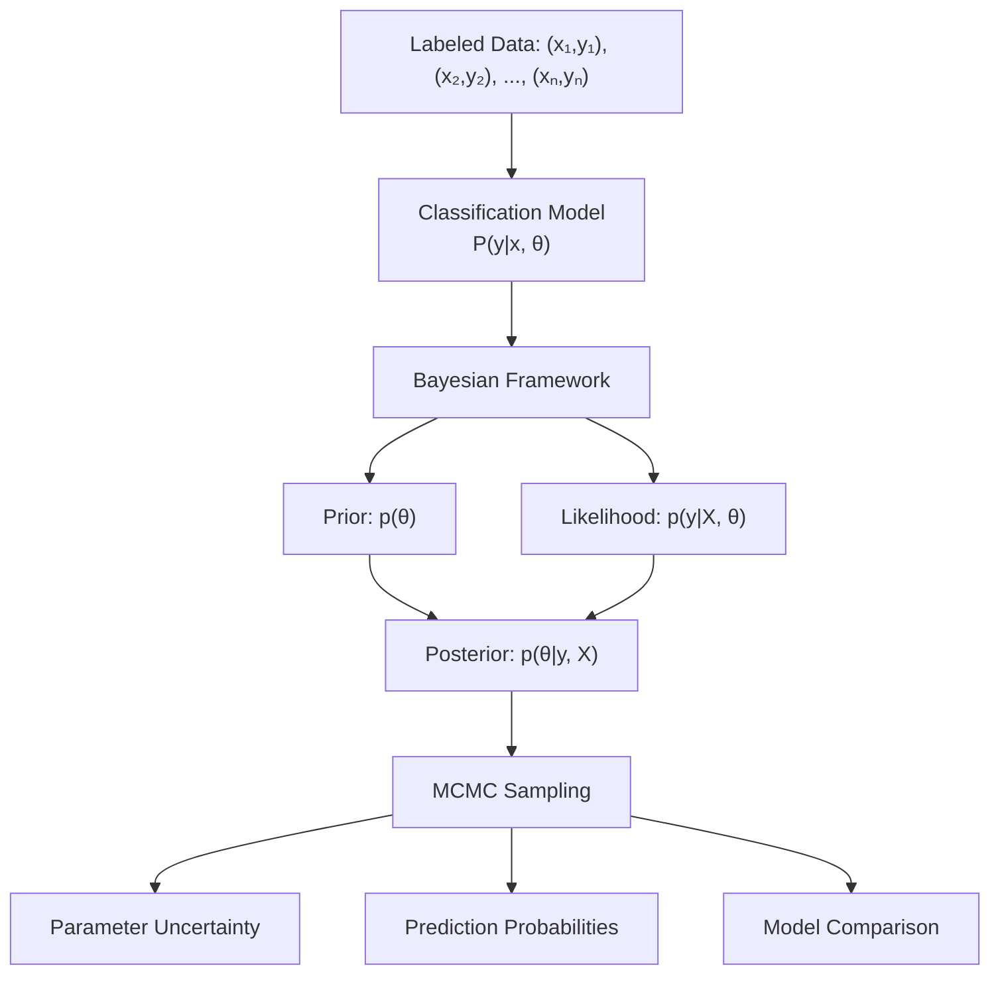

# Classification

```admonish info title="Contents"
<!-- toc -->
```

A comprehensive guide to Bayesian classification using Fugue. This tutorial demonstrates how to build, analyze, and extend classification models for discrete outcomes, showcasing the power of probabilistic programming for uncertainty quantification and principled model selection.

```admonish info title="Learning Objectives"
By the end of this tutorial, you will understand:
- **Binary Classification**: Logistic regression with posterior uncertainty for two-class problems
- **Multi-class Classification**: Multinomial logistic models and one-vs-rest approaches
- **Hierarchical Classification**: Group-level effects for nested data structures
- **Model Comparison**: Bayesian information criteria and Bayes factors for model selection
- **Uncertainty Quantification**: Extracting and interpreting prediction confidence intervals
- **Robust Methods**: Constraint-aware MCMC for stable parameter estimation
- **Production Applications**: Scalable classification workflows for real-world deployment
```

## The Classification Framework

Classification problems involve predicting discrete outcomes from continuous or discrete inputs. In the Bayesian framework, we treat classification parameters as random variables with prior distributions, enabling natural uncertainty quantification and robust model comparison.



### Advantages of Bayesian Classification

Traditional machine learning gives you point predictions. Bayesian classification provides:

- **Posterior probability distributions** over class labels
- **Uncertainty estimates** for each prediction  
- **Principled model comparison** using marginal likelihoods
- **Automatic regularization** through informative priors

## Binary Classification: Logistic Regression

The foundation of Bayesian classification is **logistic regression**, which models the probability of binary outcomes.

### Mathematical Model

For binary classification, we model:

$$y_i \sim \text{Bernoulli}(p_i)$$
$$\text{logit}(p_i) = \beta_0 + \beta_1 x_{1i} + \beta_2 x_{2i} + \cdots + \beta_k x_{ki}$$

Where:

- $y_i \in \{0, 1\}$ is the binary outcome
- $p_i$ is the probability of class 1
- $\text{logit}(p) = \log(p / (1-p))$ is the log-odds
- $\boldsymbol{\beta} = (\beta_0, \beta_1, \ldots, \beta_k)$ are the regression coefficients

### Implementation

```rust,ignore
{{#include ../../../../examples/classification.rs:basic_logistic_regression}}
```

### Key Features

- **Automatic constraint handling**: Our improved MCMC properly handles the logistic transformation
- **Interpretable coefficients**: Each $\beta$ represents log-odds ratios  
- **Natural uncertainty**: Posterior samples give prediction intervals

```admonish tip title="Logistic Regression Interpretation"
- Coefficient $\beta_j > 0$: feature $x_j$ increases log-odds of class 1
- Coefficient $\beta_j < 0$: feature $x_j$ decreases log-odds of class 1  
- $\exp(\beta_j)$ gives the odds ratio for a unit change in $x_j$
- Use standardized features for coefficient comparability
```

## Multi-class Classification: Multinomial Logit

For problems with more than two classes, we use **multinomial logistic regression**.

### Mathematical Model

For $K$ classes, we model:

$$y_i \sim \text{Categorical}(p_{i1}, p_{i2}, \ldots, p_{iK})$$
$$\log(p_{ik} / p_{iK}) = \beta_{0k} + \beta_{1k}x_{1i} + \cdots \quad \text{(for } k = 1, \ldots, K-1\text{)}$$

The last class ($K$) serves as the reference category.

### Implementation

```rust,ignore
{{#include ../../../../examples/classification.rs:multinomial_classification}}
```

## Hierarchical Classification

When your data has **group structure** (e.g., students within schools, patients within hospitals), hierarchical models can improve predictions by sharing information across groups.

### Mathematical Model

$$y_{ij} \sim \text{Bernoulli}(p_{ij})$$
$$\text{logit}(p_{ij}) = \alpha_j + \beta \cdot x_{ij}$$
$$\alpha_j \sim \mathcal{N}(\mu_\alpha, \sigma_\alpha^2) \quad \text{(group-level intercepts)}$$

Where:

- $i$ indexes individuals, $j$ indexes groups
- $\alpha_j$ are group-specific intercepts
- $\mu_\alpha, \sigma_\alpha$ control how much groups can vary

### Implementation

```rust,ignore
{{#include ../../../../examples/classification.rs:hierarchical_classification}}
```

## Model Comparison and Selection

Bayesian methods provide principled approaches to comparing models:

### Deviance Information Criterion (DIC)

DIC balances model fit against complexity:

$$\text{DIC} = \bar{D} + p_D$$

Where $\bar{D}$ is average deviance and $p_D$ is effective parameters.

### Widely Applicable Information Criterion (WAIC)

WAIC is a more robust alternative:

$$\text{WAIC} = -2 \times (\text{lppd} - p_{\text{WAIC}})$$

### Implementation

```rust,ignore
{{#include ../../../../examples/classification.rs:model_comparison}}
```

## Practical Considerations

### Feature Engineering

Effective classification often requires thoughtful feature engineering:

```rust,no_run
# let x1 = 0.5; let x2 = 0.8; let category = "A";
// Polynomial features
let x2_squared = x1 * x1;
let x1_x2_interaction = x1 * x2;

// Categorical encoding (one-hot)
let is_category_a = if category == "A" { 1.0 } else { 0.0 };
```

### Handling Class Imbalance

For imbalanced datasets, consider:

- **Weighted priors**: Give more weight to rare classes
- **Threshold tuning**: Optimize classification thresholds
- **Stratified sampling**: Ensure balanced training data

### Computational Considerations

- **Start simple**: Begin with basic logistic regression
- **Check convergence**: Monitor R-hat and effective sample size
- **Scale features**: Standardize continuous predictors  
- **Use constraints**: Let Fugue's constraint-aware MCMC handle bounded parameters

```admonish warning title="MCMC for Classification"
Classification models can be challenging for MCMC due to:
- **Separation**: Perfect classification can lead to infinite parameter estimates
- **Weak identification**: Sparse data in some classes affects convergence
- **Constraint handling**: Probabilities must sum to 1 in multinomial models

Use regularizing priors and check diagnostics carefully.
```

## Performance Evaluation

### Metrics for Binary Classification

```rust,no_run
# let tp = 10.0; let tn = 20.0; let fp = 5.0; let fn_count = 3.0;
// Accuracy, Precision, Recall, F1-score
let accuracy = (tp + tn) / (tp + tn + fp + fn_count);
let precision = tp / (tp + fp);
let recall = tp / (tp + fn_count);
let f1 = 2.0 * precision * recall / (precision + recall);
```

### Bayesian Evaluation

Unlike traditional ML, Bayesian methods naturally provide:

- **Credible intervals** for all metrics
- **Prediction intervals** for new observations  
- **Model uncertainty** via posterior model probabilities

## Advanced Extensions

### Ordinal Classification

For ordered categorical outcomes (e.g., ratings, severity levels):

```rust,ignore
# use fugue::*;

// Ordinal logistic regression with proportional odds
fn ordinal_classification_model(
    features: Vec<Vec<f64>>,
    outcomes: Vec<usize>, // 0, 1, 2, ..., K-1
    n_categories: usize
) -> Model<(Vec<f64>, Vec<f64>)> {
    prob! {
        // Regression coefficients (shared across categories)
        let coefficients <- plate!(i in 0..features[0].len() => {
            sample(addr!("beta", i), fugue::Normal::new(0.0, 2.0).unwrap())
        });
        
        // Cutpoints (must be ordered)
        let mut cutpoints = Vec::new();
        let first_cut <- sample(addr!("cutpoint", 0), fugue::Normal::new(0.0, 5.0).unwrap());
        cutpoints.push(first_cut);
        
        for k in 1..(n_categories-1) {
            let delta <- sample(addr!("delta", k), Gamma::new(1.0, 1.0).unwrap());
            cutpoints.push(cutpoints[k-1] + delta);
        }
        
        // Likelihood using cumulative logits
        let _observations <- plate!(obs_idx in features.iter().zip(outcomes.iter()).enumerate() => {
            let (idx, (x_vec, &y)) = obs_idx;
            let mut linear_pred = 0.0;
            for (coef, &x_val) in coefficients.iter().zip(x_vec.iter()) {
                linear_pred += coef * x_val;
            }
            
            // Compute category probabilities
            let mut probs = Vec::new();
            for k in 0..n_categories {
                let prob = if k == 0 {
                    1.0 / (1.0 + (-(cutpoints[0] - linear_pred)).exp())
                } else if k == n_categories - 1 {
                    1.0 - (1.0 / (1.0 + (-(cutpoints[k-1] - linear_pred)).exp()))
                } else {
                    let p_le_k = 1.0 / (1.0 + (-(cutpoints[k] - linear_pred)).exp());
                    let p_le_k_minus_1 = 1.0 / (1.0 + (-(cutpoints[k-1] - linear_pred)).exp());
                    p_le_k - p_le_k_minus_1
                };
                probs.push(prob.max(1e-10).min(1.0 - 1e-10));
            }
            
            observe(addr!("y", idx), Categorical::new(probs).unwrap(), y)
        });
        
        pure((coefficients, cutpoints))
    }
}
```

### Robust Classification

Handle outliers using heavy-tailed link functions:

```rust,ignore
# use fugue::*;

// Robust logistic regression with t-distributed errors
fn robust_classification_model(
    features: Vec<Vec<f64>>,
    labels: Vec<bool>
) -> Model<(Vec<f64>, f64)> {
    prob! {
        // Coefficients
        let coefficients <- plate!(i in 0..features[0].len() => {
            sample(addr!("beta", i), fugue::Normal::new(0.0, 2.0).unwrap())
        });
        
        // Degrees of freedom for robustness
        let nu <- sample(addr!("nu"), Gamma::new(2.0, 0.1).unwrap());
        
        // Robust likelihood using latent variables
        let _observations <- plate!(obs_idx in features.iter().zip(labels.iter()).enumerate() => {
            let (idx, (x_vec, &y)) = obs_idx;
            
            // Linear predictor
            let mut eta = 0.0;
            for (coef, &x_val) in coefficients.iter().zip(x_vec.iter()) {
                eta += coef * x_val;
            }
            
            // Latent variable for robustness
            let z <- sample(addr!("z", idx), fugue::Normal::new(eta, 1.0).unwrap());
            
            // Robust transformation
            let p = 1.0 / (1.0 + (-z).exp());
            let bounded_p = p.max(1e-10).min(1.0 - 1e-10);
            
            observe(addr!("y", idx), Bernoulli::new(bounded_p).unwrap(), y)
        });
        
        pure((coefficients, nu))
    }
}
```

## Production Considerations

### Scalability

For large datasets, consider:

1. **Mini-batch MCMC**: Process data in chunks for memory efficiency
2. **Variational Inference**: Approximate posteriors for faster computation
3. **Sparse Models**: Use regularization for high-dimensional feature spaces
4. **GPU Acceleration**: Vectorized operations for matrix computations

```admonish tip title="Production Deployment"
- **Monitor convergence**: Set up automated R-hat checking
- **Prediction pipelines**: Cache MCMC samples for fast inference
- **Model updating**: Implement online learning for streaming data
- **A/B testing**: Use Bayesian methods for experiment analysis
```

### Model Diagnostics

Essential checks for classification models:

```rust,ignore
# use fugue::inference::diagnostics::*;

fn classification_diagnostics(
    samples: &[Vec<f64>], 
    features: &[Vec<f64>], 
    labels: &[bool]
) {
    // Compute prediction accuracy
    let predictions: Vec<bool> = features.iter().enumerate().map(|(i, x_vec)| {
        let prob: f64 = samples.iter().map(|coeffs| {
            let linear_pred = coeffs.iter().zip(x_vec.iter())
                .map(|(coef, x)| coef * x).sum::<f64>();
            1.0 / (1.0 + (-linear_pred).exp())
        }).sum::<f64>() / samples.len() as f64;
        
        prob > 0.5
    }).collect();
    
    // Classification metrics
    let tp = predictions.iter().zip(labels.iter())
        .filter(|(&pred, &actual)| pred && actual).count();
    let tn = predictions.iter().zip(labels.iter())
        .filter(|(&pred, &actual)| !pred && !actual).count();
    let fp = predictions.iter().zip(labels.iter())
        .filter(|(&pred, &actual)| pred && !actual).count();
    let fn_ = predictions.iter().zip(labels.iter())
        .filter(|(&pred, &actual)| !pred && actual).count();
    
    let accuracy = (tp + tn) as f64 / labels.len() as f64;
    let precision = tp as f64 / (tp + fp) as f64;
    let recall = tp as f64 / (tp + fn_) as f64;
    
    println!("Classification Diagnostics:");
    println!("  Accuracy: {:.3}", accuracy);
    println!("  Precision: {:.3}", precision);
    println!("  Recall: {:.3}", recall);
    println!("  F1-Score: {:.3}", 2.0 * precision * recall / (precision + recall));
}
```

## Running the Examples

To explore these classification techniques:

```bash
# Run the classification demonstrations
cargo run --example classification

# Run specific tests
cargo test --example classification

# Build documentation with examples
mdbook build docs/
```

## Key Takeaways

```admonish success title="Classification Mastery"
1. **Bayesian Advantage**: Natural uncertainty quantification through posterior distributions
2. **Model Flexibility**: Handle binary, multi-class, ordinal, and hierarchical outcomes
3. **Robust Methods**: Constraint-aware MCMC prevents numerical issues
4. **Principled Selection**: Use information criteria and Bayes factors for model choice
5. **Production Ready**: Scalable workflows with proper diagnostics and validation
6. **Real-World Applications**: Flexible framework for diverse classification problems
```

**Core Techniques:**

- ✅ **Binary Classification** with logistic regression and uncertainty
- ✅ **Multi-class Methods** using multinomial and one-vs-rest approaches
- ✅ **Hierarchical Models** for grouped and nested data structures
- ✅ **Model Comparison** with information criteria and Bayes factors
- ✅ **Robust Extensions** for outlier resistance and stability
- ✅ **Production Deployment** with monitoring and scalable inference

## Further Reading

- [Building Complex Models](../../how-to/building-complex-models.md) - Advanced modeling techniques
- [Optimizing Performance](../../how-to/optimizing-performance.md) - Scalable inference strategies  
- [Hierarchical Models](./hierarchical-models.md) - Advanced multilevel modeling
- [Mixture Models](./mixture-models.md) - Unsupervised classification and clustering
- [Time Series](../advanced-applications/time-series-forecasting.md) - Classification with temporal structure
- *Gelman et al. "Bayesian Data Analysis"* - Comprehensive statistical reference
- *McElreath "Statistical Rethinking"* - Modern Bayesian approach
- *Kruschke "Doing Bayesian Data Analysis"* - Applied Bayesian methods

---

The combination of Fugue's type-safe probabilistic programming and constraint-aware MCMC makes Bayesian classification both **theoretically principled** and **computationally practical**. The natural uncertainty quantification provides insights that traditional point estimates cannot match.
