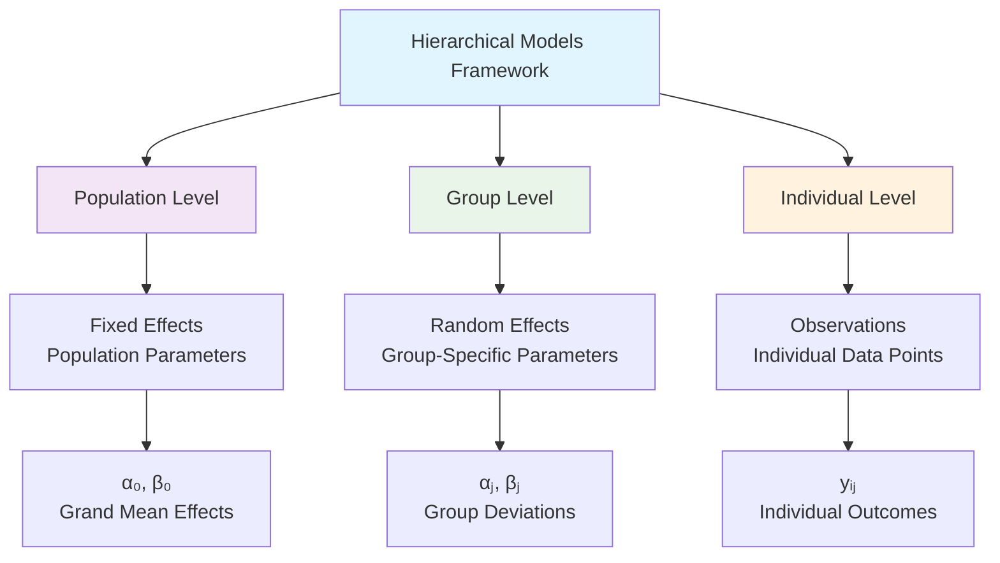
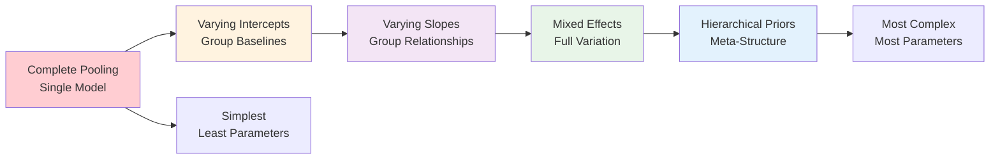

# Hierarchical Models

```admonish info title="Contents"
This tutorial covers Bayesian hierarchical modeling using Fugue:
- **Varying Intercepts**: Group-level intercept variation
- **Varying Slopes**: Group-level slope variation  
- **Mixed Effects**: Combined random and fixed effects
- **Hierarchical Priors**: Multi-level parameter structures
- **Model Selection**: Comparing hierarchical complexity
- **Practical Applications**: Real-world hierarchical data analysis
```

```admonish success title="Learning Objectives"
After completing this tutorial, you will be able to:
- Model grouped/clustered data with hierarchical structures
- Implement varying intercepts and slopes models
- Use mixed effects for complex data relationships
- Apply hierarchical priors for robust parameter estimation
- Perform model selection across hierarchical complexity levels
- Handle partial pooling vs complete pooling trade-offs
```

## Introduction

**Hierarchical models** (also called multi-level or mixed-effects models) are essential for analyzing **grouped or clustered data** where observations within groups are more similar to each other than to observations in other groups. Examples include:

- **Students within schools**: Academic performance varies by student and school
- **Patients within hospitals**: Treatment outcomes depend on individual and hospital factors  
- **Measurements over time**: Repeated measures on the same subjects
- **Geographic clustering**: Economic indicators within regions/countries



### The Hierarchical Advantage

**Complete Pooling** (ignore groups): ❌ Loses group-specific information  
**No Pooling** (separate models): ❌ Ignores shared population structure  
**Partial Pooling** (hierarchical): ✅ **Best of both worlds**

Hierarchical models provide **partial pooling**, where:

- Groups with **more data** → estimates closer to group-specific values
- Groups with **less data** → estimates shrink toward population mean  
- **Automatic regularization** prevents overfitting to small groups

## Mathematical Foundation

### Basic Hierarchical Structure

For grouped data with **J** groups and **nⱼ** observations per group:

**Level 1 (Individual):**
\\[ y_{ij} \sim \text{Normal}(\mu_{ij}, \sigma_y) \\]
\\[ \mu_{ij} = \alpha_j + \beta_j x_{ij} \\]

**Level 2 (Group):**
\\[ \alpha_j \sim \text{Normal}(\mu_\alpha, \sigma_\alpha) \\]
\\[ \beta_j \sim \text{Normal}(\mu_\beta, \sigma_\beta) \\]

**Level 3 (Population):**
\\[ \mu_\alpha, \mu_\beta \sim \text{Normal}(0, \text{large variance}) \\]
\\[ \sigma_\alpha, \sigma_\beta, \sigma_y \sim \text{HalfNormal}(\text{scale}) \\]

## Varying Intercepts Model

The **simplest hierarchical model** allows different baseline levels across groups while maintaining the same slope:

\\[ y_{ij} = \alpha_j + \beta x_{ij} + \epsilon_{ij} \\]

Where **αⱼ** varies by group **j**, but **β** is shared across all groups.

```rust,ignore
{{#include ../../../../examples/hierarchical_models.rs:varying_intercepts_model}}
```

```admonish tip title="When to Use Varying Intercepts"
- **Different baseline levels** across groups (e.g., different schools have different average test scores)
- **Same relationship strength** across groups (e.g., study hours → test scores has the same effect in all schools)
- **Moderate group-level variation** in intercepts
```

### Demonstration: School Performance Analysis

```rust,ignore
{{#include ../../../../examples/hierarchical_models.rs:varying_intercepts_demo}}
```

## Varying Slopes Model

When the **relationship strength varies** across groups, we need **varying slopes**:

\\[ y_{ij} = \alpha + \beta_j x_{ij} + \epsilon_{ij} \\]

Where **βⱼ** varies by group **j**, but **α** is shared.

```rust,ignore
{{#include ../../../../examples/hierarchical_models.rs:varying_slopes_model}}
```

```admonish warning title="Varying Slopes Complexity"
Varying slopes models are **more complex** and require:
- **Sufficient data per group** to estimate group-specific slopes
- **Careful prior specification** for slope variation
- **Convergence monitoring** due to increased parameter correlation
```

## Mixed Effects Model

The **most flexible hierarchical model** allows **both intercepts and slopes** to vary by group:

\\[ y_{ij} = \alpha_j + \beta_j x_{ij} + \epsilon_{ij} \\]

**Both αⱼ and βⱼ vary by group**, with possible **correlation** between them.

```rust,ignore
{{#include ../../../../examples/hierarchical_models.rs:mixed_effects_model}}
```

### Correlated Random Effects

In practice, intercepts and slopes are often **correlated**:

- **High-performing groups** might benefit **less** from interventions (ceiling effect)
- **Low-performing groups** might benefit **more** from interventions

```rust,ignore
{{#include ../../../../examples/hierarchical_models.rs:correlated_effects_model}}
```

```admonish success title="Mixed Effects Applications"
Mixed effects models excel in:
- **Longitudinal studies**: Individual growth trajectories
- **Treatment heterogeneity**: Different treatment effects across subgroups  
- **Geographic variation**: Region-specific policy effects
- **Individual differences**: Person-specific learning rates
```

## Hierarchical Priors

**Hierarchical priors** extend the hierarchical structure to **parameter distributions themselves**:

```rust,ignore
{{#include ../../../../examples/hierarchical_models.rs:hierarchical_priors_model}}
```

### Benefits of Hierarchical Priors

1. **Automatic regularization**: Prevents extreme parameter estimates
2. **Information sharing**: Groups with little data borrow strength from others
3. **Robustness**: Less sensitive to outlier groups
4. **Uncertainty quantification**: Proper propagation of all sources of uncertainty

## Model Comparison and Selection

### Hierarchical Model Complexity Spectrum



```rust,ignore
{{#include ../../../../examples/hierarchical_models.rs:model_comparison_demo}}
```

### Model Selection Criteria

1. **Information Criteria**: DIC, WAIC for hierarchical model comparison
2. **Cross-Validation**: Group-level or observation-level CV strategies  
3. **Posterior Predictive Checks**: Model adequacy for grouped structure
4. **Domain Knowledge**: Theoretical expectations about group variation

## Practical Considerations

### Data Requirements

```admonish warning title="Hierarchical Model Requirements"
**Minimum requirements for reliable hierarchical modeling:**
- **At least 5-8 groups** for meaningful group-level inference
- **At least 2-3 observations per group** (more for varying slopes)  
- **Balanced or reasonably balanced** group sizes when possible
- **Sufficient total sample size** (typically N > 50 for basic models)
```

### Computational Considerations

```rust,ignore
{{#include ../../../../examples/hierarchical_models.rs:computational_diagnostics}}
```

### Common Pitfalls

1. **Too few groups**: Can't estimate group-level variation reliably
2. **Too few obs/group**: Group-specific parameters poorly estimated
3. **Extreme imbalance**: Some groups dominate inference
4. **Over-parameterization**: More parameters than data can support
5. **Identification issues**: Correlated effects with insufficient data

## Advanced Extensions

### Time-Varying Hierarchical Models

```rust,ignore
{{#include ../../../../examples/hierarchical_models.rs:time_varying_hierarchical}}
```

### Nested Hierarchical Structures

For **multi-level nesting** (students within classes within schools):

```rust,ignore
{{#include ../../../../examples/hierarchical_models.rs:nested_hierarchical}}
```

```admonish tip title="Advanced Hierarchical Features"
**Fugue's hierarchical modeling strengths:**
- **Automatic constraint handling** for variance parameters
- **Efficient MCMC** with adaptive proposals for hierarchical correlation
- **Flexible prior specifications** for complex hierarchical structures
- **Built-in diagnostics** for hierarchical model assessment
```

## Production Considerations

### Model Deployment

```rust,ignore
{{#include ../../../../examples/hierarchical_models.rs:hierarchical_prediction}}
```

### Monitoring and Updates

1. **New groups**: How to handle previously unseen groups
2. **Growing groups**: Re-estimation as group sizes increase
3. **Shrinkage monitoring**: Ensure appropriate partial pooling behavior
4. **Prior sensitivity**: Regular checks on hierarchical prior specification

```admonish success title="Hierarchical Models Mastery"
You now have comprehensive understanding of:
✅ **Varying intercepts and slopes** for group-level variation  
✅ **Mixed effects models** for complex hierarchical relationships
✅ **Hierarchical priors** for robust multi-level inference
✅ **Model selection** across hierarchical complexity levels
✅ **Practical implementation** with computational diagnostics
✅ **Advanced extensions** for complex real-world scenarios

**Next steps**: Apply these hierarchical modeling techniques to your grouped data analysis challenges!
```
