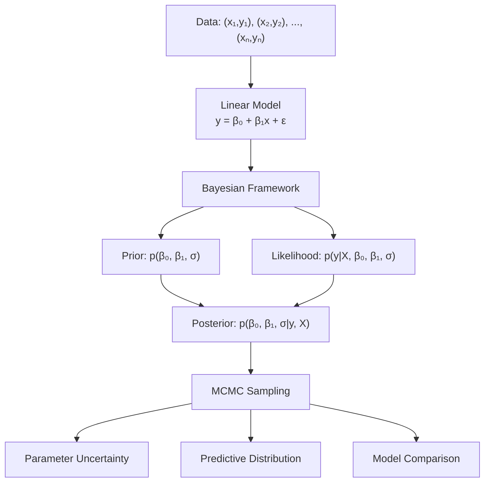
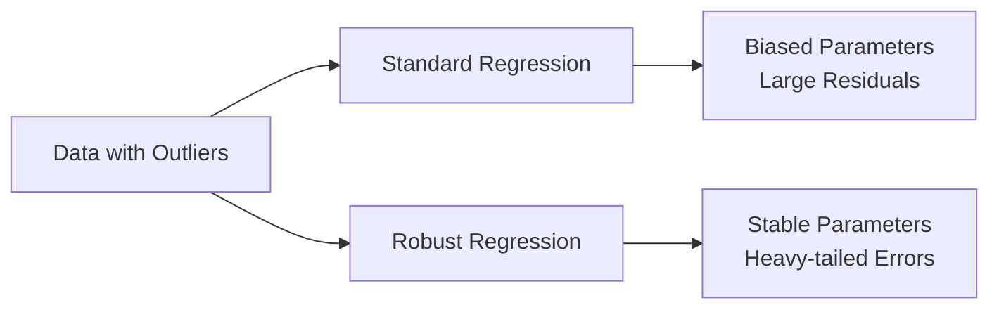
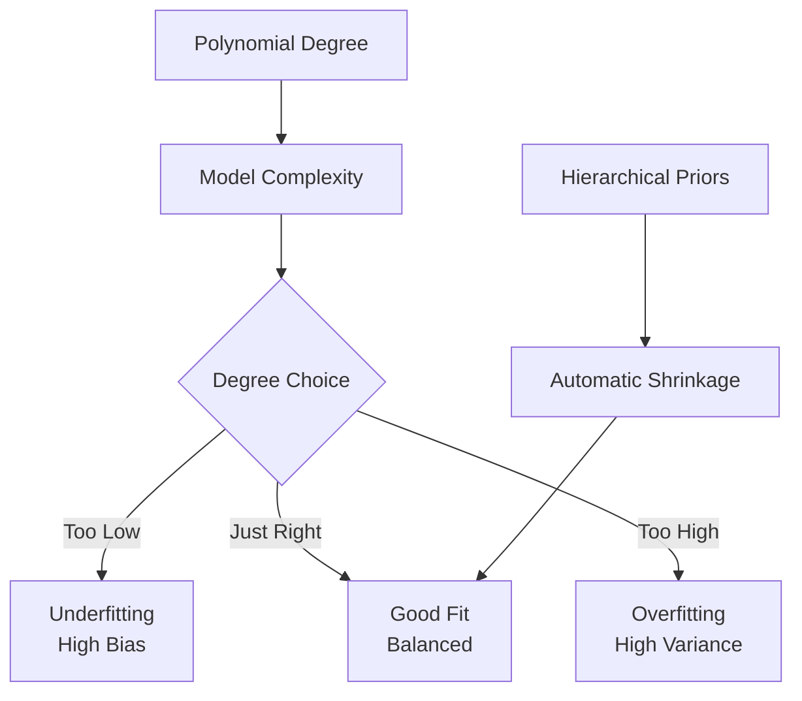
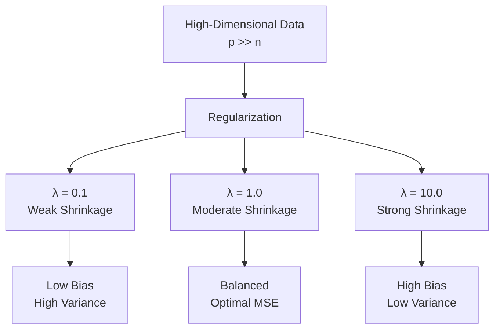

# Linear Regression

```admonish info title="Contents"
<!-- toc -->
```

A comprehensive guide to Bayesian linear regression using Fugue. This tutorial demonstrates how to build, analyze, and extend linear models for real-world data analysis, showcasing the power of probabilistic programming for uncertainty quantification and model comparison.

```admonish info title="Learning Objectives"
By the end of this tutorial, you will understand:
- **Bayesian Linear Regression**: Prior specification and posterior inference for regression parameters
- **Uncertainty Quantification**: How to extract and interpret parameter uncertainty from MCMC samples
- **Robust Regression**: Using heavy-tailed distributions to handle outliers
- **Polynomial Regression**: Modeling nonlinear relationships with polynomial basis functions
- **Model Selection**: Bayesian methods for comparing regression models
- **Regularization**: Ridge regression through hierarchical priors
- **Production Applications**: Scalable inference for high-dimensional regression problems
```

## The Linear Regression Framework

Linear regression is the cornerstone of statistical modeling. In the Bayesian framework, we treat regression parameters as random variables with prior distributions, allowing us to quantify uncertainty in our estimates and make probabilistic predictions.



### Mathematical Foundation

#### Basic Linear Model

The fundamental linear regression model is:

$$y_i = \beta_0 + \beta_1 x_i + \varepsilon_i$$

where:

- $y_i$: Response variable (dependent)
- $x_i$: Predictor variable (independent)  
- $\beta_0$: Intercept parameter
- $\beta_1$: Slope parameter
- $\varepsilon_i \sim \mathcal{N}(0, \sigma^2)$: Random error

#### Bayesian Specification

**Prior Distributions:**

- $\beta_0 \sim \mathcal{N}(\mu_{\beta_0}, \sigma_{\beta_0}^2)$
- $\beta_1 \sim \mathcal{N}(\mu_{\beta_1}, \sigma_{\beta_1}^2)$
- $\sigma \sim \text{Gamma}(\alpha, \beta)$ or $\sigma^2 \sim \text{InvGamma}(\alpha, \beta)$

**Likelihood:**
$$p(y_1, \ldots, y_n | \beta_0, \beta_1, \sigma, x_1, \ldots, x_n) = \prod_{i=1}^n \mathcal{N}(y_i | \beta_0 + \beta_1 x_i, \sigma^2)$$

**Posterior:**
$$p(\beta_0, \beta_1, \sigma | y, X) \propto p(\beta_0, \beta_1, \sigma) \prod_{i=1}^n \mathcal{N}(y_i | \beta_0 + \beta_1 x_i, \sigma^2)$$

```admonish math title="Conjugate Analysis"
When using conjugate priors (Normal-Inverse-Gamma), the posterior has a closed form. However, MCMC allows us to use more flexible priors and handle complex models without conjugacy restrictions.
```

## Basic Linear Regression

Let's start with the fundamental case: simple linear regression with one predictor variable.

### Implementation

```rust,ignore
# use fugue::*;
# use fugue::runtime::interpreters::PriorHandler;
# use rand::{SeedableRng, rngs::StdRng};
{{#include ../../../../examples/linear_regression.rs:basic_linear_regression}}
```

### Key Concepts

1. **Prior Specification**: We use weakly informative priors that allow the data to dominate
2. **Vectorized Likelihood**: The `for` loop handles multiple observations efficiently
3. **Parameter Recovery**: MCMC estimates should recover true parameter values
4. **Uncertainty Quantification**: Standard deviations provide parameter uncertainty

```admonish tip title="Prior Selection"
- Use `Normal(0, 10)` for regression coefficients when predictors are standardized
- Use `Gamma(2, 0.5)` for error variance (σ) - gives reasonable prior mass over positive values
- Adjust prior scale based on your domain knowledge and data scale
```

### Interpretation

The posterior samples provide:

- **Point Estimates**: Posterior means are Bayesian parameter estimates
- **Credible Intervals**: Quantiles give uncertainty bounds (e.g., 95% credible intervals)
- **Predictive Distribution**: For new $x^*$: $p(y^* | x^*, \text{data}) = \int p(y^* | \beta_0, \beta_1, \sigma, x^*) p(\beta_0, \beta_1, \sigma | \text{data}) d\beta_0 d\beta_1 d\sigma$

## Robust Regression

Standard linear regression assumes Gaussian errors, making it sensitive to outliers. Robust regression uses heavy-tailed distributions to reduce outlier influence.

### Theory

Replace the normal likelihood with a t-distribution:

$$y_i | \mu_i, \sigma, \nu \sim t_\nu(\mu_i, \sigma^2)$$

where:

- $\mu_i = \beta_0 + \beta_1 x_i$ (linear predictor)
- $\nu$: Degrees of freedom (lower = heavier tails)
- As $\nu \to \infty$, $t_\nu \to \mathcal{N}$ (normal distribution)

### Implementation

```rust,ignore
# use fugue::*;
{{#include ../../../../examples/linear_regression.rs:robust_regression}}
```

### Robust vs. Standard Comparison



**Advantages of Robust Regression:**

- **Outlier Resistance**: Heavy tails accommodate extreme values
- **Automatic Detection**: Low $\nu$ indicates outlier presence
- **Flexible**: Reduces to normal regression when $\nu$ is large

```admonish warning title="Computational Complexity"
t-distribution likelihoods are more computationally expensive than normal distributions. For very large datasets, consider preprocessing to remove obvious outliers first.
```

## Polynomial Regression

Linear regression can model nonlinear relationships using polynomial basis functions:

$$y_i = \beta_0 + \beta_1 x_i + \beta_2 x_i^2 + \cdots + \beta_p x_i^p + \varepsilon_i$$

### Mathematical Framework

**Design Matrix:** For polynomial degree $p$:
$$\mathbf{X} = \begin{bmatrix}
1 & x_1 & x_1^2 & \cdots & x_1^p \\
1 & x_2 & x_2^2 & \cdots & x_2^p \\
\vdots & \vdots & \vdots & \ddots & \vdots \\
1 & x_n & x_n^2 & \cdots & x_n^p
\end{bmatrix}$$

**Hierarchical Prior:** Control overfitting with shrinkage priors:
$$\tau \sim \text{Gamma}(a, b) \quad \text{(global precision)}$$
$$\beta_j \sim \mathcal{N}(0, 1/\tau) \quad j = 0, 1, \ldots, p$$

### Implementation

```rust,ignore
# use fugue::*;
{{#include ../../../../examples/linear_regression.rs:polynomial_regression}}
```

### Overfitting Prevention



**Shrinkage Benefits:**
- **Automatic Regularization**: Higher-order terms shrink toward zero
- **Bias-Variance Tradeoff**: Balances model flexibility with stability
- **Model Selection**: Coefficients near zero indicate irrelevant terms

## Bayesian Model Selection

Compare different regression models using marginal likelihood and information criteria.

### Model Comparison Framework

For models $\mathcal{M}_1, \mathcal{M}_2, \ldots, \mathcal{M}_K$:

**Marginal Likelihood:**
$$p(y | \mathcal{M}_k) = \int p(y | \theta_k, \mathcal{M}_k) p(\theta_k | \mathcal{M}_k) d\theta_k$$

**Bayes Factors:**
$$BF_{12} = \frac{p(y | \mathcal{M}_1)}{p(y | \mathcal{M}_2)}$$

**Model Posterior Probabilities:**
$$p(\mathcal{M}_k | y) = \frac{p(y | \mathcal{M}_k) p(\mathcal{M}_k)}{\sum_{j=1}^K p(y | \mathcal{M}_j) p(\mathcal{M}_j)}$$

### Implementation

```rust,ignore
# use fugue::*;
{{#include ../../../../examples/linear_regression.rs:bayesian_model_selection}}
```

### Model Selection Criteria

| Criterion | Formula | Interpretation |
|-----------|---------|----------------|
| **Marginal Likelihood** | $p(y \| \mathcal{M})$ | Higher is better |
| **Bayes Factor** | $BF_{12} = \frac{p(y\|\mathcal{M}_1)}{p(y\|\mathcal{M}_2)}$ | > 3: strong evidence for $\mathcal{M}_1$ |
| **DIC** | $\text{Deviance} + p_D$ | Lower is better |
| **WAIC** | $-2 \times \text{lppd} + 2 \times p_{\text{WAIC}}$ | Lower is better |

```admonish tip title="Model Selection Guidelines"
1. **Start Simple**: Begin with linear models, add complexity as needed
2. **Cross-Validation**: Use holdout data to validate model predictions
3. **Domain Knowledge**: Consider scientific plausibility, not just statistical fit
4. **Multiple Criteria**: Don't rely on a single selection criterion
```

## Regularized Regression

High-dimensional regression requires regularization to prevent overfitting. Ridge regression achieves this through hierarchical priors.

### Ridge Regression Theory

**Penalty Formulation:**
$$\text{minimize} \quad \sum_{i=1}^n (y_i - \mathbf{x}_i^T \boldsymbol{\beta})^2 + \lambda \sum_{j=1}^p \beta_j^2$$

**Bayesian Equivalent:**
$$\beta_j \sim \mathcal{N}(0, 1/\lambda) \quad j = 1, 2, \ldots, p$$

The regularization parameter $\lambda$ controls shrinkage:
- **Large $\lambda$**: Strong shrinkage (high bias, low variance)
- **Small $\lambda$**: Weak shrinkage (low bias, high variance)

### Implementation

```rust,ignore
# use fugue::*;
{{#include ../../../../examples/linear_regression.rs:regularized_regression}}
```

### Regularization Effects



**Advantages of Bayesian Ridge:**
- **Automatic λ Selection**: Through hierarchical priors on precision
- **Uncertainty Quantification**: Full posterior for all parameters
- **Feature Selection**: Coefficients with narrow posteriors around zero

## Advanced Extensions

### Hierarchical Linear Models

```rust,ignore
# use fugue::*;

// Group-level regression with varying intercepts
fn hierarchical_regression_model(
    x_data: Vec<f64>,
    y_data: Vec<f64>,
    group_ids: Vec<usize>
) -> Model<(f64, f64, Vec<f64>)> {
    let n_groups = group_ids.iter().max().unwrap() + 1;

    prob!(
        // Global parameters
        let global_slope <- sample(addr!("global_slope"), Normal::new(0.0, 5.0).unwrap());
        let sigma_y <- sample(addr!("sigma_y"), Gamma::new(2.0, 0.5).unwrap());
        let sigma_group <- sample(addr!("sigma_group"), Gamma::new(2.0, 1.0).unwrap());

        // Group-specific intercepts
        let mut group_intercepts = Vec::new();
        for g in 0..n_groups {
            let intercept_g <- sample(
                addr!("intercept", g),
                Normal::new(0.0, sigma_group).unwrap()
            );
            group_intercepts.push(intercept_g);
        }

        // Likelihood
        for (i, ((x_i, y_i), group_i)) in x_data.iter()
            .zip(y_data.iter())
            .zip(group_ids.iter())
            .enumerate()
        {
            let mean_i = group_intercepts[*group_i] + global_slope * x_i;
            let _obs <- observe(addr!("y", i), Normal::new(mean_i, sigma_y).unwrap(), *y_i);
        }

        pure((global_slope, sigma_y, group_intercepts))
    )
}
```

### Spline Regression

```rust,ignore
# use fugue::*;

// Bayesian cubic spline regression
fn spline_regression_model(
    x_data: Vec<f64>,
    y_data: Vec<f64>,
    knots: Vec<f64>
) -> Model<Vec<f64>> {
    let n_basis = knots.len() + 3; // Cubic splines

    prob!(
        // Smoothness prior
        let precision <- sample(addr!("precision"), Gamma::new(1.0, 0.1).unwrap());

        // Spline coefficients with smoothness penalty
        let mut coefficients = Vec::new();
        for j in 0..n_basis {
            let coef_j <- sample(
                addr!("coef", j),
                Normal::new(0.0, 1.0 / precision.sqrt()).unwrap()
            );
            coefficients.push(coef_j);
        }

        let sigma <- sample(addr!("sigma"), Gamma::new(2.0, 0.5).unwrap());

        // Likelihood (basis functions would be computed here)
        for (i, (x_i, y_i)) in x_data.iter().zip(y_data.iter()).enumerate() {
            // Compute basis function values at x_i
            let mut mean_i = 0.0;
            for (j, coef_j) in coefficients.iter().enumerate() {
                // basis_function(x_i, j, knots) would compute B-spline basis
                let basis_val = if j < knots.len() {
                    (x_i - knots[j]).max(0.0).powi(3)
                } else {
                    x_i.powi(j - knots.len())
                };
                mean_i += coef_j * basis_val;
            }
            let _obs <- observe(addr!("y", i), Normal::new(mean_i, sigma).unwrap(), *y_i);
        }

        pure(coefficients)
    )
}
```

## Production Considerations

### Scalability

For large datasets:

1. **Minibatch MCMC**: Use data subsets for likelihood computation
2. **Variational Inference**: Approximate posterior for faster computation  
3. **GPU Acceleration**: Vectorized operations on GPU
4. **Sparse Representations**: Efficient storage for high-dimensional sparse data

### Model Diagnostics

Essential checks for regression models:

```rust,ignore
# use fugue::inference::diagnostics::*;

fn regression_diagnostics(samples: &[(f64, f64, f64)], x_data: &[f64], y_data: &[f64]) {
    // Residual analysis
    let predictions: Vec<f64> = samples.iter().map(|(intercept, slope, _)| {
        x_data.iter().map(|&x| intercept + slope * x).collect::<Vec<_>>()
    }).flatten().collect();

    // Compute residuals
    let residuals: Vec<f64> = y_data.iter().zip(predictions.iter())
        .map(|(y, pred)| y - pred).collect();

    // Check for patterns in residuals
    println!("Residual diagnostics:");
    println!("  Mean residual: {:.4}", residuals.iter().sum::<f64>() / residuals.len() as f64);
    println!("  Residual std: {:.4}", {
        let mean = residuals.iter().sum::<f64>() / residuals.len() as f64;
        (residuals.iter().map(|r| (r - mean).powi(2)).sum::<f64>() / (residuals.len() - 1) as f64).sqrt()
    });
}
```

### Cross-Validation

```rust,ignore
# use fugue::*;

fn k_fold_cross_validation<F>(
    x_data: Vec<f64>,
    y_data: Vec<f64>,
    k: usize,
    model_fn: F
) -> f64
where F: Fn(Vec<f64>, Vec<f64>) -> Model<(f64, f64, f64)>
{
    let n = x_data.len();
    let fold_size = n / k;
    let mut mse_scores = Vec::new();

    for fold in 0..k {
        let test_start = fold * fold_size;
        let test_end = if fold == k - 1 { n } else { (fold + 1) * fold_size };

        // Split data
        let mut train_x = Vec::new();
        let mut train_y = Vec::new();
        let mut test_x = Vec::new();
        let mut test_y = Vec::new();

        for i in 0..n {
            if i >= test_start && i < test_end {
                test_x.push(x_data[i]);
                test_y.push(y_data[i]);
            } else {
                train_x.push(x_data[i]);
                train_y.push(y_data[i]);
            }
        }

        // Train model (simplified - would run MCMC here)
        let mut rng = StdRng::seed_from_u64(fold as u64);
        let (params, _) = runtime::handler::run(
            PriorHandler { rng: &mut rng, trace: Trace::default() },
            model_fn(train_x, train_y)
        );

        // Predict on test set
        let predictions: Vec<f64> = test_x.iter()
            .map(|&x| params.0 + params.1 * x)
            .collect();

        // Compute MSE
        let mse = test_y.iter().zip(predictions.iter())
            .map(|(y, pred)| (y - pred).powi(2))
            .sum::<f64>() / test_y.len() as f64;

        mse_scores.push(mse);
    }

    mse_scores.iter().sum::<f64>() / k as f64
}
```

## Real-World Applications

### Economic Forecasting

```rust,ignore
// Example: GDP growth prediction
let gdp_model = prob!(
    // Macroeconomic predictors
    let beta_inflation <- sample(addr!("beta_inflation"), Normal::new(0.0, 2.0).unwrap());
    let beta_unemployment <- sample(addr!("beta_unemployment"), Normal::new(0.0, 2.0).unwrap());
    let beta_interest_rate <- sample(addr!("beta_interest_rate"), Normal::new(0.0, 2.0).unwrap());
    let intercept <- sample(addr!("intercept"), Normal::new(2.0, 1.0).unwrap()); // Prior: ~2% growth

    let sigma <- sample(addr!("sigma"), Gamma::new(2.0, 0.5).unwrap());

    // Quarterly GDP growth predictions
    for (i, (inflation, unemployment, interest_rate, gdp_growth)) in economic_data.iter().enumerate() {
        let expected_growth = intercept +
                            beta_inflation * inflation +
                            beta_unemployment * unemployment +
                            beta_interest_rate * interest_rate;

        let _obs <- observe(addr!("gdp", i), Normal::new(expected_growth, sigma).unwrap(), *gdp_growth);
    }

    pure((intercept, beta_inflation, beta_unemployment, beta_interest_rate))
);
```

### Medical Research

```rust,ignore
// Example: Drug dose-response modeling
let dose_response_model = prob!(
    // Log-linear dose-response
    let log_ic50 <- sample(addr!("log_ic50"), Normal::new(0.0, 2.0).unwrap()); // IC50 concentration
    let hill_slope <- sample(addr!("hill_slope"), Normal::new(1.0, 0.5).unwrap()); // Cooperativity
    let baseline <- sample(addr!("baseline"), Normal::new(100.0, 10.0).unwrap()); // No drug effect
    let max_effect <- sample(addr!("max_effect"), Normal::new(0.0, 10.0).unwrap()); // Maximum inhibition

    let sigma <- sample(addr!("sigma"), Gamma::new(2.0, 0.5).unwrap());

    for (i, (log_dose, response)) in dose_response_data.iter().enumerate() {
        // Hill equation: E = baseline + (max_effect - baseline) / (1 + 10^(hill_slope * (log_ic50 - log_dose)))
        let hill_term = hill_slope * (log_ic50 - log_dose);
        let expected_response = baseline + (max_effect - baseline) / (1.0 + (10.0_f64).powf(hill_term));

        let _obs <- observe(addr!("response", i), Normal::new(expected_response, sigma).unwrap(), *response);
    }

    pure((log_ic50, hill_slope, baseline, max_effect))
);
```

## Testing Your Understanding

### Exercise 1: Multiple Regression

Extend basic linear regression to handle multiple predictors:

```rust,ignore
# use fugue::*;

fn multiple_regression_model(
    x_data: Vec<Vec<f64>>, // Matrix: n observations × p predictors
    y_data: Vec<f64>
) -> Model<Vec<f64>> {
    let p = x_data[0].len(); // number of predictors

    prob!(
        // TODO: Implement multiple regression
        // - Create coefficient vector of length p
        // - Use matrix multiplication for linear predictor
        // - Add appropriate priors for high-dimensional case

        pure(vec![0.0; p]) // Placeholder
    )
}
```

### Exercise 2: Heteroscedastic Regression

Model non-constant error variance:

```rust,ignore
# use fugue::*;

fn heteroscedastic_model(
    x_data: Vec<f64>,
    y_data: Vec<f64>
) -> Model<(f64, f64, f64, f64)> {
    prob!(
        // TODO: Implement regression with non-constant variance
        // - Model log(σ²) as linear function of x
        // - σ²ᵢ = exp(γ₀ + γ₁ * xᵢ)
        // - Use different variance for each observation

        pure((0.0, 0.0, 0.0, 0.0)) // Placeholder
    )
}
```

### Exercise 3: Bayesian Variable Selection

Implement spike-and-slab priors for variable selection:

```rust,ignore
# use fugue::*;

fn variable_selection_model(
    x_data: Vec<Vec<f64>>,
    y_data: Vec<f64>,
    inclusion_probability: f64
) -> Model<(Vec<f64>, Vec<bool>)> {
    let p = x_data[0].len();

    prob!(
        // TODO: Implement variable selection
        // - γⱼ ~ Bernoulli(π) for inclusion indicators  
        // - βⱼ | γⱼ ~ γⱼ * Normal(0, τ²) + (1-γⱼ) * δ₀
        // - Spike-and-slab prior structure

        pure((vec![0.0; p], vec![false; p])) // Placeholder
    )
}
```

## Key Takeaways

```admonish success title="Linear Regression Mastery"
1. **Bayesian Framework**: Uncertainty quantification through posterior distributions
2. **Model Extensions**: Robustness, nonlinearity, and regularization through prior specification
3. **Model Selection**: Principled comparison using marginal likelihood and Bayes factors
4. **Scalability**: Hierarchical models and efficient computation for high-dimensional problems
5. **Real-World Applications**: Flexible framework adaptable to diverse scientific domains
6. **Production Ready**: Cross-validation, diagnostics, and robust inference workflows
```

**Core Techniques:**
- ✅ **Basic Regression** with uncertainty quantification
- ✅ **Robust Methods** for outlier resistance  
- ✅ **Polynomial Modeling** for nonlinear relationships
- ✅ **Bayesian Model Selection** for optimal complexity
- ✅ **Ridge Regression** for high-dimensional problems
- ✅ **Hierarchical Extensions** for grouped data
- ✅ **Production Deployment** with diagnostics and validation

Linear regression in Fugue provides a solid foundation for more complex statistical models. The Bayesian approach naturally handles uncertainty, enables model comparison, and scales to modern high-dimensional problems through principled regularization.

## Further Reading

- [Building Complex Models](../../how-to/building-complex-models.md) - Advanced modeling techniques
- [Optimizing Performance](../../how-to/optimizing-performance.md) - Scalable inference strategies
- [Classification](./classification.md) - Logistic regression and discrete outcomes
- [Hierarchical Models](./hierarchical-models.md) - Multi-level modeling
- *Gelman et al. "Bayesian Data Analysis"* - Comprehensive Bayesian statistics
- *McElreath "Statistical Rethinking"* - Modern approach to statistical modeling
