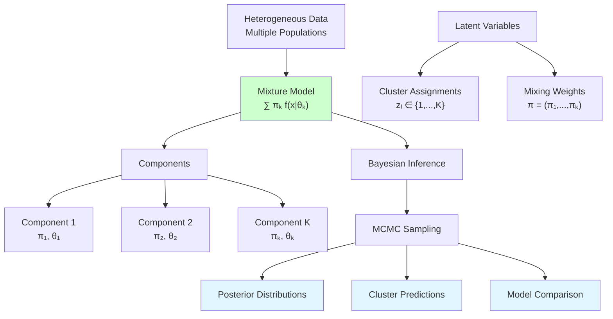

# Mixture Models

```admonish info title="Contents"
<!-- toc -->
```

A comprehensive guide to Bayesian mixture modeling using Fugue. This tutorial demonstrates how to build, analyze, and extend mixture models for complex data structures, showcasing advanced probabilistic programming techniques for unsupervised learning and heterogeneous populations.

```admonish info title="Learning Objectives"
By the end of this tutorial, you will understand:
- **Gaussian Mixture Models**: Foundation of mixture modeling for continuous data
- **Latent Variable Inference**: MCMC techniques for unobserved cluster assignments
- **Model Selection**: Choosing the optimal number of mixture components
- **Mixture of Experts**: Supervised mixture models for complex decision boundaries
- **Infinite Mixtures**: Dirichlet Process models for automatic component discovery  
- **Temporal Mixtures**: Hidden Markov Models and dynamic clustering
- **Advanced Diagnostics**: Convergence assessment and cluster validation
```

## The Mixture Modeling Framework

Mixture models assume that observed data arise from a **mixture of underlying populations**, each governed by its own distribution. This framework naturally handles heterogeneous data where simple single-distribution models fail.



### Mathematical Foundation

#### Basic Mixture Model

For $K$ components, the mixture density is:

$$p(x_i | \boldsymbol{\pi}, \boldsymbol{\theta}) = \sum_{k=1}^K \pi_k f(x_i | \theta_k)$$

Where:

- $\pi_k$ are **mixing weights** with $\sum_{k=1}^K \pi_k = 1$
- $f(x_i | \theta_k)$ is the **component density** for cluster $k$
- $\boldsymbol{\theta} = (\theta_1, \ldots, \theta_K)$ are component-specific parameters

#### Latent Variable Formulation

Introduce latent cluster assignments $z_i \in \{1, \ldots, K\}$:

$$z_i \sim \text{Categorical}(\boldsymbol{\pi})$$
$$x_i | z_i = k \sim f(\cdot | \theta_k)$$

This **data augmentation** approach enables efficient MCMC inference.

```admonish tip title="Mixture Model Advantages"
- **Flexibility**: Model complex, multimodal distributions
- **Interpretability**: Each component represents a meaningful subpopulation  
- **Uncertainty**: Natural clustering with prediction confidence
- **Extensibility**: Easy to incorporate covariates and hierarchical structure
```

## Gaussian Mixture Models

The most common mixture model uses Gaussian components, ideal for continuous data clustering.

### Mathematical Model

For $K$ Gaussian components:

$$x_i | z_i = k \sim \mathcal{N}(\mu_k, \sigma_k^2)$$
$$z_i \sim \text{Categorical}(\boldsymbol{\pi})$$

**Priors:**
$$\boldsymbol{\pi} \sim \text{Dirichlet}(\boldsymbol{\alpha})$$
$$\mu_k \sim \mathcal{N}(\mu_0, \tau_0^2)$$
$$\sigma_k^2 \sim \text{InverseGamma}(\alpha_0, \beta_0)$$

### Implementation

```rust,ignore
{{#include ../../../../examples/mixture_models.rs:gaussian_mixture_model}}
```

### Key Features

- **Automatic clustering**: Soft cluster assignments via posterior probabilities
- **Uncertainty quantification**: Credible intervals for all parameters
- **Model comparison**: Bayesian model selection for optimal $K$

```admonish warning title="Label Switching in Mixtures"
Mixture components are **not identifiable** due to label switching - permuting component labels gives the same likelihood. This causes:
- **Multimodal posteriors**: Multiple equivalent parameter configurations
- **MCMC convergence issues**: Chains can jump between label permutations

**Solutions**: Use informative priors, post-process with label matching, or employ specialized algorithms like the allocation sampler.
```

## Multivariate Mixtures

Extend to multivariate data with full covariance structure.

### Mathematical Model

For $p$-dimensional data:

$$\mathbf{x}_i | z_i = k \sim \mathcal{N}(\boldsymbol{\mu}_k, \boldsymbol{\Sigma}_k)$$

**Matrix-Normal Inverse-Wishart Priors:**
$$\boldsymbol{\mu}_k \sim \mathcal{N}(\boldsymbol{\mu}_0, \sigma_0^2 \mathbf{I})$$
$$\boldsymbol{\Sigma}_k \sim \text{InverseWishart}(\nu_0, \boldsymbol{\Psi}_0)$$

### Implementation

```rust,ignore
{{#include ../../../../examples/mixture_models.rs:multivariate_mixture_model}}
```

### Advanced Features

- **Full covariance**: Captures correlation structure within clusters
- **Regularization**: Inverse-Wishart priors prevent overfitting
- **Dimensionality**: Scales to high-dimensional feature spaces

## Mixture of Experts

Supervised mixture models where component probabilities depend on covariates.

### Mathematical Model

**Gating Network:**
$$\pi_{ik} = \text{softmax}(\mathbf{w}_k^T \mathbf{x}_i) = \frac{\exp(\mathbf{w}_k^T \mathbf{x}_i)}{\sum_{j=1}^K \exp(\mathbf{w}_j^T \mathbf{x}_i)}$$

**Expert Networks:**
$$y_i | z_i = k, \mathbf{x}_i \sim \mathcal{N}(\boldsymbol{\beta}_k^T \mathbf{x}_i, \sigma_k^2)$$

$$z_i \sim \text{Categorical}(\boldsymbol{\pi}_i)$$

### Implementation

```rust,ignore
{{#include ../../../../examples/mixture_models.rs:mixture_of_experts}}
```

### Applications

- **Complex regression**: Different relationships in different regions
- **Classification boundaries**: Non-linear decision boundaries
- **Expert systems**: Specialized models for different domains

## Infinite Mixtures: Dirichlet Process

When the number of components is unknown, use **Dirichlet Process mixtures** for automatic model selection.

### Mathematical Framework

**Dirichlet Process:** $G \sim \text{DP}(\alpha, G_0)$

**Chinese Restaurant Process:** Component assignments follow:
$$P(z_i = k | z_1, \ldots, z_{i-1}) = \begin{cases}
\frac{n_k}{i-1+\alpha} & \text{existing component } k \\
\frac{\alpha}{i-1+\alpha} & \text{new component}
\end{cases}$$

Where $n_k$ is the number of observations in component $k$.

### Implementation

```rust,ignore
{{#include ../../../../examples/mixture_models.rs:dirichlet_process_mixture}}
```

### Advantages

- **Automatic complexity**: Discovers optimal number of components
- **Infinite flexibility**: Can create new clusters as needed  
- **Bayesian elegance**: Principled uncertainty over model structure

```admonish tip title="Dirichlet Process Intuition"
Think of the **Chinese Restaurant Process** as customers entering a restaurant:
- **Existing tables**: Join with probability proportional to occupancy
- **New table**: Start with probability proportional to concentration parameter $\alpha$
- **Rich get richer**: Popular clusters attract more observations
```

## Hidden Markov Models

Temporal extension of mixture models with **state transitions**.

### Mathematical Model

**State Transitions:**
$$z_t | z_{t-1} \sim \text{Categorical}(\boldsymbol{\pi}_{z_{t-1}})$$

**Emission Model:**
$$x_t | z_t = k \sim f(\cdot | \theta_k)$$

**Initial Distribution:**
$$z_1 \sim \text{Categorical}(\boldsymbol{\pi}_0)$$

### Implementation

```rust,ignore
{{#include ../../../../examples/mixture_models.rs:hidden_markov_model}}
```

### Applications

- **Time series clustering**: Regime switching models
- **Speech recognition**: Phoneme sequence modeling  
- **Bioinformatics**: Gene sequence analysis
- **Finance**: Market regime detection

## Model Selection and Diagnostics

### Information Criteria

For mixture models, use:

**Deviance Information Criterion (DIC):**
$$\text{DIC} = \bar{D} + p_D$$

**Widely Applicable Information Criterion (WAIC):**
$$\text{WAIC} = -2(\text{lppd} - p_{\text{WAIC}})$$

### Implementation

```rust,ignore
{{#include ../../../../examples/mixture_models.rs:mixture_model_selection}}
```

### Cluster Validation

```rust,ignore
{{#include ../../../../examples/mixture_models.rs:cluster_diagnostics}}
```

**Key Metrics:**
- **Within-cluster sum of squares**: Cluster tightness
- **Between-cluster separation**: Distinctiveness
- **Silhouette coefficient**: Overall clustering quality
- **Adjusted Rand Index**: Agreement with ground truth (if available)

## Advanced Extensions

### Mixture Regression

Components with different regression relationships:

```rust,ignore
# use fugue::*;

fn mixture_regression_model(
    x_data: Vec<f64>,
    y_data: Vec<f64>,
    n_components: usize
) -> Model<(Vec<f64>, Vec<(f64, f64)>, Vec<f64>)> {
    prob! {
        // Mixing weights
        let alpha_prior = vec![1.0; n_components];
        let mixing_weights <- sample(addr!("pi"), Dirichlet::new(alpha_prior).unwrap());

        // Component-specific regression parameters
        let mut component_params = Vec::new();
        for k in 0..n_components {
            let intercept <- sample(addr!("intercept", k), fugue::Normal::new(0.0, 5.0).unwrap());
            let slope <- sample(addr!("slope", k), fugue::Normal::new(0.0, 5.0).unwrap());
            let sigma <- sample(addr!("sigma", k), Gamma::new(1.0, 1.0).unwrap());
            component_params.push((intercept, slope, sigma));
        }

        // Latent cluster assignments and observations
        let mut cluster_assignments = Vec::new();
        for i in 0..x_data.len() {
            let z_i <- sample(addr!("z", i), Categorical::new(mixing_weights.clone()).unwrap());
            cluster_assignments.push(z_i);

            let (intercept, slope, sigma) = component_params[z_i];
            let mean_y = intercept + slope * x_data[i];
            let _obs <- observe(addr!("y", i), fugue::Normal::new(mean_y, sigma).unwrap(), y_data[i]);
        }

        let regression_params: Vec<(f64, f64)> = component_params.iter()
            .map(|(int, slope, _)| (*int, *slope)).collect();
        let sigmas: Vec<f64> = component_params.iter()
            .map(|(_, _, sigma)| *sigma).collect();

        pure((mixing_weights, regression_params, sigmas))
    }
}
```

### Robust Mixtures

Use heavy-tailed distributions for outlier resistance:

```rust,ignore
# use fugue::*;

fn robust_mixture_model(
    data: Vec<f64>,
    n_components: usize
) -> Model<(Vec<f64>, Vec<(f64, f64, f64)>)> {
    prob! {
        // Mixing weights
        let alpha_prior = vec![1.0; n_components];
        let mixing_weights <- sample(addr!("pi"), Dirichlet::new(alpha_prior).unwrap());

        // t-distribution components for robustness
        let mut component_params = Vec::new();
        for k in 0..n_components {
            let mu <- sample(addr!("mu", k), fugue::Normal::new(0.0, 10.0).unwrap());
            let sigma <- sample(addr!("sigma", k), Gamma::new(1.0, 1.0).unwrap());
            let nu <- sample(addr!("nu", k), Gamma::new(2.0, 0.1).unwrap()); // Degrees of freedom
            component_params.push((mu, sigma, nu));
        }

        // Observations with t-distribution likelihood
        for i in 0..data.len() {
            let z_i <- sample(addr!("z", i), Categorical::new(mixing_weights.clone()).unwrap());
            let (mu, sigma, nu) = component_params[z_i];

            // Use Normal approximation for t-distribution (simplified)
            let effective_sigma = sigma * (nu / (nu - 2.0)).sqrt(); // t-distribution variance adjustment
            let _obs <- observe(addr!("x", i), fugue::Normal::new(mu, effective_sigma).unwrap(), data[i]);
        }

        pure((mixing_weights, component_params))
    }
}
```

## Production Considerations

### Scalability

For large datasets:

1. **Variational Inference**: Approximate posteriors for faster computation
2. **Stochastic EM**: Process data in mini-batches
3. **Parallel MCMC**: Multiple chains with different initializations
4. **GPU Acceleration**: Vectorized likelihood computations

```admonish tip title="Production Deployment"
- **Initialization**: Use K-means for parameter starting values
- **Monitoring**: Track log-likelihood and cluster stability
- **Memory**: Use sparse representations for high-dimensional data
- **Validation**: Cross-validate on held-out data for model selection
```

### Common Pitfalls

**Overfitting:**
- Too many components capture noise
- **Solution**: Use informative priors, cross-validation

**Label switching:**
- MCMC chains swap component labels  
- **Solution**: Post-process with Hungarian algorithm matching

**Poor initialization:**
- MCMC stuck in local modes
- **Solution**: Multiple random starts, simulated annealing

## Running the Examples

To explore mixture modeling techniques:

```bash
# Run mixture model demonstrations
cargo run --example mixture_models

# Test specific model types
cargo test --example mixture_models

# Generate clustering visualizations
cargo run --example mixture_models --features="plotting"
```

## Key Takeaways

```admonish success title="Mixture Modeling Mastery"
1. **Flexible Framework**: Handle heterogeneous populations and complex distributions
2. **Latent Variables**: Elegant treatment of unobserved cluster structure
3. **Bayesian Advantages**: Natural uncertainty quantification and model comparison
4. **Advanced Methods**: Infinite mixtures and temporal extensions
5. **Production Ready**: Scalable inference with proper diagnostics and validation
6. **Real-World Applications**: Clustering, anomaly detection, and population modeling
```

**Core Techniques:**
- ✅ **Gaussian Mixtures** for continuous data clustering
- ✅ **Multivariate Extensions** with full covariance structure  
- ✅ **Mixture of Experts** for supervised heterogeneous modeling
- ✅ **Infinite Mixtures** with automatic complexity selection
- ✅ **Temporal Mixtures** for sequential and time-series data
- ✅ **Advanced Diagnostics** for convergence and cluster validation

## Further Reading

- [Building Complex Models](../../how-to/building-complex-models.md) - Advanced mixture architectures
- [Optimizing Performance](../../how-to/optimizing-performance.md) - Scalable mixture inference
- [Classification](./classification.md) - Mixture discriminant analysis connections
- [Hierarchical Models](./hierarchical-models.md) - Nested mixture structures  
- [Time Series](../advanced-applications/time-series-forecasting.md) - Dynamic mixture models
- *Murphy "Machine Learning: A Probabilistic Perspective"* - Comprehensive mixture theory
- *Bishop "Pattern Recognition and Machine Learning"* - Classical mixture methods
- *Gelman et al. "Bayesian Data Analysis"* - Bayesian mixture modeling

---

Mixture models in Fugue provide a **powerful and flexible framework** for modeling heterogeneous data. The combination of principled Bayesian inference and constraint-aware MCMC makes complex mixture modeling both **theoretically sound** and **computationally practical**.
